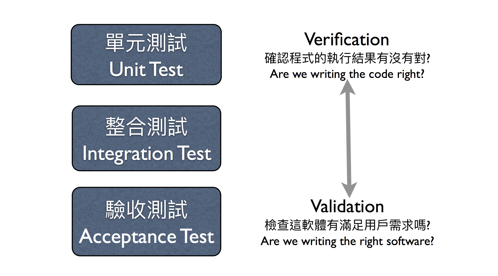
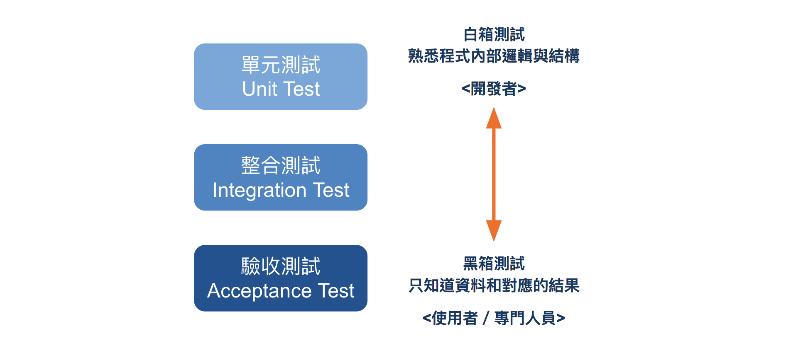

## 測試是什麼
> 能夠解釋何謂測試
> 能理解自動化測試的好處

軟體測試（Software Testing，以下簡稱測試），是指軟體產品在進入市場或發佈前，對產品的程式碼、規格和需求進行評估，確保軟體產品的品質達到預期的標準。

測試意在確認產品的功能符合當初的設計，因此在測試時也可以反過來檢視設計的規格是否夠完整，提供不同角度的觀察。

### 最常見的三種測試

測試可以從不同層面切入，最常見的有三種：
- 單元測試（Unit Test）
- 整合測試（Integration Test）
- 驗收測試（Acceptance Test）

單元測試，會針對個別的類別（class）和方法（method）或功能（function）進行測試，確保其產出的結果符合預期。

整合測試，則會測試多個類別和功能之間的互動，確保系統整合後能正常運作。

驗收測試，會從使用者的觀點測試整個軟體，確保軟體產品符合使用者的需求。

### 測試的人員



測試可以用「白箱測試」和「黑箱測試」進行分類：
- 白箱測試：測試人員清楚知道程式的內部邏輯與結構
- 黑箱測試：測試人員不知道程式的內部邏輯與結構，只知道輸入什麼資料會取得什麼結果

白箱測試由於必須熟悉程式的內部邏輯與結構，測試者多為開發者自身，反之黑箱測試只需清楚輸入的資料和對應的結果，因此可交由非開發者的專門人員或一般使用者進行測試。



由於我們是開發者，接下來會聚焦在單元測試（Unit Test）的部分，帶大家進行測試的實務操作。

### 手動測試

我們在寫完程式時，基本上都會進行測試看看結果是否正確，然而，手動測試的效率很低，如果是一些較複雜的程式，有多個判斷方式，你很可能會漏掉該檢查的幾種可能性，尤其許多程式都有「例外情況」。

舉「 n 是否為 2 的次方」的程式碼為例，輸入一個正整數 n：
- 若 n 為 2 的次方，回傳 true
- 若 n 不為 2 的次方，回傳 false


```ruby
def is_power_of_two(n)
  if n == 1
    return true
  end

  while n > 0
    if n % 2 == 1
      return false
    elsif n % 2 == 0 && n / 2  == 1
      return true
    end
    n = n / 2
  end

end
```

你的資料會有：1、2、7、12、16 ...

你會發現，如果要手動測試這個程式，你需要重複輸入資料多次，如果你稍有更動到程式碼，又需要再次輸入一輪資料作測試。

因此，為了不浪費時間往返於終端觀看測試結果和修改程式，就有了自動化測試：<span style="color:red">讓程式去測試程式</span>。

### 自動化測試

使用自動化測試，除了不需要每次都手動輸入資料外，還有很多優勢：

#### 快速確認正確

一旦寫好測試程式，很容易就可以檢查程式有沒有寫對，大大減少除錯的時間，讓測試時間小於除錯的時間。

#### 提高穩定性

若要新增功能或重構程式碼時，不容易改壞之前寫好的功能，這又稱作「回饋測試」，你不需要再手動測試之前的功能是否受影響，可以直接使用之前寫好的測試程式。

對於那些需要長期維護的軟體產品，一定會有「回饋測試」的需求。

#### 產出更明確的規格

測試就是一種程式的規格書，若使用者不知道如何使用程式的功能，可透過閱讀測試程式知道怎麼使用；測試的規格書也能協助你設計 API，讓人理解怎麼使用你的程式。

接下來的單元會有大量自動化測試的練習，而下個單元，我們先來快速體驗下自動化測試的妙用。


## Quiz

### Q1

關於單元測試的描述，以下何者是正確的？（多選題）

- <mark>針對單一功能或單一類別進行測試</mark>
- <mark>測試者多為開發者自己</mark>
- <mark>測試者通常要清楚內部邏輯與結構</mark>
- 確認軟體產品符合使用者的需求

答：1、2、3
註記：確認軟體產品符合使用者需求是驗收測試的目標，不是單元測試的目標。

### Q2

以下哪個選項關於測試的描述是正確的？（多選題）

- <mark>黑箱測試的測試者不需要知道內部邏輯與結構</mark>
- <mark>驗收測試是為了確認軟體產品符合使用者需求</mark>
- 白箱測試的測試者會是一般使用者
- <mark>單元測試的目標是確認程式執行結果正確無誤</mark>

答：1、2、4
註記：白箱測試的測試者通常要知道程式內部邏輯與結構，因此測試者不會是一般使用者，而是開發者。
