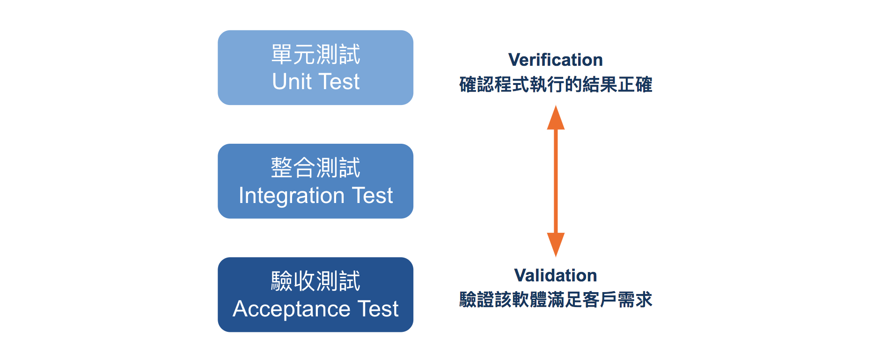

## 測試是什麼

軟體測試（Software Testing，以下簡稱測試），是指軟體產品在進入市場或發佈前，對於產品的程式碼、規格和需求進行評估，確保軟體產品的品質達標。

### 測試不是什麼

測試不是在幫程式碼除錯（Debug），不是寫了測試錯誤就不存在了；測試也不是打開瀏覽器，用滑鼠將所有功能點過一遍，沒有出錯就可以了。

在測試時很多細節並不是用滑鼠點擊能測出來的，甚至每次進行修改時，都要再次進行一次測試，以確保沒有改壞一些原本是正常運作的功能。

測試主要是在確認產品和功能符合當初的設計，因此在測試時也可以反過來檢定我們的規格是否完整，提供不同角度的觀察。

### 最常見的三種測試

測試可以從不同層面切入，這裡提供三種最常見的測試，以測試內容的大小排序：
- 單元測試（Unit Test）
- 整合測試（Integration Test）
- 驗收測試（Acceptance Test）

單元測試，會對個別的類別和方法測試結果如預期，通常會由開發者自行負責測試，因為只有你自己清楚每個類別和方法的內部結構是怎麼設計的。

整合測試會測試多個元件之間的互動正確；而驗收測試，則常由專門的測試工程師來負責，測試者不需要知道程式碼內部是怎麼實作的，只需知道什麼是系統應該做的事即可。

由於我們是開發者，本章節會聚焦在單元測試（Unit Test）的部分，帶大家透過練習跑一次測試。

### 測試的目的

單元測試意在確認程式的執行結果是否正確，測試個別的類別和函式正確。

整合測試則是在確認通過單元測試的功能組合在一起的執行結果是否正確，或測試多個類別之間的互動是否正確。

最後，驗收測試是從使用者的角度來考量該軟體產品是否有滿足需求，從用戶觀點測試整個軟體。



這三種測試也可以用「白箱測試」和「黑箱測試」分類：
- 白箱測試：測試人員清楚知道程式的內部邏輯與結構
- 黑箱測試：測試人員不知道程式的內部邏輯與結構，只知道輸入什麼資料會取得什麼結果

白箱測試因為必須熟悉程式的內部邏輯與結構，測試者多為開發者自身，反之黑箱測試只需要清楚輸入的資料和對應的結果，因此可交由非開發者的專門人員或一般使用者進行測試。


### 手動測試與自動化測試

我們在寫完程式時，基本上都會進行測試看看結果是否正確，然而，手動測試很沒有效率，如果是一些較複雜的程式，有多個判斷方式，你很可能會漏掉該檢查的幾種可能性，尤其許多程式都有「例外情況」。

以下為「 n 是否為 2 的次方」的程式碼，輸入一個正整數 n：
- 若 n 為 2 的次方，回傳 true
- 若 n 不為 2 的次方，回傳 false

```ruby
def is_power_of_two(n)
  if n == 1
    return true
  end

  while n > 0
    if n % 2 == 1
      return false
    elsif n % 2 == 0 && n / 2  == 1
      return true
    end
    n = n / 2
  end

end
```

你會發現，要手動測試這個程式，至少需要重複輸入幾次不同的資料：1、2、7、12、16 等等；為了不浪費時間往返於終端觀看測試結果和修改程式，因此就有了自動化測試：讓程式去測試程式。

### 自動化測試的價值

使用自動化測試，除了不需要每次都手動輸入資料外，主要提供以下價值：

#### 快速確認正確
一旦寫好測試程式，很容易就可以檢查程式有沒有寫對，大大減少除錯的時間，讓測試時間小於除錯的時間

#### 提高穩定性

若要新增功能或重構程式碼時，不容易改壞之前寫好的功能，這又稱作「回饋測試」，你不需要再手動測試之前的功能是否受影響，可以直接使用之前寫好的測試程式。

對於那些需要長期維護的軟體產品，一定會有「回饋測試」的需求。

#### 產出更明確的規格

測試就是一種程式的規格書，若使用者不知道如何使用程式的功能，可透過閱讀測試程式知道怎麼使用；測試的規格書也能協助你設計 API，讓人理解怎麼使用你的程式。

在接下來的單元裡，我們會透過實作來練習自動化測試，下個單元，我們要來快速體驗下自動化測試的妙用。
