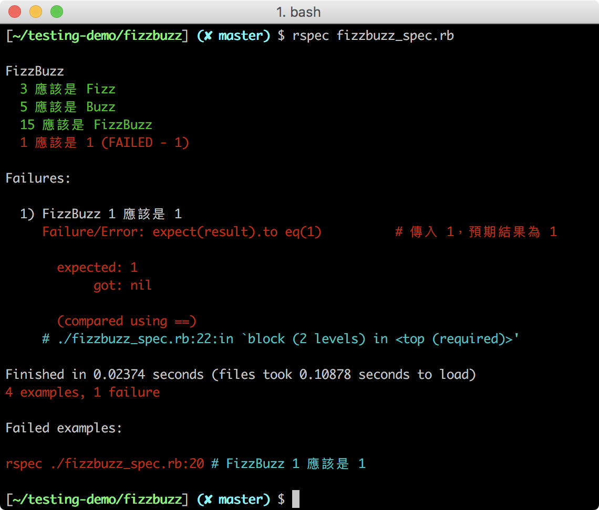
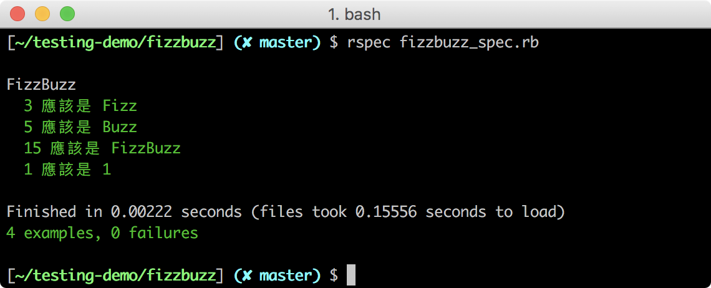

## 快速體驗自動化測試
> 認識自動化測試的操作步驟

你已經從上個單元了解到什麼是測試，現在先讓我們用一個簡單的題目來快速體驗一下「自動化測試」。

注意：本單元意在體驗自動化測試，請依照教案將程式碼依序貼上並執行對應指令，仔細觀察結果；我們會在之後的章節裡詳細說明 自動化測試的語法和使用方式。

### 題目說明：FizzBuzz

FizzBuzz 程式是經典的面試考題之一，給一個整數：
- 整數能被三整除，回傳 Fizz；如果數字是 3，就會回傳 Fizz
- 整數能被五整除，回傳 Buzz；如果數字是 5，就會回傳 Buzz
- 整數能被三和五同時整除，回傳 FizzBuzz；如果數字是 15，就會回傳 FizzBuzz
- 若都不能整除，回傳該整數；若數字是 1，則回傳 1

### 撰寫 FizzBuzz 程式（第一版）

自動化測試，就是用程式去測試程式，因此我們必須先寫好 FizzBuzz 的程式。

請創建一個檔案 **fizzbuzz.rb**，內容如下：
```ruby
def fizzbuzz(int)
  if int % 3 == 0
   return "Fizz"
  end

  if int % 5 == 0
   return "Buzz"
  end

  if int % 3 == 0 && int % 5 == 0
   return "FizzBuzz"
  end
end
```

完成了程式，我們通常會手動進行測試，最常見的就是用進入 irb 帶入對應的測試資料。

#### 手動測試：irb

在終端執行 `irb` 输入指令：

```
require_relative './fizzbuzz.rb'
fizzbuzz(3)   # => 应该得到 Fizz
fizzbuzz(5)   # => 应该得到 Buzz
fizzbuzz(15)  # => 应该得到 FizzBuzz
```

irb 上的結果是否正確？

整數 15 本該回傳 `FizzBuzz`，但結果是 `Fizz`；程式寫錯了，我們必須回去更動程式。

请輸入 `exit` 離開 `irb`。

### 修改 FizzBuzz 程式（第二版）

讓我們來修改 `fizzbuzz.rb`，改寫成：

```ruby
def fizzbuzz(int)
  if int % 3 == 0 && int % 5 == 0
   return "FizzBuzz"
  end

  if int % 5 == 0
   return "Buzz"
  end

  if int % 3 == 0
   return "Fizz"
  end
end
```

再次進入 `irb` 測試程式：
```
require_relative './fizzbuzz.rb'
fizzbuzz(3)   # => 应该得到 Fizz
fizzbuzz(5)   # => 应该得到 Buzz
fizzbuzz(15)  # => 应该得到 FizzBuzz 了
```

看起來這次的測試結果好像都對了，你可能還會想再輸入幾個數字試試看。

這個往返檢查和修改程式的過程，相信大家一定都不陌生，自動化測試要達成的目的，就是把這個檢查過程給自動化。

### 使用 RSpec 進行自動化測試

RSpec 是一套 Ruby 的軟體套件，目前非常多 Ruby on Rails 專案使都使用 RSpec 來進行測試。

請各位使用指令安裝 RSpec：
```
gem install rspec
```

請在 **fizzbuzz.rb** 同個資料夾內，新增一個 `.rspec` 檔，內容如下：
```
--format documentation
--color
```

接着再新增一個檔档案 `fizzbuzz_spec.rb`，內容如下：

```ruby
require_relative './fizzbuzz.rb'

describe "FizzBuzz" do

  it "3 應該是 Fizz" do
    result = fizzbuzz(3)
    expect(result).to eq('Fizz')    # 结果应该要是 Fizz
  end

  it "5 應該是 Buzz" do
    result = fizzbuzz(5)
    expect(result).to eq('Buzz')     # 结果应该要是 Buzz
  end

  it "15 應該是 FizzBuzz" do
    result = fizzbuzz(15)
    expect(result).to eq('FizzBuzz')     # 结果应该要是 FizzBuzz
  end

  it "1 應該是 1" do
    result = fizzbuzz(1)
    expect(result).to eq(1)      # 结果应该要是 1
  end

end
```

在這個檔案裡，每個 `it` 包起來的就是一個測試案例（Test Case），我們會在裡面用 `expect` 方法去檢查結果是否如我們預期。

這裡除了測試 3、5、15 外，也多新增了 1 的測試案例，由於 1 不能被 3 或 5 整除，其其結果應為 `1`。

#### 通過與失敗：Green or Red？

至此我們共有三個檔案：**.rspec**、**fizzbuzz.rb**、**fizzbuzz_rspec.rb**，這些檔案必須在同一個資料夾裡。

請執行以下指令使用 RSpec 進行自動化測試：
```bash
[~] $ rspec leap_year_spec.rb
```



紅色的字表示有測試案例沒有通過，它指出我們的數字為 1 的結果不正確，預期是 1 但卻得到 nil。這很正常，因為我們剛撰寫的 fizzbuzz 程式並沒有考量到整數不能被 3 或 5 整除的情況。

### 修改 FizzBuzz 程式（完成版）

讓我們再次回去更動我們的程式，改寫成以下版本：
```ruby
def fizzbuzz(int)
  if int % 3 == 0 && int % 5 == 0
   return "FizzBuzz"
  end

  if int % 5 == 0
   return "Buzz"
  end

  if int % 3 == 0
   return "Fizz"
  end

  return int
end
```

再執行一次 `rspec fizzbuzz_spec.rb`，結果應如下所示：



當你看到終端上都是綠色時，表示這四個測試案例都通過了，如果你對程式還有疑慮，是否考慮得不夠完善，你也可以增加更多的測試資料來檢查。

## 重構 FizzBuzz 程式（最終版）

最後，雖然程式是完成了，但程式碼本身不夠精簡，我們需要替 FizzBuzz 重構一下。
重構，即是在不影響程式功能的情況下讓程式碼變得「漂亮」，例如 FizzBuzz 程式可以修改成以下內容：


```ruby
def fizzbuzz(int)
  string = ""
  string += "Fizz" if int % 3 == 0
  string += "Buzz" if int % 5 == 0
  return string if string != ""
  return int
end
```

那現在要怎麼確認改稱這樣，結果還是正確的呢？

只要再執行一次就可以了 `rspec fizzbuzz_spec.rb` 指令檢查測試結果就行了！是不是很方便？！這就是自動化測試！


自動化測試，讓我們在重構可以非常快速進行檢查時，不至於改壞了程式而不自知。

你已經體驗過自動化測試的妙用，下個單元，我們會用一個 LeetCode 題目帶大家實際使用 RSpec 進行練習！
