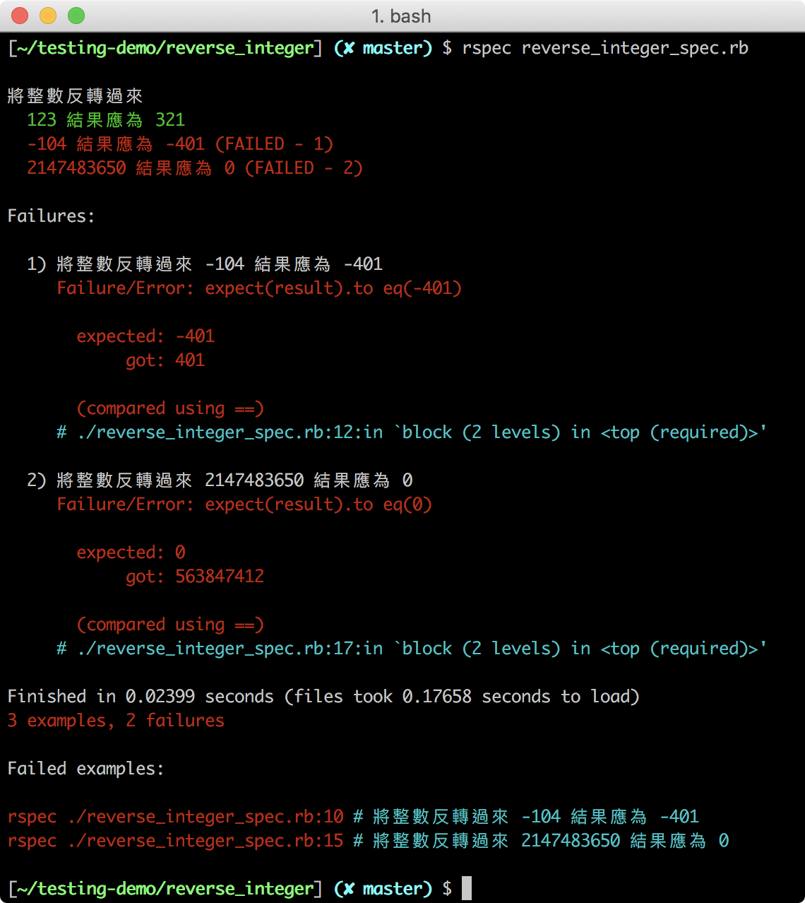
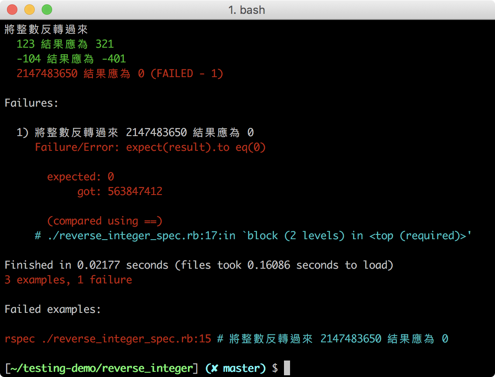

## RSpec 與實作（1）：Reverse Integer
> 能夠使用基本的 RSpec 語法撰寫測試案例

你已經在上個單元快速體驗了自動化測試，現在我們要用一個常見的題目 Prime Number 來進行自動化測試的練習，從實作中學習 RSpec 的基本語法。

### Red-Green-Refactor 循環

Red-Green-Refractor 循環是一種實作流程，我們在上個單元使用 RSpec 指令時，不通過的測試結果會顯示紅色（Red），而通過的會顯示綠色（Green）：
- Red - 先寫好測試案例，但還沒寫好功能，所以這時候測試自然是失敗的狀態
- Green - 寫好功能，使原本失敗的測試能通過
- Refactor - 將程式重構，讓程式碼更精簡，並維持通過的狀態

我們接下來就會採用 Red-Green-Refractor 循環來進行實作，因此我們會先寫測試案例，然後撰寫程式的功能，並在期間不斷重構。

### 分析 Reverse Integer 的輸入與輸出

Reverse Integer 是 LeetCode 的題目，給一個 32-bit 大小的整數，即從 -2147483647 到 2147483647 中挑出一個整數， 程式會將這個整數反轉過來，但若該整數超出範圍，則回傳 0。

讓我們從題目去分析輸入與輸出：
第一種情境，輸入的是一個正整數，輸出結果會是一個反轉的正整數。
第二種情境，輸入的是一個負整數，輸出結果會是一個反轉的負整數，負數符號的位置不變。
第三種情境，輸入的整數若超出範圍（ -2147483647 ～ 2147483647 ），輸出結果會是回傳 0。

#### 從分析設計測試案例

評估過輸入輸出後，至少會有以下三種測試案例：
- 如果整數為 123，結果為 321
- 如果整數為 -104，結果為 -401
- 如果整數為 2147483650，結果為 0

### 撰寫測試程式

請分別創建程式 **reverse_integer.rb** 和測試用程式 **reverse_integer_spec.rb** 的檔案，慣例上在替測試用程式命名時，會以原本的程式名稱加上 `_spec` 字樣作命名。

#### 設定測試結果的產出格式：.rspec

請新增一個 RSpec 設定檔，也就是 **.rspec** 檔，其內容如下：

請在 **rspec_tutorial_1** 資料夾內，新增一個 `.rspec` 檔，內容如下：
```diff .rspec
--format documentation
--color
```

以上設定分別是：
- `--format documentation`：讓我們在終端上能看到格式化的測試結果
- `--color`：讓我們在終端上看到有顏色的測試結果

#### 描述你要測試的程式：describe

我們會用 `describe` 語法描述要測試的程式，並在其範圍內撰寫測試案例，請在 **reverse_integer_spec.rb** 加入 `describe` 語法和描述要測試程式的文字：
```Ruby
describe "將整數反轉過來" do
  # 在這裡寫測試案例
end
```

#### 撰寫測試案例：it、expect、to eq

每一個 `it` 語法代表著一個測試案例，請將測試案例逐個寫入：
```Ruby
describe "將整數反轉過來" do

  it "123 結果應為 321" do
    # 在這裡寫上輸入資料與預期結果
  end

  it "-104 結果應為 -401" do
    # 在這裡寫上輸入資料與預期結果
  end

  it "4611686018427387906 結果應為 0" do
    # 在這裡寫上輸入資料與預期結果
  end

end
```

接著，我們要使用 `expect` 、 `to eq` 語法來撰寫測試案例的內容：
- `expect`：帶入結果
- `to eq`：帶入預期的結果，判斷結果是否等於符合預期


完成後的測試案例應如下所示：
```Ruby
describe "將整數反轉過來" do

  it "123 結果應為 321" do
    result = reverse_integer(123)
    expect(result).to eq(321)     # expect 帶入結果，to eq 帶入預期結果
  end

  it "-104 結果應為 -401" do
    result = reverse_integer(-104)
    expect(result).to eq(-401)    # expect 帶入結果，to eq 帶入預期結果
  end

  it "4611686018427387906 結果應為 0" do
    result = reverse_integer(4611686018427387906)
    expect(result).to eq(0)       # expect 帶入結果，to eq 帶入預期結果
  end

end
```

#### 連結測試與測試用程式

最後，請在檔案最上方加上以下程式碼，將兩個檔案連結起來：
```Ruby
require_relative './reverse_integer.rb'
```

這裡想請大家先自行嘗試，根據測試案例逐個完成程式功能，再往下查看程式碼是否相似，這樣學習效果會更好。
[防雷圖] Ellen 李大師的巨作！！！！！！！！！！！！！

### 撰寫程式功能：反轉正整數

請打開 **reverse_integer.rb** 檔，讓我們針對第一個情境，將正整數反轉，撰寫程式碼：
```ruby
def reverse_integer(int)
  string = int.to_s     # 將整數轉換成字串
  string.reverse!       # 將字串反轉
  return string.to_i    # 將字串轉換成數字，並回傳
end
```

接著，請使用 `rspec` 指令進行測試，指令後要帶入測試程式的檔名：
```
rspec reverse_integer_spec.rb
```

結果應如下所示：


綠色的 `123 結果應為 321` 表示第一個測試案例通過了！

請仔細觀察第二個測試案例的產出結果，我們期望 -104 反轉後會成為 -401，但結果卻是 401，這是字串和數字在轉換之間引發的錯誤。

### 撰寫程式功能：反轉負整數

讓我們針對情境二，將負整數反轉，新增處理負整數的功能，再重構程式碼：
```ruby
def reverse_integer(int)
  string = int.to_s         # 將整數轉換成字串
  string.reverse!           # 將字串反轉
  result = string.to_i      # 將字串轉換成數字，存入 result
  result *= -1 if int < 0   # 如果原來的整數是負數，result 變成負數
  return result
end
```

請使用 `rspec reverse_integer_spec.rb` 指令進行測試，結果應如下所示：



這次我們多了一個綠色的 `-104 結果應為 -401` 表示第二個測試案例也通過了！

### 撰寫程式功能：限制整數範圍

我們只剩下最後一個程式功能要完成，即將輸入的整數限縮在範圍內（ -2147483647 到 2147483647 ），超過這個範圍就回傳 0。

新增限制整數範圍的功能後，程式碼應如下所示：
```ruby
def reverse_integer(int)
  return 0 if int > 2147483647 || int < -2147483647 # 超出範圍回傳 0
  string = int.to_s         # 將整數轉換成字串
  string.reverse!           # 將字串反轉
  result = string.to_i      # 將字串轉換成數字，存入 result
  result *= -1 if int < 0   # 如果原來的整數是負數，result 變成負數
  return result
end
```

請使用 `rspec reverse_integer_spec.rb` 指令進行測試：



全部都是綠色的文字！表示所有測試案例都通過了！

### 重構你的程式碼

最後讓我們在保持測試案例都通過的情況下，進行程式碼的重構，讓程式碼更精簡，重構方式有很多種，這裡提供一種讓大家參考：

```ruby
def reverse_integer(int)
  return 0 if int > 2147483647 || int < -2147483647
  result = int.to_s.reverse!.to_i     # 整數轉換成字串，反轉後再變回整數
  result *= -1 if int < 0
  return result
end
```

恭喜你！你透過練習完成了 Red-Green-Refractor 循環的實作流程，也初步了解如何使用 RSpec 語法撰寫測試程式。

### 小結

以下是撰寫自動化測試時要注意事項：
- 一個 it 裡面只有一種測試目的，最好只有一個 expectation
- 先從測試失敗的案例開始
- 確保每個測試都有效益，不會發生砍掉實作卻沒有造成任何測試失敗
- 一開始的實作不一定要先直攻一般解，可以一步一步在循環中進行思考和重構
- 測試程式碼的可讀性比 DRY 更重要
- 安全重構：無論是改實作或是改測試碼，當時的狀態應該要維持 Green

下個單元，我們會介紹更多的 RSpec 語法和指令。
