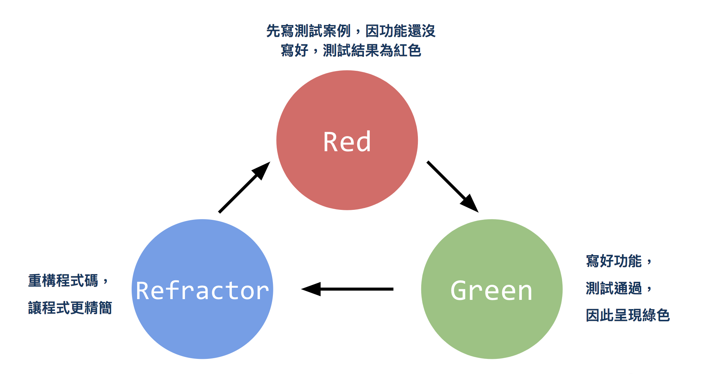
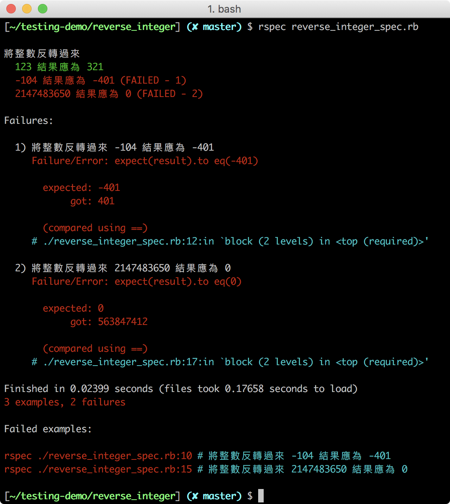
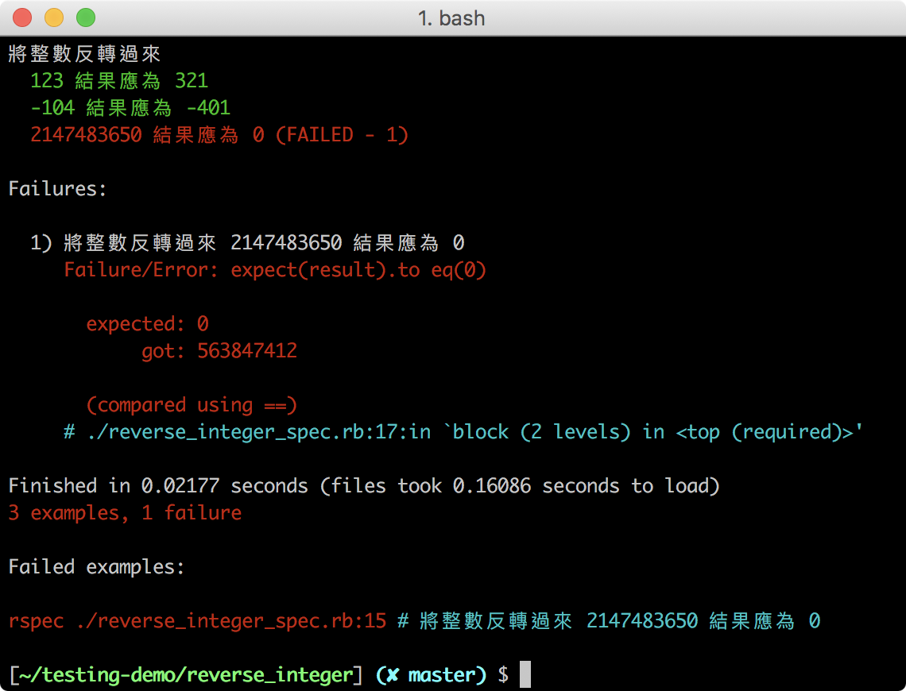
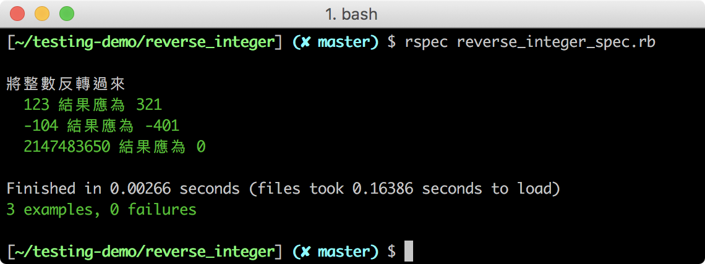

## RSpec 與實作（1）：Reverse Integer
> 能夠使用基本的 RSpec 語法撰寫測試案例
> 能夠使用 Red-Green-Refractor 循環完成程式

你已經在上個單元快速體驗了自動化測試，現在讓我們用一 LeetCode 題目 Reverse Integer 來進行自動化測試的練習，從實作中學習 RSpec 的基本語法。

### Red-Green-Refactor 循環

Red-Green-Refractor 循環是一種實作測試的流程，在上個單元使用 RSpec 指令時，不通過的測試會顯示紅色（Red），通過的會顯示綠色（Green）：
- Red - 先寫好測試案例，但還沒寫好功能，所以這時候測試自然是失敗的狀態
- Green - 寫好功能，使原本失敗的測試能通過
- Refactor - 將程式重構，讓程式碼更精簡，並維持通過的狀態



我們接下來就會採用 Red-Green-Refractor 循環來進行實作，因此我們會先寫測試案例，然後再撰寫程式的功能，並在期間不斷重構。

### 設計 Reverse Integer 的測試案例

#### Reverse Integer 題目說明

給一個 32-bit 大小的整數，即從 -2147483647 到 2147483647 中挑出一個整數， 程式會將這個整數反轉過來，然而正反轉換不會有正負數的變化，負整數反轉後依然會是負整數，正整數亦然；但若該整數超出範圍，則回傳 0。

#### 從題目思考測試情境

請先停下思考，根據題目的說明，Reverse Integer 會有哪幾種類型的資料輸入？

我們能確定輸入的資料會是一個整數，而整數有分成正整數和負整數。

因此，我們至少會有兩種情境：
- 輸入正整數，輸出結果會是一個反轉的正整數
- 輸入負整數，輸出結果會是一個反轉的負整數，負數符號的位置不變

而最後題目還有一個提醒，就是超出範圍值（ -2147483647 ～ 2147483647 ）的整數，回傳 0，因此超出範圍值的整數，就全計入第三種情境。

#### 依情境設計測試案例

讓我們來為三個情境設計測試案例：
- 正整數：如果整數為 123，結果為 321
- 負整數：如果整數為 -104，結果為 -401
- 超出範圍：如果整數為 2147483650，結果為 0

### 撰寫測試程式

請分別創建程式 **reverse_integer.rb** 和測試用程式 **reverse_integer_spec.rb** 的檔案，慣例上在替測試程式命名時，會以原本的程式名稱加上 `_spec` 字樣作命名。

#### 設定測試結果的產出格式：.rspec

請新增一個 RSpec 設定檔，也就是 **.rspec** 檔，其內容如下：

請在 **rspec_tutorial_1** 資料夾內，新增一個 `.rspec` 檔，內容如下：
```
--format documentation
--color
```
_Path: .rspec_

以上設定分別是：
- `--format documentation`：讓我們在終端上能看到格式化的測試結果
- `--color`：讓我們在終端上看到有顏色的測試結果

#### 描述你要測試的程式：describe

我們會用 `describe` 語法描述要測試的程式，並在其範圍內撰寫測試案例，請在 **reverse_integer_spec.rb** 加入 `describe` 語法和描述要測試程式的文字：
```Ruby
describe "將整數反轉過來" do
  # 在這裡寫測試案例
end
```
_Path: reverse_integer_spec.rb_

#### 撰寫測試案例：it、expect、to eq

每一個 `it` 語法代表著一個測試案例，請將測試案例逐個寫入：
```Ruby
describe "將整數反轉過來" do

  it "123 結果應為 321" do
    # 在這裡寫上輸入資料與預期結果
  end

  it "-104 結果應為 -401" do
    # 在這裡寫上輸入資料與預期結果
  end

  it "2147483650 結果應為 0" do
    # 在這裡寫上輸入資料與預期結果
  end

end
```
_Path: reverse_integer_spec.rb_

接著，我們要使用 `expect` 、 `to eq` 語法來撰寫測試案例的內容：
- `expect`：帶入結果
- `to eq`：帶入預期的結果，判斷結果是否等於符合預期


完成後的測試案例應如下所示：
```Ruby
describe "將整數反轉過來" do

  it "123 結果應為 321" do
    result = reverse_integer(123)
    expect(result).to eq(321)     # expect 帶入結果，to eq 帶入預期結果
  end

  it "-104 結果應為 -401" do
    result = reverse_integer(-104)
    expect(result).to eq(-401)    # expect 帶入結果，to eq 帶入預期結果
  end

  it "2147483650 結果應為 0" do
    result = reverse_integer(2147483650)
    expect(result).to eq(0)       # expect 帶入結果，to eq 帶入預期結果
  end

end
```
_Path: reverse_integer_spec.rb_

#### 連結測試與測試用程式

最後，請在檔案最上方加上以下程式碼，將兩個檔案連結起來：
```Ruby
require_relative './reverse_integer.rb'
```
_Path: reverse_integer_spec.rb_

這裡想請大家先自行嘗試，根據測試案例逐個完成程式功能，再往下查看程式碼是否相似，這樣學習效果會更好。

#[防雷圖] 拜託 Ellen 李大師

### 撰寫程式功能：反轉正整數

請打開 **reverse_integer.rb** 檔，讓我們針對第一個情境，將正整數反轉，撰寫程式碼：
```ruby
def reverse_integer(int)
  string = int.to_s     # 將整數轉換成字串
  string.reverse!       # 將字串反轉
  return string.to_i    # 將字串轉換成數字，並回傳
end
```
_Path: reverse_integer.rb_

接著，請使用 `rspec` 指令進行測試，指令後要帶入測試程式的檔名：
```
rspec reverse_integer_spec.rb
```

結果應如下所示：


綠色的 `123 結果應為 321` 表示第一個測試案例通過了！

請仔細觀察第二個測試案例的產出結果，我們期望 -104 反轉後會成為 -401，但結果卻是 401，這是字串和數字在轉換之間引發的錯誤。

### 撰寫程式功能：反轉負整數

讓我們針對情境二，將負整數反轉，新增處理負整數的功能，再重構程式碼：
```ruby
def reverse_integer(int)
  string = int.to_s         # 將整數轉換成字串
  string.reverse!           # 將字串反轉
  result = string.to_i      # 將字串轉換成數字，存入 result
  result *= -1 if int < 0   # 如果原來的整數是負數，result 變成負數
  return result
end
```
_Path: reverse_integer.rb_

請使用 `rspec reverse_integer_spec.rb` 指令進行測試，結果應如下所示：



這次我們多了一個綠色的 `-104 結果應為 -401` 表示第二個測試案例也通過了！

### 撰寫程式功能：限制整數範圍

我們只剩下最後一個程式功能要完成，即將輸入的整數限縮在範圍內（ -2147483647 到 2147483647 ），超過這個範圍就回傳 0。

新增限制整數範圍的功能後，程式碼應如下所示：
```ruby
def reverse_integer(int)
  return 0 if int > 2147483647 || int < -2147483647 # 超出範圍回傳 0
  string = int.to_s         # 將整數轉換成字串
  string.reverse!           # 將字串反轉
  result = string.to_i      # 將字串轉換成數字，存入 result
  result *= -1 if int < 0   # 如果原來的整數是負數，result 變成負數
  return result
end
```
_Path: reverse_integer.rb_

請使用 `rspec reverse_integer_spec.rb` 指令進行測試：



全部都是綠色的文字！表示所有測試案例都通過了！

### 重構你的程式碼

最後讓我們在保持測試案例都通過的情況下，進行程式碼的重構，讓程式碼更精簡，重構方式有很多種，這裡提供一種讓大家參考：

```ruby
def reverse_integer(int)
  return 0 if int > 2147483647 || int < -2147483647
  result = int.to_s.reverse!.to_i     # 整數轉換成字串，反轉後再變回整數
  result *= -1 if int < 0
  return result
end
```
_Path: reverse_integer.rb_

恭喜！你已透過練習完成了 Red-Green-Refractor 循環的實作流程，也初步了解如何使用 RSpec 語法撰寫測試程式！

### 小結

你已經學會自動化測試和 RSpec 的基本語法了，但在撰寫自動化測試時有不少需要注意的事項和細節：
- 一個 `it` 裡面盡可能只有一個測試案例，也最好只有一個預期結果
- 先從測試失敗的案例開始修改
- 確保每個測試都有效益，不會發生砍掉實作卻沒有造成任何測試失敗
- 一開始的實作不一定要先直攻一般解，可以一步一步在循環中進行思考和重構
- 測試程式碼的可讀性比 DRY 更重要
- 無論是改實作或是改測試碼，測過的案例狀態應該要維持 Green

下個單元，我們會介紹更多的 RSpec 語法和指令。


## Quiz

### Q1

關於 RSpec 語法，以下何者是正確的？（多選題）

- <mark>紅色代表失敗</mark>
- <mark>expect 要帶入執行程式的結果</mark>
- <mark>to eq 要帶入預期的結果</mark>
- <mark>describe 用於描述要進行測試的程式</mark>

答：1、2、3、4
註記：所有選項都是正確的，都可以在內文找到。

### Q2

以下哪個選項關於 Red-Green-Refractor 循環的描述是正確的？（多選題）

- 先寫好程式，才進行測試
- <mark>循環裡的 Green 是指把寫好功能把原本不能通過的測試案例給通過</mark>
- <mark>先寫好測試案例，才開始寫程式</mark>
- <mark>重構是讓程式碼變得更精簡，但要維持在通過的狀態</mark>

答：2、3、4
註記：Red-Green-Refractor 循環先寫測試案例才寫程式，所以才會先看到全部紅色的結果，Red 才會是第一個位置。
