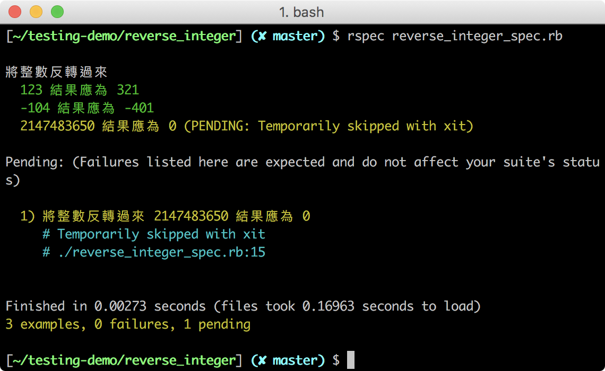

## RSpec 語法簡介

你已經快速體驗了 RSpec 的妙用，也透過簡單的練習熟悉了部分 RSpec 的語法，本單元會提供更全面的 RSpec 語法說明。

### RSpec 指令

安裝 RSpec：
```
gem install rspec
```

要設定 RSpec 的產出格式需要 **.rspec** 檔，你可以手動創建一個，或使用指令創建 .rspec 檔：
```
rspec --init
```
**.rspec** 檔主要是讓我們在使用 `rspec` 指令執行測試程式時，帶入**.rspec** 檔內的設定作為副指令，如：
- `--format documentation`：產出更詳盡的分類和測試案例
- `--color`：產出結果用顏色區分

若你想認識更多的 rspec 副指令，可用 `--help` 查詢：
```
rspec  --help
```

執行測試程式：
```
rspec filename
```

### RSpec 資料夾結構

在使用 RSpec 測試 Ruby 程式時，通常會開一個專案資料夾，在裡面建立不同的資料夾管理不同目的的檔案：

- **lib**：管理程式碼
- **spec**：管理測試程式
- **.rspec**：產出格式的設定檔

### RSpec 語法

#### 描述功能與情境：describe、context

`describe` 和 `context` 是幫助組織和分類，兩者可任意套疊。它的參數可以是一個類別，或是一組字串描述：

```Ruby
describe Transaction do
  describe "#price" do
    context "If user is member" do
     # ...
    end

   context "If user is not member" do
      # ...
    end
  end
end
```

在上述例子裡，我們要測試 `Transaction` 裡的 `price` 方法，在 `user` 是會員和非會員的情況下購買物品的價格會打多少折扣。

在撰寫測試程式時，最外層通常是我們想要測試的類別（class），然後下一層是該類別的方法（method），然後是不同的情境（context），最後才到測試案例。

#### 描述測試案例：it

每個 `it` 是一個測試案例，在 `it` 裡要清楚描述測試的事情：

```Ruby
describe Transaction do
  describe "#price" do
    context "If user is member" do
      it "Discount 5% if total > 1000" do
        # ..
      end

      it "Discount 10% if total > 10000" do
        # ..
      end
    end

    context "If user is not member" do
      it "No discount if not member" do
        # ..
      end
    end
  end
end
```

#### 設定並比較預期結果：expect、to、eq

我們會在每個 `it` 裡，用 `expect`、`to` 和 `eq` 來設定和比較實際結果與預期結果，我們會在 `expect` 內帶入是實際結果，在 `eq` 內帶入預期結果：
```Ruby
describe Transaction do
  describe "#price" do
    context "If user is member" do

      it "Discount 5% if total > 1000" do
        user = User.new( :is_member => true )
        transaction = Transaction.new( :user => user, :total => 2000 )
        expect(transaction.price).to eq(1900)
      end

      # 其他測試案例
    end
    # 其他測試情境
  end
end
```

我們也可以用 `not_to` 取代 `to` 改為反向判斷：

```Ruby
expect(result).not_to eq(wrong_result)
```

除了已使用過的等於判斷函式 `eq`，也還有許多判斷函式，RSpec 稱之為 Matcher，以下是用於判斷大小的 Matcher：

|大小判斷| RSpec 語法|
|--|--|
大於 | expect(actual).to be >  expected|
大於等於|expect(actual).to be >= expected|
小於等於|expect(actual).to be <= expected|
小於|expect(actual).to be <  expected|

若想了解更多 Matcher，請參考：https://relishapp.com/rspec/rspec-expectations/docs/built-in-matchers

#### 測試的前置與後置作業：before、after

使用 `before` 和 `after` 可以在每段 `it` 或 `describe` 執行前後進行程式碼的設定，如：宣告物件、加入物件新的資料。

- `before(:each)`：每段 `it` 前執行
- `before(:all)`：整段 `describe` 前只執行一次
- `after(:each)`：每段 `it` 後執行
- `after(:all)`：整段 `describe` 後只執行一次

以下提供一範例，在每個 `it` 開始前使用 `before` 宣告好 `user` 和 `transaction`，在 `it` 內只設定 `total` 屬性：

```Ruby
describe Transaction do
  describe "#price" do
    context "If user is member" do

      before(:each) do
        @user = User.new( :is_member => true )
        @transaction = Transaction.new( :user => @user )
      end

      it "Discount 5% if total > 1000" do
        @transaction.total = 2000
        expect(transaction.price).to eq(1900)
      end

      # 其他測試案例
    end
    # 其他測試情境
  end
end
```

#### 關閉測試案例：xit

在撰寫測試案例時，並不會一口氣完成所有的測試案例，有時候會只寫測試案例的標題，有時候則是不想跑該測試案例，這時你可以在每個 `it` 前加上 `x` 變成 `xit` 關閉該測試案例。

以下是上個單元的 `reverse integer` 測試程式，我們將最後一個測試案例的 `it` 更動為 `xit` ：

```ruby
require_relative './reverse_integer.rb'

describe "將整數反轉過來" do

  it "123 結果應為 321" do
    result = reverse_integer(123)
    expect(result).to eq(321)
  end

  it "-104 結果應為 -401" do
    result = reverse_integer(-104)
    expect(result).to eq(-401)
  end

  xit "4611686018427387906 結果應為 0" do
    result = reverse_integer(4611686018427387906)
    expect(result).to eq(0)
  end

end

```

結果會如下圖產生黃色的結果與 `PENDING` 字樣，表示我們跳過了那個測試案例：



### 小結


以下是撰寫自動化測試時要注意事項：
- 一個 it 裡面只有一種測試目的，最好只有一個 expectation
- 先從測試失敗的案例開始
- 確保每個測試都有效益，不會發生砍掉實作卻沒有造成任何測試失敗
- 一開始的實作不一定要先直攻一般解，可以一步一步在循環中進行思考和重構
- 測試程式碼的可讀性比 DRY 更重要
- 安全重構：無論是改實作或是改測試碼，當時的狀態應該要維持 Green


### 參考資料
- 如何寫出好的測試案例：http://www.betterspecs.org/
