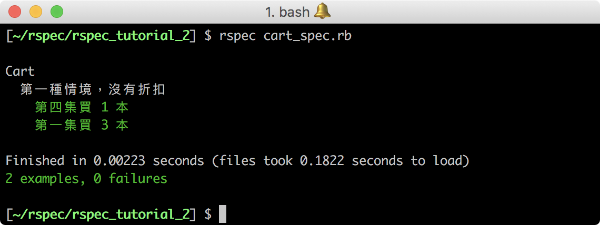
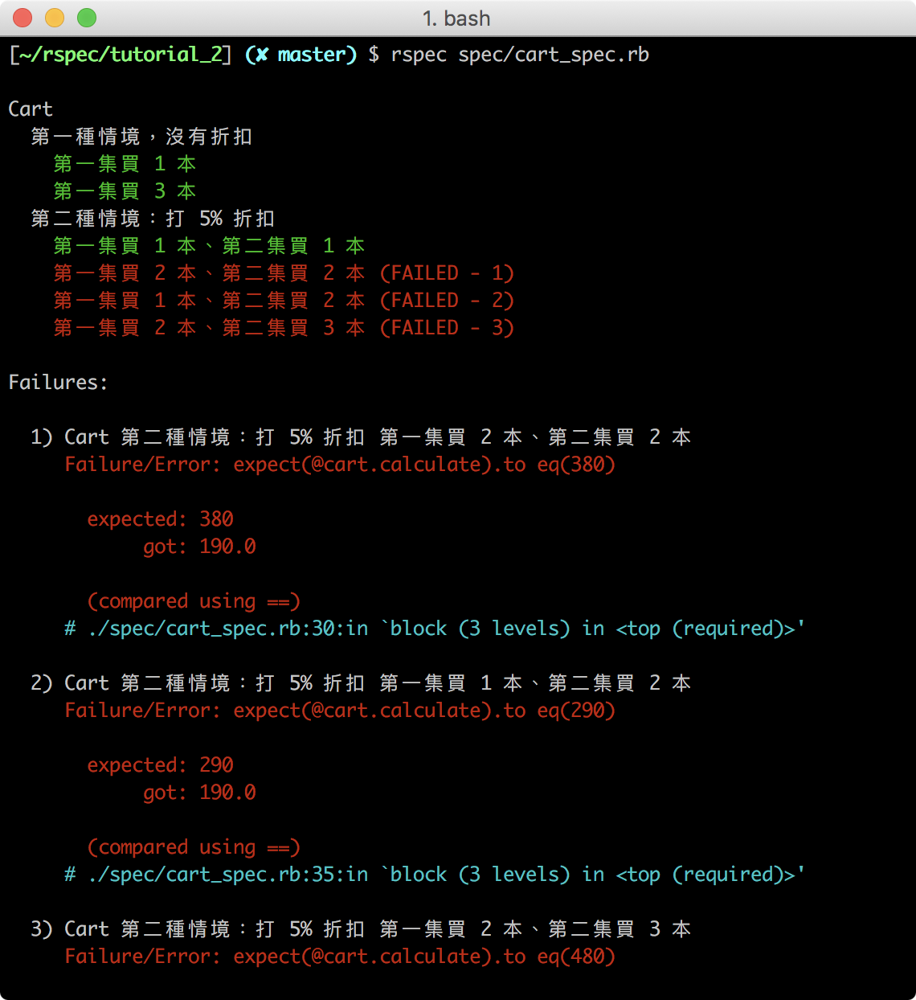

## RSpec 實作（2）：波特賣書
> 能夠使用 RSpec 語法撰寫類別的測試案例
> 能夠使用 Red-Green-Refractor 循環完成程式

你已經懂得撰寫單一功能的測試案例，現在我們要來撰寫情境更複雜的的測試案例，藉由實際題目練習新的 RSpec 語法和 Red-Green—Refractor 循環。

### 波特賣書（Potter Kata） 題目說明

有一家書店在賣哈利波特系列的書籍，共有五集的哈利波特，每一本哈利波特定價為 100 元，為了推廣哈利波特，書店訂定了以下優惠：

- 購買兩本不同集的哈利波特可以打 5% 折扣
- 購買三本不同集的哈利波特可以打 10% 折扣
- 購買四本不同集的哈利波特可以打 20% 折扣
- 購買五本不同集的哈利波特可以打 25% 折扣

因此，我們要來寫出一個可以計算出書籍總價的函式。

#### 輸入函式的資料：陣列

這個函式會輸入一個代表書籍的陣列，如： `[1,2,2,2]` 表示有 1 本第一集和 3 本第二集的哈利波特。

#### 函式輸出的結果：總價

陣列 `[1,2,2,2]` 經過函式演算後，由於 1 + 2 為一組，折扣 5% 後價格為 190，再加上兩本書總價為 200，產出的結果會是 190 + 200 = 390 元。

### 設計波特買書的測試案例

依照題目的描述，我們先處理兩個比較簡單的情境：不打折和打 5% 折扣的情境。

#### 情境一：不打折

若客戶只購買其中一集的哈利波特，則總價不打折，購買其中一集的情境，主要分成兩種：
- 只買一集 1 本
- 買一集但多本

依照上面的情境，測試案例會如下所示：

|情境| 書籍 | 數量 | 總價  |  
|---|---|---|---|
| 只買 1 集 1 本| 第一集 | 1 | 100 |
| 買一集，但多本 | 第一集 | 3 | 300 |

#### 情境二：打 5% 折扣

若客戶購買兩本不同集的哈利波特，則會打 5% 的折扣，若兩本不同集的哈利波特為一組，那麼測試案例會有四種：
- 買一組：1 本第一集、1 本第二集的哈利波特
- 買多組：2 本第一集、2 本第二集的哈利波特
- 買一組 + 一本：1 本第一集、2 本第二集的哈利波特
- 買多組 + 一本：2 本第一集、3 本第二集的哈利波特

其透過函式計算出的總價應如下表所示：

| 書籍組合 | 公式 | 總價 |  
|---|---|---|
| 1 本第一集、1 本第二集 | ( 100 + 100 ) * 0.95 | 190 |
| 2 本第一集、2 本第二集 | ( 200 + 200 ) * 0.95 | 380 |
| 1 本第一集、2 本第二集 | ( 100 + 100 ) * 0.95 + 100 | 290 |
| 2 本第一集、3 本第二集 | ( 200 + 200 ) * 0.95 + 100 | 480 |

其他情境的測試案例可以此類推，讓我們來運用 Red-Green-Refractor 循環來完成上述測試案例和程式功能，過程中請謹記以下三個準則:
- 請先寫好測試案例，才開始實作程式功能
- 每次只新增一個測試情境，不用一次新增多個測試情境
- 每次實作功能時，只需要剛剛好通過測試即可，不多也不少

### 撰寫「不打折」的測試案例與程式

請為本題目創建一個資料夾 **rspec_tutorial_2**，並在裡面新增兩個資料夾和三個檔案：
- **.rspec**
- **lib/cart.rb**
- **spec/cart_spec.rb**

接著在 **.rspec** 裡加入 `--format documentation` 和 `--color` 設定測試產出格式。

#### 撰寫測試案例

現在我們要來撰寫第一個情境，即沒有打折扣的測試案例。

請打開 **cart_spec.rb**，將要測試的程式拉入其中：

```Ruby
require_relative 'cart.rb'
```
_Path: spec/cart_spec.rb_

接著，描述我們要測試的程式：
```Ruby
require_relative 'cart.rb'

describe Cart do

end
```
_Path: spec/cart_spec.rb_

我們會使用 `Cart`（購物車）物件來計算書的總價，使用 `cart.add` 方法把代表書籍的陣列放入，然後用 `cart.calculate` 方法計算出書的總價。

代表書籍在的陣列，每個陣列內容代表一本書，其數字代表第幾集：
- `[1]` ：一本第一集的哈利波特
- `[1,1,1]` ：三本第一集的哈利波特

由於我們使用物件來計算，因此我們會使用 RSpec 的  `before` 語法，在每個 it 測試前宣告一個 `cart` 物件：

```Ruby
require_relative 'cart.rb'

describe Cart do

  before :each do
    @cart = Cart.new
  end

end
```
_Path: spec/cart_spec.rb_

接著，使用 `context` 語法描述情境，在該情境內使用 `it`、`expect` 和 `to eq` 語法撰寫兩個測試案例：

```Ruby
describe Cart do

  before :each do
    @cart = Cart.new
  end

  context "第一種情境：不打折" do

    it "第一集買 1 本 : [1]" do
      @cart.add([1])
      expect(@cart.calculate).to eq(100)
    end

    it "第一集買 3 本 : [1,1,1]" do
      @cart.add([1,1,1])
      expect(@cart.calculate).to eq(300)
    end

  end
end
```
_Path: spec/cart_spec.rb_

小撇步：你可以在 `it` 內的字串寫上你輸入的資料，這樣在測試時會更容易檢索自己輸入了什麼資料，如第一個測試案例的 `it`：`第一集買 1 本 : [1]`。

#### 撰寫計算程式

請打開 **cart.rb**，創建一個 `Cart` class，並為這個 class 定義 `add` 和 `calculate` 方法。
- `add` 方法會帶入一個陣列，並存入一個實例變數 `@books` 裡
- `calculate` 方法會回傳一個書籍的總價

請完成以上程式碼的撰寫，內容應如下所示：
```Ruby
class Cart

  def add(books)
    @books = books            # 把輸入的資料存起來
  end

  def calculate
    return @books.size * 100  # 根據書籍多少回傳總價
  end

end
```
_Path: lib/cart.rb_


#### 進行測試

請執行 `rspec cart_spec.rb` 指令測試你的程式碼，確認結果為綠色。



成功通過測試後，讓我們繼續撰寫下一個情境的測試案例。

### 撰寫「打 5% 折扣」的測試案例與程式

#### 撰寫測試案例

依照之前定義好的三個測試案例，請使用 `context` 描述「打 5% 折扣」的情境，並使用 `it`、`expect` 和 `to eq` 撰寫測試案例：

```Ruby
require_relative './cart.rb'

describe Cart do

  # 設定測試案例前要宣告 cart
  # 第一種情境的程式碼

  context "第二種情境：打 5% 折扣" do

    it "第一集買 1 本、第二集買 1 本 : [1,2]" do
      @cart.add([1,2])
      expect(@cart.calculate).to eq(190)
    end

    it "第一集買 2 本、第二集買 2 本 : [1,1,2,2]" do
      @cart.add([1,1,2,2])
      expect(@cart.calculate).to eq(380)
    end

    it "第一集買 1 本、第二集買 2 本 : [1,2,2]" do
      @cart.add([1,2,2])
      expect(@cart.calculate).to eq(290)
    end

    it "第一集買 2 本、第二集買 3 本 : [1,1,2,2,2]" do
      @cart.add([1,1,2,2,2])
      expect(@cart.calculate).to eq(480)
    end

  end

end
```
_Path: spec/cart_spec.rb_

#### 撰寫計算程式

請打開 **cart.rb**，在 `calculate` 繼續撰寫「打 5% 折扣」的功能，以下提供一完成了第二個情境的程式碼供參考：

```Ruby
class Cart

  def add(books)
    @books = books
  end

  def empty?(books)                 # 判斷陣列內是否還有書要計算
    empty = true
    for i in books do
      (empty = false) if i > 0
    end
    empty
  end

  def calculate

    price = 0
    organize_books = [0,0,0,0,0]    # 一個代表五集哈利波特的陣列，每個陣列內容對應一集哈利波特的數量

    for i in @books do
      organize_books[i-1] += 1      # 將 @books 分類到 organize_books
    end

    combo = []                      # 計算不同組合打折用的陣列

    while !empty?(organize_books)   # 當陣列裡還有書時才執行
      combo.push(5 - organize_books.count(0)) # 用 0 的數量反向找出打折組合
      5.times do |i|                
        organize_books[i] -= 1 if organize_books[i] > 0 # # 陣列裡的書籍數量 - 1，但最小是 0，不會超過
      end
    end

    for i in 0...combo.size do      # 把所有打折組合吐出來
      if combo[i] == 1              # 只有單本書時不打折 = 100
        price += 100
      elsif combo[i] == 2           # 有兩本不同書時打五折 = 190
        price += 190
      end
    end
    return price

  end
end
```

_Path: lib/cart.rb_

#### 進行測試

請執行 `rspec cart_spec.rb` 指令測試你的程式碼，確認結果全為綠色。

 

### 小結

透過本次練習，你應該已經對自動化測試有較全面的認識，但在實際開發時，除了流程與語法，你將不知不覺面對以下問題：

- 要撰寫多少測試案例才能完全涵蓋規格和所有的可能性？
- 每次循環，程式都會變得越來越複雜，是否該重構？還是繼續寫？若重構，如何確保在重構時不會改壞之前寫好的程式？
- 如何確保每個測試案例都有效益？不會發生刪除程式碼後，測試案例依舊能全部通過的情況
- 測試案例會新增越來越多的例外情況，實作該如何因應來越改越通用？
- 程式的介面要如何設計，才會方便測試和使用？
- 測試用程式的程式碼品質在可讀性和擴增性上也需要和程式本身相等重要嗎？

以上問題沒有絕對的答案，唯有不斷練習累積經驗，才能在不同的情況下判斷最適當的處理方式。

下個章節，我們會介紹「測試驅動開發」，不過在進入下個章節前，請先完成 Assignment 的題目，累積撰寫測試案例的經驗。

## Quiz

### Q1

針對波特買書，我們實際上要測的方法是 ... ？（多選題）

- <mark>cart.add</mark>
- <mark>cart.calculate</mark>
- Cart.new
- <mark>empty?</mark>

答：1、2、4
註記：我們並沒有撰寫 new，因此 new 只是前置作業，不算是我們要測試的方法之一。
