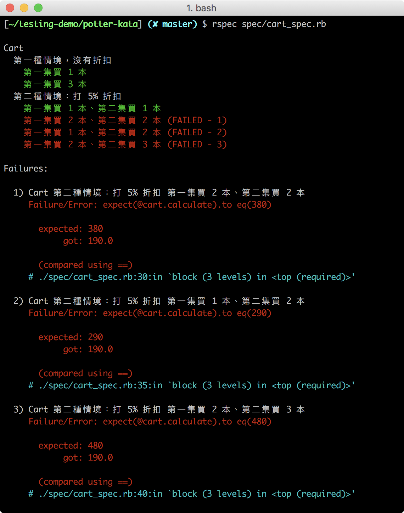

## RSpec 實作（2）：波特賣書
> 能夠使用 RSpec 語法撰寫類別的測試案例

你已經懂得撰寫單一功能的測試案例，在這個單元裡，我們要來撰寫情境更複雜的的測試案例。我們會運用一道經典的 Kata 題目，來練習 Red-Green-Refractor 的測試實作流程。

### Red-Green-Refactor 與 TDD

Red-Green-Refractor 循環是一種實作測試的流程，在 RSpec 輸出測試結果時，不通過的測試會顯示紅色（Red），通過的會顯示綠色（Green），因此，在實作時形成了一個「Test-driven development」的循環：


你會先撰寫測試，此時因為還沒寫功能，所以執行測試會亮紅燈，測試失敗。
接著，針對你的測試，撰寫恰恰好的程式碼，讓綠燈亮起，測試通過。
最後，將程式重構，讓程式碼更精簡，重構過程中維持綠燈狀態。

這種循環被稱為「測試驅動開發 (Test-driven development)」

我們接下來就會採用 Red-Green-Refractor 循環來進行實作，因此我們會先寫測試案例，然後再撰寫程式的功能，並在期間不斷重構。

### Potter Kata 題目說明

這是一道經典的 Kata 題目。

有一家書店在賣哈利波特系列的書籍，共有五集的哈利波特，每一本哈利波特定價為 100 元，為了推廣哈利波特，書店訂定了以下優惠：

- 購買兩本不同集的哈利波特可以打 5% 折扣
- 購買三本不同集的哈利波特可以打 10% 折扣
- 購買四本不同集的哈利波特可以打 20% 折扣
- 購買五本不同集的哈利波特可以打 25% 折扣

因此，我們要來寫一個可以計算出書籍總價的功能。

#### 定義輸入資料：Hash

我們會輸入一個代表書籍的 Hash，如果客戶買了 1 本第一集的哈利波特和 3 本第二集的哈利波特，資料會如下所示：
```Ruby
items = { "1st" => 1, "2nd" => 3, "3rd" => 0, "4th" => 0, "5th" => 0 }
```
Key 代表的是哪一集的哈利波特，如 `1st` 是第一集，Value 代表的是買了多少本。

#### 定義輸出結果：總價

將上述 Hash 傳入程式，經過運算後，最後會回傳一個正整數，代表總價。

運算過程會去分析哪些書要打折、哪些書照原價，例如，若依照上述的 Hash 資料，因為買了兩本不同集的書 （1st & 2nd），這一組要折扣 5%，而剩餘的書依原價計算：

|折扣組合| 依原價 | 總價  |  
|---|---|---|
| （100 + 100）* 0.95 | 2 * 100  | 390 |

### 設計測試案例

在本單元裡，我們會示範「不打折」和「打 5% 折扣」的情境，剩下的情境會留作 Assignment。

#### 情境一：不打折

若客戶只購買其中一集的哈利波特，則總價不打折，購買其中一集的情境，主要分成兩種：
- 只買一集 1 本
- 買一集但多本

依照上面的情境，測試案例會如下所示：

|情境| 書籍 | 數量 | 總價  |  
|---|---|---|---|
| 只買 1 集 1 本| 第一集 | 1 | 100 |
| 買一集，但多本 | 第一集 | 3 | 300 |

#### 情境二：打 5% 折扣

若客戶購買兩本不同集的哈利波特，則會打 5% 的折扣，若兩本不同集的哈利波特為一組，那麼測試案例會有四種：
- 買一組：1 本第一集、1 本第二集的哈利波特
- 買多組：2 本第一集、2 本第二集的哈利波特
- 買一組 + 一本：1 本第一集、2 本第二集的哈利波特
- 買多組 + 一本：2 本第一集、3 本第二集的哈利波特

其透過函式計算出的總價應如下表所示：

| 書籍組合(輸入值) | 公式 | 總價(輸出值) |  
|---|---|---|
| `{ "1st" => 1, "2nd" => 1}` | ( 100 + 100 ) * 0.95 | 190 |
| `{ "1st" => 2, "2nd" => 2}` | 2 * ( 100 + 100 ) * 0.95 | 380 |
| `{ "1st" => 1, "2nd" => 2}` | ( 100 + 100 ) * 0.95 + 100 | 290 |
| `{ "1st" => 2, "2nd" => 3}` | 2 * ( 200 + 200 ) * 0.95 + 100 | 480 |

以此類推，讓我們來運用 Red-Green-Refractor 循環來完成上述測試案例和程式功能，過程中請謹記以下三個準則：
- 請先寫好測試案例，才開始實作程式功能
- 每次只新增一個測試情境，不用一次新增多個測試情境
- 每次實作功能時，只需要剛剛好通過測試即可，不多也不少

### 「不打折」測試與功能實作

#### 準備檔案

請為本題目創建一個專用的資料夾目錄，以下是預期包含的內容：
- **.rspec**
- **lib/cart.rb**
- **spec/cart_spec.rb**
- **Gemfile** 和 **Gemfile.lock**

我們會宣告一個 Cart class 來管理買書與計價的方法，你可以把這個類別當成一個擴充模組看待，所以習慣上會用一個叫名 **lib** 的資料夾來管理這些模組，也就是「函式庫」（library）。至於測試檔就放在 **spec** 的資料夾裡，意思是「規格」。

先設定 **.rspec** 的內容：
```
--format documentation
--color
```
_Path: .rspec_

然後先把主程式和測試檔連結起來，請你打開 **cart_spec.rb**，將要測試的程式拉入其中，並使用 `describe` 規劃出一個程式碼區塊：

```Ruby
require_relative '../lib/cart.rb'

describe Cart do

end
```
_Path: spec/cart_spec.rb_

另外，在之前的練習，我們是手動去做了 `gem install`，但從專案的角度，你的資料夾內應該要把有相依性的 gem 也準備好，所以讓我們加入 **Gemfile**，把會用到的 rspec gem 安裝起來：

```Ruby
source 'https://rubygems.org'

gem 'rspec'
```
記得要在終端機裡執行 `bundle`，產生 **Gemfile.lock** 檔案

#### 撰寫測試案例

現在我們要來撰寫第一個情境，即沒有打折扣的測試案例。
我們會宣告一個 `Cart` 類別來撰寫功能，在寫測試的時候，你也會需要定義會用到的 `Cart` 方法，也就是 `Cart` 公開的 API 介面。在這裡，我們會定義了兩個方法：
- `add` 用於取得書籍的資料
- `calculate` 計算出書的總價

讓我們使用 `it`、`expect` 和 `to eq` 來呈現之前定義好的測試案例：

```Ruby
require_relative '../lib/cart.rb'

describe Cart do

  it "第一集買 1 本" do
    @cart = Cart.new
    @cart.add({ "1st": 1, "2nd": 0, "3rd": 0, "4th": 0, "5th": 0 })
    expect(@cart.calculate).to eq(100)
  end

  it "第一集買 3 本" do
    @cart = Cart.new
    @cart.add({ "1st": 3, "2nd": 0, "3rd": 0, "4th": 0, "5th": 0 })
    expect(@cart.calculate).to eq(300)
  end

end
```
_Path: spec/cart_spec.rb_

比較需要注意的是，你需要使用物件導向的形式，先宣告出 `Cart` 物件實例，然後呼叫該實例的方法。
此時因為你還沒有撰寫任何程式，如果在終端機執行 `rspec spec/cart_spec.rb`，結果會是一片紅燈：


#### 撰寫計算程式

請打開 **lib/cart.rb**，創建一個 `Cart` class，先設定一些已知的方法與資料：

```Ruby
class Cart

  PRICE = 100     # 每本書的單價是 100 元

  def add(items)
    @ordered_items = items.map{ |key,value| value }   # 把資料由 Hash 轉成陣列
  end

  def calculate    # 計算客戶所買的書本總價
    total = 0
    for item in @ordered_items do         # 把書拿出來計算
      total = total + item * PRICE
    end
    return total
  end

end
```
_Path: lib/cart.rb_

- `PRICE` ：代表每本書的單價，因為這個數字不會改變，所以設成常數
- `add` 方法：帶入資料，經處理後存入 `@ordered_items`，在這裡會直接使用 `map` 方法將 Hash 格式的資料轉成 Array，變成一個類似 `[1, 0, 0, 0, 0]` 的結構。
- `calculate` 方法：根據 `@ordered_items` 計算價格，會回傳總價

寫好程式之後，我們來試著執行 `rspec spec/cart_spec.rb` 指令測試你的程式碼，結果亮起了綠燈：


由於不打折的功能較為簡單，我們一次通過了兩個測試案例。

#### 重構測試程式

這時候我們可以停下來整理一下測試程式碼，首先，我們可以將重複用的到變數取出來，用 `before` 宣告一個區塊來統一管理：

```diff  
  describe Cart do

+   before do
+     @cart = Cart.new
+   end

    it "第一集買 1 本" do
-     @cart = Cart.new
      @cart.add({ "1st": 1, "2nd": 0, "3rd": 0, "4th": 0, "5th": 0 })
      expect(@cart.calculate).to eq(100)
    end

    it "第一集買 3 本" do
-    @cart = Cart.new
      @cart.add({ "1st": 3, "2nd": 0, "3rd": 0, "4th": 0, "5th": 0 })
      expect(@cart.calculate).to eq(300)
    end

  end
```
_Path: spec/cart_spec.rb_

考慮到接下來還要處理好幾個情境，我們也可以使用 `context` 語法來組織不同情境，`context` 的功能和 `describe` 一樣，不會影響到測試的執行，但會影響到輸出格式：

```diff
  describe Cart do

    before :each do
      @cart = Cart.new
    end

+   context "第一種情境：不打折" do

      it "第一集買 1 本" do
        @cart.add({ "1st": 1, "2nd": 0, "3rd": 0, "4th": 0, "5th": 0 })
        expect(@cart.calculate).to eq(100)
      end

      it "第一集買 3 本" do
        @cart.add({ "1st": 3, "2nd": 0, "3rd": 0, "4th": 0, "5th": 0 })
        expect(@cart.calculate).to eq(300)
      end

+    end

  end
```
_Path: spec/cart_spec.rb_

請執行 `rspec spec/art_spec.rb` 指令測試你的程式碼，你會看見輸出結果多了一個階層：


### 「打 5% 折扣」測試與功能實作


#### 撰寫測試案例

讓我們來把之前定義子的測試案例轉成 RSpec 規格，每一個 `it` 代表一組測試案例，並且用 `context` 來組織「打 5% 折扣」的情境：

```Ruby
require_relative '../lib/cart.rb'

describe Cart do

  # 設定測試案例前要宣告 cart
  # 第一種情境的程式碼

  context "第二種情境：打 5% 折扣" do

    it "第一集買 1 本、第二集買 1 本" do
      @cart.add({ "1st": 1, "2nd": 1, "3rd": 0, "4th": 0, "5th": 0 })
      expect(@cart.calculate).to eq(190)
    end

    it "第一集買 2 本、第二集買 2 本" do
      @cart.add({ "1st": 2, "2nd": 2, "3rd": 0, "4th": 0, "5th": 0 })
      expect(@cart.calculate).to eq(380)
    end

    it "第一集買 1 本、第二集買 2 本" do
      @cart.add({ "1st": 1, "2nd": 2, "3rd": 0, "4th": 0, "5th": 0 })
      expect(@cart.calculate).to eq(290)
    end

    it "第一集買 2 本、第二集買 3 本" do
      @cart.add({ "1st": 2, "2nd": 3, "3rd": 0, "4th": 0, "5th": 0 })
      expect(@cart.calculate).to eq(480)
    end

  end

end
```
_Path: spec/cart_spec.rb_

#### 案例：只買一組書，要打折

由於第二個情境較為複雜，所以這次會依照每個 `it` 的需求撰寫功能，只求剛剛好通過情境二的第一個測試案例：只買 1 組。

請打開 **cart.rb**，把 `calculate` 方法擴充成能處理「打 5% 折扣」的情境，以下是參考程式碼：

```Ruby
class Cart

  PRICE = 100     # 每本書的單價是 100 元

  def add(items)
    @ordered_items = items.map{ |key,value| value }   # 把資料由 Hash 轉成陣列
  end

  def calculate    # 計算客戶所買的書本總價
    total = 0
    @ordered_items = @ordered_items.delete_if{ |i| i == 0 } # 刪除客戶沒有買的哈利波特集數

    if @ordered_items.size == 2       # 如果買了一組，要依原價打 5% 折扣
      total = total + 2 * PRICE * 0.95
    else
      for item in @ordered_items do   # 如果只買了單集 1 本或多本，就原價計算
        total = total + item * PRICE
      end
    end

    return total
  end

end
```
_Path: lib/cart.rb_

執行 `rspec spec/cart_spec.rb`：

 

我們在第二個情境裡的第一個測試案例也通過了，並且沒有破壞到第一組情境，然而，情境二裡的另外三個測試案例還沒沒有通過。

#### 案例：有多組書籍，都要打折

接著讓我們要來撰寫情境二第二個測試案例，從這組案例開始，要開始處理書籍的折扣組合，在本案例中，我們先處理「有多組書籍，都要打折」的狀況。因此，我們準備的測資是 `{ "1st": 2, "2nd": 2, "3rd": 0, "4th": 0, "5th": 0 }`：

參考程式碼如下：

 ```Ruby
class Cart

  PRICE = 100     # 每本書的單價是 100 元

  def add(items)
    @ordered_items = items.map{ |key,value| value }   # 把資料由 Hash 轉成陣列
  end

  def calculate    # 計算客戶所買的書本總價
    total = 0
    @ordered_items = @ordered_items.delete_if{ |i| i == 0 } # 刪除客戶沒有買的哈利波特集數

    if @ordered_items.size == 2       # 如果客戶買了兩集的哈利波特
      while @ordered_items.size > 0   # 當還有書籍時
        total = total + 2 * PRICE * 0.95   # 把客戶買的一組哈利波特打折後計入總價
        @ordered_items[0] -= 1       # 刪除已計算過的書籍       
        @ordered_items[1] -= 1       # 刪除已計算過的書籍
        @ordered_items = @ordered_items.delete_if{ |i| i == 0 }
      end
    else
      for item in @ordered_items do   # 客戶只買了單一集的哈利波特
        total = total + item * PRICE
      end
    end

    return total
  end

end
```

_Path: lib/cart.rb_

執行 `rspec spec/cart_spec.rb` 指令測試你的程式碼，通過了情境二的第二組案例。


#### 案例：要打折和不打折的組合

情境二的第三個測試案例，必須能處理出現單組和單集 1 本的情況，同時將之前的測試案例也維持在通過的狀態。

請繼續撰寫程式功能，以下是範例程式碼：
 ```Ruby
 class Cart

   PRICE = 100     # 每本書的單價是 100 元

   def add(items)
     @ordered_items = items.map{ |key,value| value }   # 把資料由 Hash 轉成陣列
   end

   def calculate    # 計算客戶所買的書本總價
     total = 0
     @ordered_items = @ordered_items.delete_if{ |i| i == 0 } # 刪除客戶沒有買的哈利波特集數

     while @ordered_items.size > 0      # 當客戶還有書籍還沒計入時
       if @ordered_items.size == 2      # 如果客戶買了兩集的哈利波特
         total = total + 2 * PRICE * 0.95   # 把客戶買的一組哈利波特打折後計入總價
         @ordered_items[0] -= 1       # 刪除已計算過的書籍       
         @ordered_items[1] -= 1       # 刪除已計算過的書籍
         @ordered_items = @ordered_items.delete_if{ |i| i == 0 }
       else
         total = total + PRICE        # 把客戶賣得單集 1 本哈利波特計入總價
         @ordered_items[0] -= 1       # 刪除已計算過的書籍
         @ordered_items = @ordered_items.delete_if{ |i| i == 0 }
       end
     end

     return total
   end

 end
```
_Path: lib/cart.rb_

執行 `rspec spec/cart_spec.rb`：


恭喜你！雖然我們只是針對第三個測試案例撰寫程式功能，但也剛巧完成了第四個測試案例的功能，因此所有測試案例全數通過！

### 重構程式碼

程式碼雖然完成了，但仍有點雜亂，有許多重複的部分，有些程式碼的位置也不是很合適，有些程式碼則可以組合在一起，讓整個程式碼看起來更精簡和漂亮，在撰寫更完整的功能前，讓我們來重構一下目前的程式碼：

```Ruby
class Cart

  PRICE = 100

  def add(items)
    @ordered_items = items.map{ |key,value| value }.delete_if{ |i| i == 0 } #將資料轉換為陣列後，刪除客戶沒有買的哈利波特集數
  end

  def calculate
    total = 0

    while @ordered_items.size > 0         # 當客戶還有書籍尚未結帳時
      if @ordered_items.size == 2
        total = total + 2 * PRICE * 0.95  # 客戶買了一組哈利波特
      else
        total = total + PRICE             # 客戶買了單一本哈利波特
      end
      @ordered_items = @ordered_items.map{ |i| i -= 1 } # 刪除已計算過的書籍
      @ordered_items = @ordered_items.delete_if{ |i| i == 0 } # 把已經結完的集數刪除
    end

    return total
  end

end
```

完成後，請執行 `rspec spec/cart_spec.rb` 指令測試重構後的程式碼，確保在你重構之後所有測試案例還是維持在綠色！


### 小結

透過本次練習，你應該已經對自動化測試有較全面的認識，在實際開發時，除了流程與語法，你將不知不覺面對以下問題：

- 要撰寫多少測試案例才能完全涵蓋規格和所有的可能性？
- 每次循環，程式都會變得越來越複雜，是否該重構？還是繼續寫？若重構，如何確保在重構時不會改壞之前寫好的程式？
- 如何確保每個測試案例都有效益？不會發生刪除程式碼後，測試案例依舊能全部通過的情況
- 測試案例會新增越來越多的例外情況，實作該如何因應來越改越通用？
- 程式的介面要如何設計，才會方便測試和使用？
- 測試用程式的程式碼品質在可讀性和擴增性上也需要和程式本身相等重要嗎？

以上問題沒有絕對的答案，唯有不斷練習累積經驗，才能在不同的情況下判斷最適當的處理方式。

目前為止，我們不知不覺應用了 red-green-refactor 的流程來完成實作，在下個章節，我們會更正式的介紹「測試驅動開發 (Test-driven development)」，也就是聽起來很厲害的 TDD，了解如何從 TDD 的思維出來，進行程式碼設計。

不過在進入下個章節前，請先試著完成 Assignment 的題目，提高對 RSpec 的熟悉度。

```
你可以在[這裡](https://github.com/ALPHACamp/testing-demo/tree/master/potter-kata)看見與本單元的示範程式碼
```

#### Quiz

##### Q1

針對波特買書，我們實際上要測的方法是 ... ？（多選題）

- <mark>cart.add</mark>
- <mark>cart.calculate</mark>
- Cart.new
- PRICE # QUIZ 改了

答：1、2
註記：我們並沒有撰寫 new，因此 new 只是前置作業，而 PRICE 不是方法，只是屬性設定，因此這兩個選項不是我們要測試的方法。

##### Q2

以下哪個選項關於 Red-Green-Refractor 循環的描述是正確的？（多選題）

- 先寫好程式，才進行測試
- 循環裡的 Green 是指把寫好功能把原本不能通過的測試案例給通過
- 先寫好測試案例，才開始寫程式
- 重構是讓程式碼變得更精簡，但要維持在通過的狀態

答：2、3、4
註記：Red-Green-Refractor 循環先寫測試案例才寫程式，所以才會先看到全部紅色的結果，Red 才會是第一個位置。
