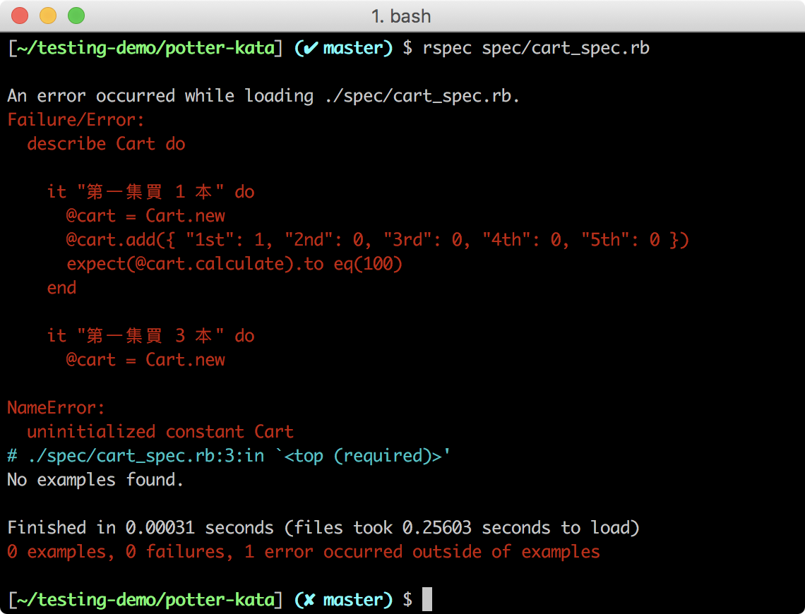
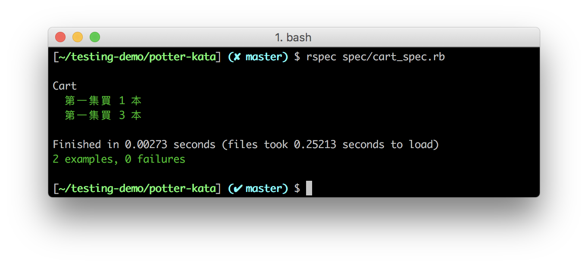

## RSpec 實作（2）：波特賣書
> 能夠使用 RSpec 語法撰寫類別的測試案例
> 能夠使用 Red-Green-Refractor 循環完成程式

你已經懂得撰寫單一功能的測試案例，現在我們要來撰寫情境更複雜的的測試案例，藉由實際題目練習新的 RSpec 語法和 Red-Green—Refractor 循環。

### 波特賣書（Potter Kata） 題目說明

有一家書店在賣哈利波特系列的書籍，共有五集的哈利波特，每一本哈利波特定價為 100 元，為了推廣哈利波特，書店訂定了以下優惠：

- 購買兩本不同集的哈利波特可以打 5% 折扣
- 購買三本不同集的哈利波特可以打 10% 折扣
- 購買四本不同集的哈利波特可以打 20% 折扣
- 購買五本不同集的哈利波特可以打 25% 折扣

因此，我們要來寫一個可以計算出書籍總價的功能。

#### 輸入的資料：Hash

我們會輸入一個代表書籍的 Hash，如果客戶買了 1 本第一集的哈利波特和 3 本第二集的哈利波特，資料會如下所示：
```Ruby
items = { "1st": 1, "2nd": 3, "3rd": 0, "4th": 0, "5th": 0 }
```
Key 代表的是哪一集的哈利波特，如 `1st` 是第一集，Value 代表的是買了多少本。

#### 輸出的結果：總價

如果將以上資料經過程式計算，因有兩本不同集的書，所以該第一集和第二集的書合計後會打折扣 5%，而剩餘兩本單一集的書照原價計算：

|兩集一組| 單集 2 本 | 總價  |  
|---|---|---|
| （100 + 100）* 0.95 | 2 * 100  | 390 |

### 設計波特買書的測試案例

依照題目的描述，我們先處理兩個比較簡單的情境：不打折和打 5% 折扣的情境。

#### 情境一：不打折

若客戶只購買其中一集的哈利波特，則總價不打折，購買其中一集的情境，主要分成兩種：
- 只買一集 1 本
- 買一集但多本

依照上面的情境，測試案例會如下所示：

|情境| 書籍 | 數量 | 總價  |  
|---|---|---|---|
| 只買 1 集 1 本| 第一集 | 1 | 100 |
| 買一集，但多本 | 第一集 | 3 | 300 |

#### 情境二：打 5% 折扣

若客戶購買兩本不同集的哈利波特，則會打 5% 的折扣，若兩本不同集的哈利波特為一組，那麼測試案例會有四種：
- 買一組：1 本第一集、1 本第二集的哈利波特
- 買多組：2 本第一集、2 本第二集的哈利波特
- 買一組 + 一本：1 本第一集、2 本第二集的哈利波特
- 買多組 + 一本：2 本第一集、3 本第二集的哈利波特

其透過函式計算出的總價應如下表所示：

| 書籍組合 | 公式 | 總價 |  
|---|---|---|
| 1 本第一集、1 本第二集 | ( 100 + 100 ) * 0.95 | 190 |
| 2 本第一集、2 本第二集 | 2 * ( 100 + 100 ) * 0.95 | 380 |
| 1 本第一集、2 本第二集 | ( 100 + 100 ) * 0.95 + 100 | 290 |
| 2 本第一集、3 本第二集 | 2 * ( 200 + 200 ) * 0.95 + 100 | 480 |

以此類推，讓我們來運用 Red-Green-Refractor 循環來完成上述測試案例和程式功能，過程中請謹記以下三個準則:
- 請先寫好測試案例，才開始實作程式功能
- 每次只新增一個測試情境，不用一次新增多個測試情境
- 每次實作功能時，只需要剛剛好通過測試即可，不多也不少

### 撰寫「不打折」的測試案例與程式

請為本題目創建一個資料夾 **rspec_tutorial_2**，並在裡面新增兩個資料夾和三個檔案：
- **.rspec**
- **lib/cart.rb**
- **spec/cart_spec.rb**

接著在 **.rspec** 裡加入 `--format documentation` 和 `--color` 設定測試產出格式。

#### 撰寫測試案例

現在我們要來撰寫第一個情境，即沒有打折扣的測試案例。

請打開 **cart_spec.rb**，將要測試的程式拉入其中：

```Ruby
require_relative '../lib/cart.rb'
```
_Path: spec/cart_spec.rb_

接著，描述我們要測試的程式：
```Ruby
require_relative '../lib/cart.rb'

describe Cart do

end
```
_Path: spec/cart_spec.rb_

我們會使用 `Cart`（購物車）物件撰寫這個功能，其中 `cart.add` 方法會用於取得書籍的資料，然後用 `cart.calculate` 方法計算出書的總價。

由於我們使用物件來計算，因此要先用 RSpec 的  `before` 語法，在每個 it 測試前宣告一個 `cart` 物件，用來取用其方法：

```Ruby
require_relative '../lib/cart.rb'

describe Cart do

  before :each do
    @cart = Cart.new
  end

end
```
_Path: spec/cart_spec.rb_

接著，使用 `context` 語法描述情境，在該情境內使用 `it`、`expect` 和 `to eq` 語法撰寫兩個測試案例：

```Ruby
require_relative '../lib/cart.rb'

describe Cart do

  before :each do
    @cart = Cart.new
  end

  context "第一種情境：不打折" do

    it "第一集買 1 本" do
      @cart.add({ "1st": 1, "2nd": 0, "3rd": 0, "4th": 0, "5th": 0 })
      expect(@cart.calculate).to eq(100)
    end

    it "第一集買 3 本" do
      @cart.add({ "1st": 3, "2nd": 0, "3rd": 0, "4th": 0, "5th": 0 })
      expect(@cart.calculate).to eq(300)
    end

  end

end
```
_Path: spec/cart_spec.rb_

#### 撰寫計算程式

請打開 **cart.rb**，創建一個 `Cart` class，並為這個 class 定義 `PRICE` 、 `add` 和 `calculate`：
- `PRICE` 常數：代表每本書的單價
- `add` 方法：帶入資料，經處理後存入 `@ordered_items`
- `calculate` 方法：會回傳一個書籍的總價

請完成以上程式碼的撰寫，內容應如下所示：
```Ruby
class Cart

  PRICE = 100     # 每本書的單價是 100 元

  def add(items)
    @ordered_items = items.map{ |key,value| value }   # 把資料由 Hash 轉成陣列
  end

  def calculate    # 計算客戶所買的書本總價
    total = 0
    for item in @ordered_items do         # 把書拿出來計算
      total = total + item * PRICE
    end
    return total
  end

end
```
_Path: lib/cart.rb_


#### 進行測試

請執行 `rspec spec/cart_spec.rb` 指令測試你的程式碼，確認結果為綠色。



由於不打折的功能較為簡單，我們一次通過了兩個測試案例，讓我們繼續撰寫下一個情境的測試案例。

### 撰寫「打 5% 折扣」的測試案例與程式

#### 撰寫測試案例

依照之前定義好的四個測試案例，請使用 `context` 描述「打 5% 折扣」的情境，並使用 `it`、`expect` 和 `to eq` 撰寫測試案例：

```Ruby
require_relative '../lib/cart.rb'

describe Cart do

  # 設定測試案例前要宣告 cart
  # 第一種情境的程式碼

  context "第二種情境：打 5% 折扣" do

    it "第一集買 1 本、第二集買 1 本" do
      @cart.add({ "1st": 1, "2nd": 1, "3rd": 0, "4th": 0, "5th": 0 })
      expect(@cart.calculate).to eq(190)
    end

    it "第一集買 2 本、第二集買 2 本" do
      @cart.add({ "1st": 2, "2nd": 2, "3rd": 0, "4th": 0, "5th": 0 })
      expect(@cart.calculate).to eq(380)
    end

    it "第一集買 1 本、第二集買 2 本" do
      @cart.add({ "1st": 1, "2nd": 2, "3rd": 0, "4th": 0, "5th": 0 })
      expect(@cart.calculate).to eq(290)
    end

    it "第一集買 2 本、第二集買 3 本" do
      @cart.add({ "1st": 2, "2nd": 3, "3rd": 0, "4th": 0, "5th": 0 })
      expect(@cart.calculate).to eq(480)
    end

  end

end
```
_Path: spec/cart_spec.rb_

#### 撰寫「買 1 組」的計算程式

由於第二個情境較為複雜，所以這次會依照每個 `it` 的需求撰寫功能，只求剛剛好通過情境二的第一個測試案例：只買 1 組。

請打開 **cart.rb**，在 `calculate` 繼續撰寫「打 5% 折扣」的功能，以下提供一完成了第二個情境的程式碼供參考：

```Ruby
class Cart

  PRICE = 100     # 每本書的單價是 100 元

  def add(items)
    @ordered_items = items.map{ |key,value| value }   # 把資料由 Hash 轉成陣列
  end

  def calculate    # 計算客戶所買的書本總價

    total = 0
    @ordered_items = @ordered_items.delete_if{ |i| i == 0 } # 刪除客戶沒有買的哈利波特集數

    if @ordered_items.size == 2       # 如果買了一組，價格要打 5% 折扣
      total = total + 2 * PRICE * 0.95
    else
      for item in @ordered_items do   # 如果只買了單集 1 本或多本，就原價計算
      end
        total = total + item * PRICE
      end
    end

    return total
  end

end
```

_Path: lib/cart.rb_

#### 進行測試

請執行 `rspec spec/cart_spec.rb` 指令測試你的程式碼，確認結果全為綠色。

 

 你會發現，除了之前已經通過的測試案例外，我們在第二個情境裡的第一個測試案例也通過了，但由於我們只針對「買 1 組」的情境撰寫程式，情境二裡的另外三個測試案例都呈現紅色，表示沒有通過。

 #### 撰寫「買多組」的計算程式

接著讓我們要來撰寫情境二第二個測試案例，這次我們要完成「買多組」的功能，但不用擔心會多出單一集的書，我們輸入的資料只有兩種可能性：
- 單組或多組
- 單一集 1 本或多本

完成的程式碼內容如下：
 ```Ruby
class Cart

  PRICE = 100     # 每本書的單價是 100 元

  def add(items)
    @ordered_items = items.map{ |key,value| value }   # 把資料由 Hash 轉成陣列
  end

  def calculate    # 計算客戶所買的書本總價

    total = 0

    @ordered_items = @ordered_items.delete_if{ |i| i == 0 } # 刪除客戶沒有買的哈利波特集數

    if @ordered_items.size == 2       # 如果客戶買了兩集的哈利波特
      while @ordered_items.size > 0   # 當還有書籍時
        total = total + 2 * PRICE * 0.95   # 把客戶買的一組哈利波特打折後計入總價
        @ordered_items[0] -= 1       # 刪除已計算過的書籍       
        @ordered_items[1] -= 1       # 刪除已計算過的書籍
        @ordered_items = @ordered_items.delete_if{ |i| i == 0 }
      end
    else
      for item in @ordered_items do   # 客戶只買了單一集的哈利波特
        total = total + item * PRICE
      end
    end

    return total
  end

end
```

_Path: lib/cart.rb_

#### 進行測試

請執行 `rspec spec/cart_spec.rb` 指令測試你的程式碼，確認結果全為綠色。


你已經通過了情境二的第二個測試案例，目前還有兩個測試案例的功能尚未完成，讓我們繼續完成程式功能。

 #### 撰寫「買一組 + 單集 1 本」的計算程式

情境二的第三個測試案例，必須能處理出現單組和單集 1 本的情況，同時將之前的測試案例也維持在通過的狀態。

請繼續撰寫程式功能，以下提供完成的範例程式碼：
 ```Ruby
 class Cart

   PRICE = 100     # 每本書的單價是 100 元

   def add(items)
     @ordered_items = items.map{ |key,value| value }   # 把資料由 Hash 轉成陣列
   end

   def calculate    # 計算客戶所買的書本總價

     total = 0

     @ordered_items = @ordered_items.delete_if{ |i| i == 0 } # 刪除客戶沒有買的哈利波特集數

     while @ordered_items.size > 0      # 當客戶還有書籍還沒計入時
       if @ordered_items.size == 2      # 如果客戶買了兩集的哈利波特
         total = total + 2 * PRICE * 0.95   # 把客戶買的一組哈利波特打折後計入總價
         @ordered_items[0] -= 1       # 刪除已計算過的書籍       
         @ordered_items[1] -= 1       # 刪除已計算過的書籍
         @ordered_items = @ordered_items.delete_if{ |i| i == 0 }
       else
         total = total + PRICE        # 把客戶賣得單集 1 本哈利波特計入總價
         @ordered_items[0] -= 1       # 刪除已計算過的書籍
         @ordered_items = @ordered_items.delete_if{ |i| i == 0 }
       end
     end

     return total
   end

 end

```

_Path: lib/cart.rb_

#### 進行測試

請執行 `rspec spec/cart_spec.rb` 指令測試你的程式碼：


恭喜你！雖然我們只是針對第三個測試案例撰寫程式功能，但也剛巧完成了第四個測試案例的功能，因此所有測試案例全數通過！

### 重構「不打折」和「打 5% 折扣」程式碼

程式碼雖然完成了，但仍有點雜亂，有許多重複的部分，有些程式碼的位置也不是很合適，有些程式碼則可以組合在一起，讓整個程式碼看起來更精簡和漂亮，讓我們來重構一下程式碼。

以下是重構後的程式碼：
```Ruby
class Cart

  PRICE = 100

  def add(items)
    @ordered_items = items.map{ |key,value| value }.delete_if{ |i| i == 0 } #將資料轉換為陣列後，刪除客戶沒有買的哈利波特集數
  end

  def calculate

    total = 0

    while @ordered_items.size > 0         # 當客戶還有書籍尚未結帳時
      if @ordered_items.size == 2
        total = total + 2 * PRICE * 0.95  # 客戶買了一組哈利波特
      else
        total = total + PRICE             # 客戶買了單一本哈利波特
      end
      @ordered_items = @ordered_items.map{ |i| i -= 1 } # 刪除已計算過的書籍
      @ordered_items = @ordered_items.delete_if{ |i| i == 0 } # 把已經結完的集數刪除
    end

    return total
  end

end
```

完成後，請執行 `rspec spec/cart_spec.rb` 指令測試重構後的程式碼，確保在你重構之後所有測試案例還是維持在綠色！

### 小結

透過本次練習，你應該已經對自動化測試有較全面的認識，但在實際開發時，除了流程與語法，你將不知不覺面對以下問題：

- 要撰寫多少測試案例才能完全涵蓋規格和所有的可能性？
- 每次循環，程式都會變得越來越複雜，是否該重構？還是繼續寫？若重構，如何確保在重構時不會改壞之前寫好的程式？
- 如何確保每個測試案例都有效益？不會發生刪除程式碼後，測試案例依舊能全部通過的情況
- 測試案例會新增越來越多的例外情況，實作該如何因應來越改越通用？
- 程式的介面要如何設計，才會方便測試和使用？
- 測試用程式的程式碼品質在可讀性和擴增性上也需要和程式本身相等重要嗎？

以上問題沒有絕對的答案，唯有不斷練習累積經驗，才能在不同的情況下判斷最適當的處理方式。

下個章節，我們會介紹「測試驅動開發」，不過在進入下個章節前，請先完成 Assignment 的題目，累積撰寫測試案例的經驗。

## Quiz

### Q1

針對波特買書，我們實際上要測的方法是 ... ？（多選題）

- <mark>cart.add</mark>
- <mark>cart.calculate</mark>
- Cart.new
- PRICE # QUIZ 改了

答：1、2
註記：我們並沒有撰寫 new，因此 new 只是前置作業，而 PRICE 不是方法，只是屬性設定，因此這兩個選項不是我們要測試的方法。
