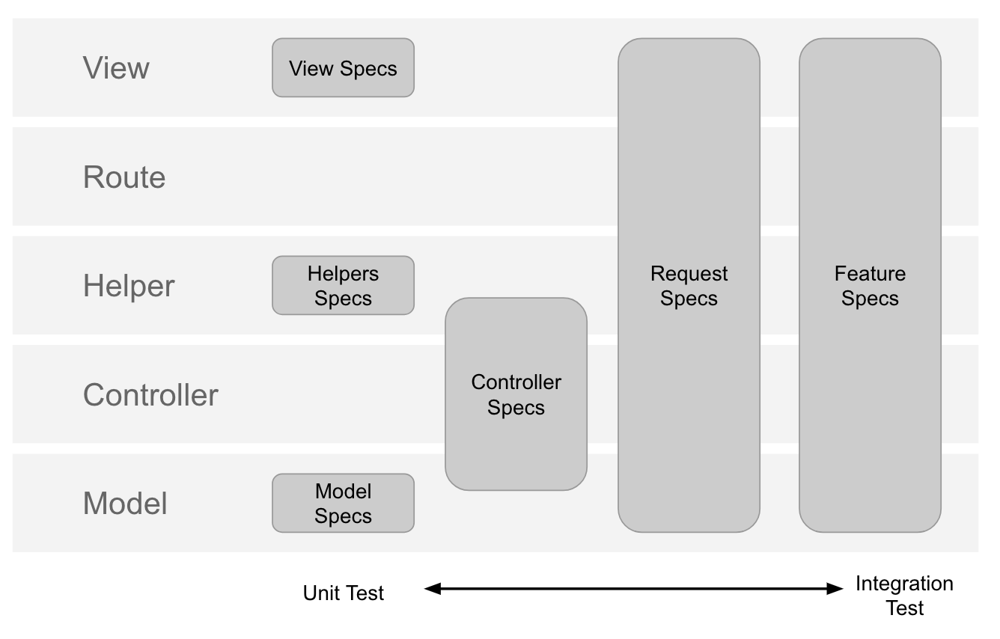
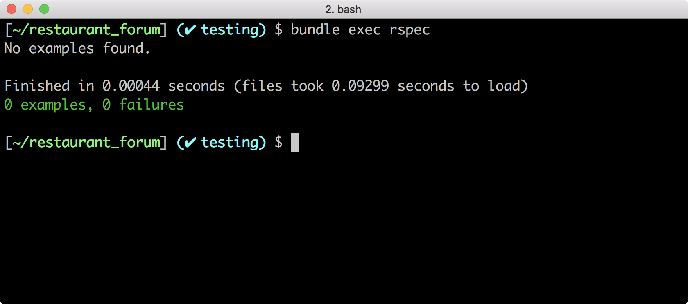

## Rails 測試準備
> 認識 Rails 框架下的測試分類，能夠著手為自己的專案加上測試
> 認識實務上會和 RSpec 搭配的套件，並完成套件設定

在接下來的幾個單元，我們會討論如何把 RSpec 和 Rails 搭配在一起，並介紹實務上寫測試時會搭配的常用工具。

### Rspec + Rails

在 Rails 裡寫測試時，通常會搭配 Rails 框架的架構，去思考不同層級的測試，因而產生以下光譜：



每一個人撰寫測試的原則和習慣都略有不同，原則上的區分可能是：
- Model specs：測試 model method 的預期行為
- Helper specs：類似 model 測試，去測試 helper method 的預期行為
- Controller specs：測試 action 流程、指定變數
- Routing specs：測試路徑與元件之間的連結
- View specs：將 render 的行為從 controller 測試區分出來
- Request specs：和 controller spec 有點像，通常拿來測試 Web API 發出 request 後的預期 response
- Feature specs：適合測試 HTML 網頁，需搭配 capybara gem 使用


筆者的習慣是「model > helper > controller > request > feature > view」，從範圍小的著手、再往範圍較大的測試推進。

如果同學在學習本章節後，要開始為自己的專案加上測試，建議同學可以從 Model 方法的單元測試開始建立習慣，原因是因為 Model 是邏輯上最不容易改變，卻又最關鍵的地方，而 view 比較常會改變，而且改變的內容通常不會太重要。

接下來的幾個單元，我們會先以簡單的範例示範 Model 測試與 Controller 測試，進一步延伸到 Web API 的 Controller 測試以及相關處理技巧。


在這個單元裡，我們會先把工具一口氣安裝好，這些工具的目的是幫助工程師能更加方便地撰寫、維護測試，請你先把工具安裝好，至於工具的使用方法和細節，之後會一邊實作、一邊展示。

### 準備練習用專案：餐廳論壇

本課程的展示，會以你之前完成的「餐廳論壇」為出發點，教你怎麼把既有的功能加上測試。

你可以選擇下載[我們準備的示範專案](https://github.com/ALPHACamp/restaurant-forum-3)，也可以選擇打開你自己的專案成果。

#### 安裝 RSpec

在正式開始之前，我們需要安裝一些需要的工具，加速我們撰寫測試的過程。

首先是 RSpec，在整合到 Ruby on Rails 時，我們會使用 [rspec-rails](https://github.com/rspec/rspec-rails) 這個 gem，請注意要加在 `:development, :test` 的群組裡，來和正式 production 的環境做區分：

```ruby
group :development, :test do
  gem 'rspec-rails', '~> 3.6'
end
```
*Path: Gemfile*


然後執行：
```bash
[~/restaurant_forum] $ bundle install
```

接著要幫專案初始化 RSpec：

```bash
[~/restaurant_forum] $ bundle exec rails generate rspec:install
```

這個指令會幫你安裝三個設定檔：

- **.rspec**: 你可以把常用的參數加到這個檔案裡面。舉例來說，如果你想顯示來自 Ruby 的 warning，你可以在檔案裡面加上一行 `--warnings`，這樣之後每次在跑 `bundle exec rspec` 的時候就會自動帶上這個參數。你可以透過 `rspec -h` 這個指令看到所有的參數。
- **spec/rails_helper.rb**: 我們會在這裡撰寫跟 Rails 相關的內容。舉例來說，在測試開始跑之前，導入自定義的 matcher 檔案。
- **spec/spec_helper.rb**: 我們會在這裡撰寫跟 RSpec 本身設定有關的內容。舉例來說，調整 `rspec-mock` 或是 `rspec-expectation` 的設定。

透過 rspec 的指令看看安裝有沒有成功

```bash
[~/restaurant_forum] $ bundle exec rspec
```

順利的話會看到下面的畫面：



#### 安裝 FactoryBot

撰寫測試時，由於每個 `it` 是獨立的，因此每次都要重新建立測試用的假資料，你現在已經知道可以用 `before` 的方法來做一次性的宣告。然而，當 Model 之間的關聯變得複雜時，資料建置就會愈來愈麻煩。因此，實務上會搭配 FactoryBot 這個函式庫，用來快速產生假資料，可以省下很多準備資料的時間。

（FactoryBot 原名為 FactoryGirl，已於 2017 年底更名為 FactoryBot，由於更名不久，絕大多數網路資料仍稱其 FactoryGirl，請同學查詢資料時特別注意。）

以下按照 FactoryBot 提供的[說明文件](https://github.com/thoughtbot/factory_bot/blob/master/GETTING_STARTED.md)，講解安裝步驟。

首先安裝 [factory_bot_rails](https://github.com/thoughtbot/factory_bot_rails) ：

```ruby
group :development, :test do
  gem "factory_bot_rails", "~> 4.0"
end
```
*Path: Gemfile*

```bash
[~/restaurant_forum] $ bundle install
```

接著請你建立一個 **spec/support/factory_bot.rb** 檔案，加入 FactoryBot 的設定：

```ruby
RSpec.configure do |config|
  config.include FactoryBot::Syntax::Methods
end
```
*Path: spec/support/factory_bot.rb*

然後記得到 **spec/rails_helper.rb** 檔案上方載入你剛才新建的設定檔：

```ruby
# 預設載入的設定
# Add additional requires below this line. Rails is not loaded until this point!
require 'support/factory_bot'
```
*Path: spec/rails_helper.rb*

安裝完成之後，你就可以針對目標 model 新增相對應的設定檔，請你建立一個檔案 `spec/factories.rb`，用來存放相關的設定檔。並且參考你之前在「餐廳專案」定義的假資料，搭配 FactoryBot 的[語法說明](https://github.com/thoughtbot/factory_bot/blob/master/GETTING_STARTED.md#configure-your-test-suite)，完成測試需要的資料內容，在設定假資料時，也可以繼續沿用專案[稍早安裝](https://lighthouse.alphacamp.co/units/426)的 [FFaker](https://github.com/ffaker/ffaker) 套件來產生亂數資料。

完成後的設定如下：

```ruby
FactoryBot.define do
  factory :user do
    sequence(:name) { |n| "user#{n}" }
    sequence(:email) { |n| "user#{n}@gmail.com" }
    password { "12345678" }
    intro { FFaker::Lorem.paragraph }
  end

  factory :category do
    sequence(:name) { |n| "category#{n}" }
  end

  factory :restaurant do
    sequence(:name) { |n| "restaurant#{n}" }
    opening_hours { FFaker::Time.datetime }
    tel { FFaker::PhoneNumber.short_phone_number }
    address { FFaker::Address.street_address }
    description { FFaker::Lorem.paragraph }
    category
  end

  factory :comment do
    content { FFaker::Lorem.sentence }
    user
    restaurant
  end
end
```
*Path: spec/factories.rb*

做好以上設定之後，之後就可以在測試裡面透過類似 `Factory.create(:user)` 的 API 來幫我們建立新的 user，加速開發的流程。

#### 安裝 rails-controller-testing
[rails-controller-testing](https://github.com/rails/rails-controller-testing) 是一個 RSpec 的輔助套件，他提供兩個功能分別是 `assigns` 和 `assert_template`。 `assigns` 能幫我們提供取得傳進去 view 的 instance variable 的值，而 `assert_template` 能幫我們確認 view 有沒有被正確的 render，詳細的教學請參考[官方的使用手冊](https://github.com/rails/rails-controller-testing#usage)。

安裝 rails-controller-testing：

```ruby
group :development, :test do
  gem 'rails-controller-testing'
end
```
*Path: Gemfile*

#### 安裝 database_cleaner
[database_cleaner](https://github.com/DatabaseCleaner/database_cleaner) 是一個 RSpec 的輔助套件，他能夠幫助你在每次測試開始之前建立一個乾淨的環境，讓你每次測試的狀態不受之前測試的過程影響，增加測試執行的正確率。

安裝 database_cleaner：

```ruby
group :development, :test do
  gem 'database_cleaner'
end
```
*Path: Gemfile*

在 `spec/rails_helper.rb` 的檔案最下方新增設定：

```ruby
RSpec.configure do |config|
  config.before(:suite) do
    DatabaseCleaner.strategy = :transaction
    DatabaseCleaner.clean_with(:truncation)
  end

  config.around(:each) do |example|
    DatabaseCleaner.cleaning do
      example.run
    end
  end
end
```
*Path: spec/rails_helper.rb*

透過上面的設定，我們在每個測試執行之前，都會把資料庫的內容清空。

#### 安裝 Shoulda-matchers

[Shoulda-matchers](https://github.com/thoughtbot/shoulda-matchers) 是一個 RSpec 的補充包，裡面針對 `ActiveModel`、`ActiveRecord` 和 `ActionController` 的設定提供了方便的 API 來進行測試。

安裝 shoulda-matchers：

```ruby
group :development, :test do
  gem 'shoulda-matchers', '~> 3.1'
end
```
*Path: Gemfile*


```bash
[~/restaurant_forum] $ bundle install
```

在 `spec/rails_helper.rb` 的檔案最下方新增設定：

```ruby
Shoulda::Matchers.configure do |config|
  config.integrate do |with|
    with.test_framework :rspec
    with.library :active_record
    with.library :active_model
  end
end
```
*Path: spec/rails_helper.rb*


#### Devise 登入/登出 API 設定

在測試的許多情境裡面常常都會需要讓使用者登入或是登出，以順利完成後續的行為。為了讓我們在測試的程式裡面也能夠自在的呼叫 Devise 的登入/登出 API，我們需要下列的設定：

```ruby
require 'devise'

# 請注意此行要加在 RSpec.configure do |config| 之後
config.include Devise::Test::ControllerHelpers, :type => :controller
```
*Path: spec/rails_helper.rb*

之後我們就能在測試的程式裡面使用 `sign_in user` 和 `sign_out`

#### 設定測試資料庫

最後一步，把目前專案資料庫的設定從開發環境複製一份到測試的環境：

```bash
[~/restaurant_forum] $ rails db:migrate RAILS_ENV=test
```

現在我們裝好了寫測試的工具，接下來要進入實作了！

---

### 參考資源

本章節介紹的測試工具都有各自的語法，在你需要客製化設定時，就需要到以下的專案文件內查詢：

- RSpec：http://rspec.info/documentation/
- FactoryBot：https://github.com/thoughtbot/factory_bot_rails
- Shoulda-matchers：https://github.com/thoughtbot/shoulda-matchers

### 參考程式碼

你可以在[這裡](https://github.com/ALPHACamp/restaurant-forum-testing/commit/b7e4b16fe838641a2696b2f580655b7944af9ba3)看見和本單元相關的程式碼
