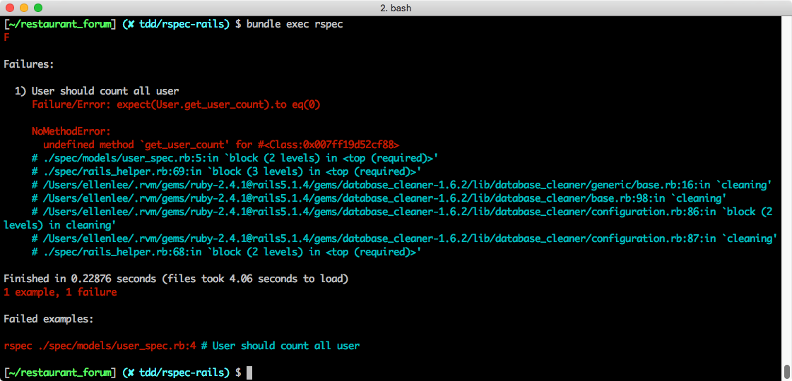

## 測試 Model
> 能夠在 Rails 裡使用 RSpec 進行 Model 測試
> 能夠使用 TDD 開發流程完成功能

在上個單元，你已經在你的「餐廳論壇」專案裡安裝了 RSpec 的相關環境，接下來，我們會跟隨 TDD 的開發原則，實作一個「關於本站」的頁面，在這個頁面裡會呈現全站統計數據，包括：
1. 全站有多少使用者
2. 全站總共有多少回覆

我們曾經在【[S16 主題論壇：強化功能 > 餐廳 Dashboard - restaurants#dashboard](https://lighthouse.alphacamp.co/units/496)】裡寫過一個 **/dashboard** 頁面，在本單元裡，由於要練習 TDD，我們會特地另外做一個 **/about** 來練習。

### 定義期待結果

#### 構思 API

在撰寫 model 相關的測試之前，我們通常會先把需要的情境條列出來，做成一個一個的 API。每一次的轉換需要以下步驟：
1. 思考這個 API 有沒有必要拆解成更小的 API
2. 考慮把 API 放在哪裡
3. 幫這個 API 想一個適合的名字。

對應到我們在上文列出的情境需求，

- **查看全站有多少使用者**：
  - 可以透過 `User.all.size` 得到我們要的資訊，不需要進一步的拆解的必要。
  - 又因為 `User.all.size` 只會被 `User` 資料表影響，所以我會傾向於把此 API 定義成一個類別方法 (class method)，歸類在 `model/user.rb` 裡面。
  - 最後，我打算將此 API 命名為 `get_user_count`。

- **查看某個使用者做過多少回覆**：
  - 這個 API 跟「查看全站有多少使用者」類似，我們可以透過 `user.comments.size` 來達到
  - 同理，定義在 `model/user.rb` 裡面，當成一個實例方法 (instance method)
  - 命名為 `get_comment_count`。

#### 定義路由

我們打算將這個頁面的 route 命名為 **/about**，我們預期呼叫 **/about** 的時候，回傳的 template 裡面帶有**全站使用者的數量**和**全站回覆的數量**的資訊。

```ruby
resources :restaurants do
  # ...
  collection do
    get :about
  end
end
```
*Path: config/routes.rb*

這將會需要一組 controller 的測試，我們通常會直接在測試裡面模擬呼叫想測試的路由，然後依據我們的情境設計測試內容。

### User Model API

#### 查看全站使用者人數

首先從 model 的 API 開始，請你在 **spec/models/user_spec.rb** 來撰寫測試案例（目錄與檔案需要手動新增）：

```ruby
require 'rails_helper'

RSpec.describe User, type: :model do
  it "should count all user" do
    expect(User.get_user_count).to eq(0)
    create(:user)
    expect(User.get_user_count).to eq(1)
  end
end
```
*Path: spec/models/user_spec.rb*

請注意每一個 **\*_spec.rb** 文章的最開頭，都需要加入 `require 'rails_helper'`，來載入針對 Rails 的測試設定。

在這個測試案例中，我們先測試了 User 數量，此時測試環境下的資料庫裡面什麼都沒有，所以可以預期 user 的數量為零。

接著我們透過 FactoryBot 的 create API 創造一個 user `create(:user)`，呼叫 `create(:user)` 時，就會按我們之前在 `FactoryBot.define` 裡撰寫的設定，產生一個 `User` 物件：

呼叫 `create(:user)` 之後，測試資料庫裡面應該會有只一個 user，我們透過 `expect` 來測試 API 的呼叫結果是不是跟我們預期的一樣，請你以 `bundle exec rspec` 執行測試，預期出現 `1 example, 1 failure`：



請你仔細閱讀 RSpec 給你的 Failuer 報告，在執行「User should count all user」這個測試案例時，在執行 `expect(User.get_user_count).to eq(0)` 的時候發生錯誤，錯誤原因是沒有定義 `get_user_count` 這個方法。

現在我們要來寫 API 程式內容，涉法讓這個案例通過，請你在 `User` model 裡加入 `get_user_count` 方法:

```ruby
def self.get_user_count
  User.all.size
end
```
*Path: model/user.rb*

透過 `User.all.size` 取得資料庫裡面所有的 user 數量，完成之後，重新執行一次測試，應該會出現 `1 example, 0 failures`：


#### 查看全站使用者的回覆數

接著是「查看使用者有過多少回覆」的 API，一樣我們先寫測試，請在剛才的案例下，加入另一個測試案例：

```ruby
RSpec.describe User, type: :model do

  # other examples

  it "should count all comments by this user" do
    user = create(:user)
    expect(user.get_comment_count).to eq(0)
    comment = create(:comment)
    user.comments << comment
    expect(user.get_comment_count).to eq(1)
  end
end
```
*Path: spec/models/user_spec.rb*

首先，透過 `user = create(:user)` 先建立起一個測試用的 user，接著我們用 `expect(user.get_comment_count).to eq(0)` 先確認 comment 為零。再來 `comment = create(:comment)` 建立測試用的 comment，然後把 `user.comments << comment` 讓這個 comment 跟 user 建立關聯，最後用 `expect(user.get_comment_count).to eq(1)` 測試 user 目前的 comment 數量為 1。

透過 `bundle exec rspec` 執行測試，應該會出現 `1 examples, 1 failure`。失敗的原因是因為我們在 User 的 model 裡面還沒有定義 `get_comment_count` 這個方法。


讓我們回到 User model 完成實作：

```ruby
def get_comment_count
  comments.all.size
end
```
*Path: model/user.rb*

定義完成之後，重新執行一次測試，如果你的 FactoryBot 測試資料設定有誤，可能會在執行 `create(:comment)` 的時候發生錯誤，若是看見此類訊息，請你檢查 **spec/factories/model.rb**：


如果設定沒有問題，預期會出現 `2 examples, 0 failures`：


恭喜你完成了 Model 測試！在下一個單元，我們會繼續完成 Controller 的測試。
