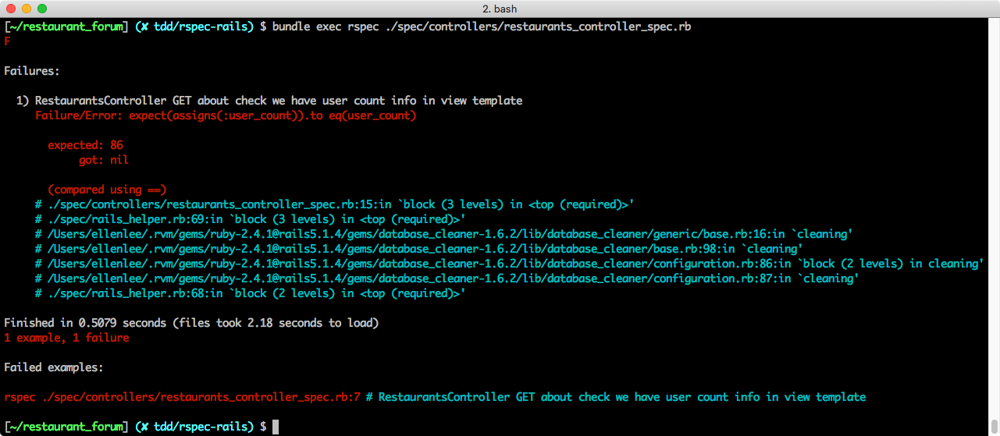
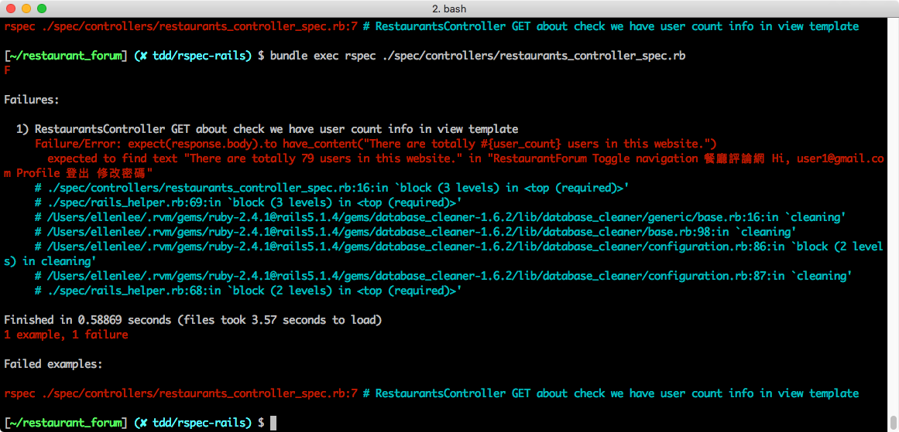
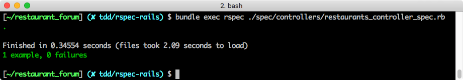

## 測試 Controller
> 能夠撰寫測試確保 controller action 的預期流程
> 能夠撰寫測試確保 controller action 的指定變數
> 能夠撰寫測試確保 template 的必要資訊

延續著上個單元，到現在為止，我們還沒有定義 **/about** 的 controller action，按照 TDD 的開發流程，一樣我們先從測試開始。

### 撰寫測試

首先我們要開一個專門測試 RestaurantsController 的檔案，命名慣例為 `restaurants_controller_spec.rb`，會歸類在 **spec/controllers** 的目錄下，並撰寫以下測試案例：

```ruby
require 'rails_helper'

RSpec.describe RestaurantsController, type: :controller do
  render_views

  describe "GET about" do
    it "check we have user count info in view template" do
      # 準備變數
      sign_in(create(:user))
      user_count = rand(20..100)
      allow(User).to receive(:get_user_count).and_return(user_count)

      # 測試
      get :about
      expect(assigns(:user_count)).to eq(user_count)
      expect(response.body).to have_content("There are totally #{user_count} users in this website.")
    end
  end
end
```
*Path: spec/controllers/restaurants_controller_spec.rb*

我們定義了一個 describe 區塊來分類同一個 controller 下面不同的 action，這部分的命名則使用 http verb 搭配上 action name，在這個例子裡面就是 `GET about`。

需要注意的是，在 RSpec 的架構裡，執行 controller action 時不會自動 render view，在想要測試 template 內容時，需要手動加上 `render_views`。

接著我們正式進入測試的程式碼。在 controller 這個階段我們主要會測試兩件事：

1. 變數有確實被 assign
2. template 的內容含有我們想要的結果

因此，整個測試的過程會被分成兩個部分：

1. 準備變數
2. 測試

#### 準備變數

考慮到這是一個需要登入的路徑，我們需要先創造一個使用者，並且用這個使用者的身份登入，也就是 `sign_in(create(:user))`。之前我已經在 **spec/rails_helper.rb** 裡引入了 Devise，所以可以使用 Devise 提供的 `sign_in` 方法。

接著我們要偽造 `get_user_count` 的回傳結果，原因是我們在上一個 model 的例子裡面已經寫過它的測試，所以我們可以相信 `get_user_count` 回傳的結果。為了保持測試是一個獨立的單元，我們希望盡量不要讓其他因素影響到這個測試，所以我們會用偽造的方式處理。

所謂「偽造的方式」，就是透過 `user_count = rand(20..100)` 來偽造使用者的人數，並且用 `allow(User).to receive(:get_user_count).and_return(user_count)` 嘗試偽造 `get_user_count` 的結果。

`allow(A).to receive(B).with(C).and_return(D)` 是表達「預期 A 物件會收到 B 方法與 C 參數，然後 A 物件會回傳 D」，

#### 測試

準備完之後，就可以正式開始測試了！

首先，用 `get :about` 讓 RSpec 模擬呼叫路徑的情形，然候我們就可以開始檢視我們的假設跟實際狀況是不是吻合：
- `expect(assigns(:user_count)).to eq(user_count)`，用來檢視 action 裡面的 `@user_count` 這個變數跟我們偽造的值是不是一樣；
- `expect(response.body).to have_content("There are totally #{user_count} users in this website.")` 判斷對應的 template 頁面上有沒有我們預期的字串。

此時我們還沒有在 controller 裡面加上對應的程式，但我們先執行測試看看，你可以在指令後加上檔名，只跑單一檔案的測試，來提高效率：

```bash
[~/restaurant_forum] $ bundle exec rspec ./spec/controllers/restaurants_controller_spec.rb
```

預期會出現 failure，表示該測試不通過，失敗原因是找不到 `user_count` 的值，然而因為根本就還沒有 controller action，所以自然也測不到該變數值：



### 撰寫功能

現在我們到 RestaurantsController 裡補上對應的方法：

```ruby
# GET restaurats/about
def about
  @user_count = User.get_user_count
end
```
*Path: app/controllers/restaurants_controller.rb*

補上之後，再跑一次測試看看，應該會發現還是沒有通過。原因是我們沒有在 view 裡面加上我們要顯示的資訊：



讓我們建立一個 template，把指定的變數放進去：

```
<div>There are totally <%= @user_count %> users in this website.</div>
```
*Path: views/restaurants/about.html.erb*

這個時候再跑一次 `bundle exec rspec` 會發現順利通過：



恭喜你開發成功！

希望經過以上的命名，你已經熟悉在 Rails 裡面搭配 RSpec 測試框架開發的感覺，拆解 API 和命名其實是很主觀的，如果你有想到什麼更好的拆解方式或是命名方式，請多上討論區跟同學們分享與討論。

### Recap

下個單元開始，我們會針對 Web API 的情境，討論如何測試以及相關技巧。在進入新主題之前，在此先總結一下目前的學習，目前我們用了較簡單的例子去示範 model 和 controller 測試，希望能讓同學熟悉在 Rails 裡寫測試的手感。

接下來重要的就是鼓勵同學回到自己的專案裡去寫測試，一開始的重點不是追求測試覆蓋率，建議的起手點如下：
- 從習慣寫 model spec 開始，因為粒度最小、也最重要
- 測試你最擔心出錯的部分，把以前手動去檢查的行為，改成寫測試去檢查
- 開發時遇到 bug 時，撰寫單元測試來揭發該 bug，再進行 debug

建議可以先瀏覽一輪 [rspec-rails 文件](https://github.com/rspec/rspec-rails#contributing)，掌握可能的寫法，需要用到時再 Google 查詢，常用的有兩個參考資源：
- rspec-rails 文件：https://github.com/rspec/rspec-rails#contributing
- Relish：https://relishapp.com/rspec/rspec-rails/v/3-7/docs/matchers

### 參考程式碼

| Commit | GitHub |
|:----- | ----- |
| GET about check we have user count info in view template | [LINK](https://github.com/ALPHACamp/restaurant-forum-testing/commit/dc1325114726a5dfa553e8ce83e72510be8de9c0) |
