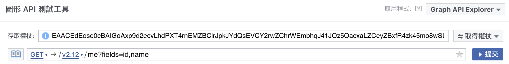

## 測試第三方 API：臉書登入
> 理解如何撰寫第三方 API 的測試

之前我們在 Web API 的章節有討論過如何實作 Facebook 的登入功能。在本單元和下一個單元，我們會用臉書登入功能，來示範第三方 API 的測試手法。

請注意這兩個單元的學習焦點在「測試技巧」而非「功能實作」，串接第三方 API 時，為了想維持 Controller 測試的單元性，會傾向盡可能把測試案例的變因降到最少 (e.g. 若需要先設定好外部資料、才能執行程式，就會增加變因)。

因此，過程中會透過大量的「假造」或「假設」來處理，讓測試重點放在 Controller action 的流程，而不是每個流程的 input/output。

在這個單元，我們會先按上述理念，撰寫臉書登入的測試；在下個單元，我們會進一步示範「假造」和「錄製」的進階技巧，來進行更逼真的模擬測試。

### 開始前的準備

#### 事前必讀

在使用本章節前，希望你已經練習過【[OAuth 第三方認證：Facebook 帳號登入](https://lighthouse.alphacamp.co/lessons/236/units/1154)】，並能夠解釋 OmniAuth、Facebook 以及 Devise 之間的關係。

#### 準備練習用專案

請你不要使用練習 FB 登入的同一個專案（應為「家庭相簿」專案）來進行本單元的練習，會容易搞混。

建議你直接使用當前的「餐廳論壇」專案，但需要確保上個單元已順利完成（會需要整合上個單元的登入/登出程式碼），或者，你可以直接下載[這個專案](https://github.com/ALPHACamp/restaurant-forum-fb-login)來進行練習。

#### 安裝 OmniAuth 套件

準備好專案之後，我們先安裝 OmniAuth 提供的套件：
```ruby
# Gemfile
gem 'omniauth-facebook'
```
```bash
[~/restaurant_forum] $ bundle install
```

#### 準備 method 介面

請你在 User model 裡準備以下兩個 method，這兩個 method 是臉書登入流程中需要處理的兩件事情。但在這個單元，我們不會真的撰寫方法內容去呼叫臉書服務，而是會先把測試案例準備好，下一個單元講解「偽造」和「錄製」技巧時，再回過頭來實作。

請你先理解以下 method 的作用，但只需要準備呼叫方法的介面，不需要撰寫方法內容：

```ruby
# app/models/user.rb

def self.get_facebook_user_data(access_token)
  # 需要傳入你的臉書登入權杖
  # 使用權杖向 Facebook 發送 Request，請求回傳使用者的臉書資料
end

def self.from_omniauth(auth_hash)
  # Facebook 回傳的資訊，會再以 Hash 的形式傳入此方法做後續處理
  # 由於 Facebook 回傳資訊未必能和你的資料庫相容，要在這個方法裡制定標準
  # 透過你制定的標準，把 Hash 整理成能和 User model 相容的資料
end
```

#### 什麼是「權杖」？

接下來我們會一直提到「權杖」這個字眼。每一個臉書用戶都有一支存取權杖，只要有權杖就可以存取臉書的個人資料。

權杖是一組由大小寫英文以及數字組成、長達 200 個字左右的字串，可以在 facebook for developers 的[圖形 API 測試工具](https://developers.facebook.com/tools/explorer/?method=GET&path=me%3Ffields%3Did%2Cname&version=v2.12)取得，只要登入 Facebook 就可以看到自己的權杖：



注意！權杖是私密資料，在練習的過程中，請小心不要把權杖 push 到 GitHub 上。

###撰寫「臉書登入」測試

接著我們先撰寫 Facebook 登入的測試，你可以透過閱讀以下測試案例，理解登入臉書的處理程序：

```ruby
# spec/controllers/api_v1/auth_spec.rb

RSpec.describe Api::V1::AuthController, type: :controller do

  it "login via email and password" do
    # skip
  end

  it "login via facebook access_token" do
    # 準備測試資料
    # 產生測試用的 User 物件
    user = create(:user, email: '123@gmail.com', password: '123123')
    # 偽造 FB 的使用者資訊
    fb_data = { "id" => "123", "email" => "123@gmail.com", "name" => "fung" }
    # 偽造 FB 權杖與臉書回傳資料 auth_hash
    fb_access_token = 'blablabla'
    auth_hash = double('OmniAuth::AuthHash')

    # 定義呼叫相關方法後的期待回傳值
    allow(User).to receive(:get_facebook_user_data).with(fb_access_token).and_return(fb_data)

    allow(OmniAuth::AuthHash).to receive(:new).and_return(auth_hash)
    allow(User).to receive(:from_omniauth).with(auth_hash).and_return(user)

    # 以偽造的 FB 權杖發出登入請求，預期登入成功，取得 auth_token
    post "login", params: { access_token: fb_access_token }

    expect(response).to have_http_status(200)
    expect(JSON.parse(response.body)).to eq({
      'message' => 'ok',
      'auth_token' => user.authentication_token
    })
  end

  it "logout succesfully" do
    # skip
  end
end
```
以下是程式碼的細部說明：

#### 準備測試資料
測試案例的前半主要是在準備測試資料，我們做了以下事情：
1. **產生測試用的 User 物件**
2. **偽造 FB 的使用者資訊**
準備偽造的臉書資料，在這裡我們假造了 `fb_data` 做為客戶端傳來的權杖，之後將以此進行身份確認的回傳資訊，透過「假造」的技巧，這組偽造資料仍然能通過測試
3. **偽造 FB 權杖與臉書回傳資料 auth_hash**
我們沒有去 Facebook for developers 取得真實的權杖，而是偽造一組假的。至於 `auth_hash` 是臉書的回傳值，理論上會由 `OmniAuth::AuthHash` 函式庫來產生，但測試階段我們不想處理繁瑣的參數，所以直接使用 RSpec 的 `double()` 技巧產生一個 instance 當作替身。

#### 定義呼叫相關方法後的期待回傳值
`allow(A).to receive(B).with(C).and_return(D)` 是表達「預期 A 物件會收到 B 方法與 C 參數，然後 A 物件會回傳 D」，在這個段落裡，我們做了以下三個假設：
1. 預期 User 的 `get_facebook_user_data` 這個 class method 會被呼叫，並回傳我們假造的 `fb_data`；
2. 利用 `OmniAuth::AuthHash` 創建一個該類別下的 instance，並且將回傳的 instance 定義為 auth_hash
3. 假設 User 類別下的 `from_omniauth` 應該會被呼叫，並回傳 `user`。

在單元最開頭，我們提到我們希望「維持測試的單元性」，舉例來說，透過 `allow(User).to receive(:from_omniauth).with(auth_hash).and_return(user)` 這行程式碼，我可以確保就算 `from_omniauth` 不小心被我改壞掉，在執行測試的時候，「login via facebook access_token」這個測試一樣可以順利通過，因為 Controller 的流程是對的，而壞掉的應該是另一個和 from_omniauth 直接相關的測試。

需要這樣思考的原因，是因為測試的初衷是幫助你精準找到邏輯錯誤的程式碼片段，一個龐大的專案可能有上千上萬個單元測試，必須思考測試的單元性，才能發揮測試的效用。

#### 發出登入請求，預期成功取得 auth_token

最後我們預期使用偽造的 `fb_access_token` 向 `api/v1/login` 發出 POST 請求，可以成功登入，並取得通過 ApiController 需要的 `auth_token` 參數。

測試寫完以後，你可以先試著執行 `bundle exec rspec`，由於還沒有修改 `api/v1/login`，理應出現 Failure。

### auth#login 整合臉書登入

現在我們需要稍微調整 `ApiV1::AuthController` 裡面的 `login` 的邏輯，試著讓 email 登入與 facebook 登入能夠一起運作，主要的修改邏輯是：
1. 如果傳進來的 request 攜帶的參數不是帳號密碼，而是臉書的權杖，就去呼叫 `User.get_facebook_user_data` 取得臉書資訊；
2. 把臉書資訊整理成 Hash 的形式，送進 `User.from_omniauth` 方法，比對出資料庫中的 User 紀錄。
3. 若成功取得臉書資訊與資料庫的 User 紀錄，就認定可成功登入。

```diff
# app/controllers/api/v1/auth_controller.rb

  def login
    success = false

    if params[:email] && params[:password]
      user = User.find_by_email(params[:email])
      success = user && user.valid_password?(params[:password])
-   end
+   elsif params[:access_token]
+     fb_data = User.get_facebook_user_data(params[:access_token])
+     if fb_data
+         auth_hash = OmniAuth::AuthHash.new({
+           uid: fb_data["id"],
+           info: { email: fb_data["email"] },
+           credentials: {
+            token: params[:access_token],
+            expires_at: Time.now + 60.days
+          }
+         })
+       user = User.from_omniauth(auth_hash)
+     end
+     success = fb_data && user.persisted?
+   end

    if success
      render json: {
        message: "ok",
        auth_token: user.authentication_token
      }
    else
      render json: { message: "failed" }, status: 401
    end
  end
end
```

此時，你可以執行 `bundle exec rspec`，會發現雖然我們根本沒有撰寫 `User.get_facebook_user_data()` 和 `User.from_omniauth()` 的內容，在經過一連串的偽造資料後，可以通過測試。

下個單元，我們會進一步講解「偽造」和「錄製」的技巧。
