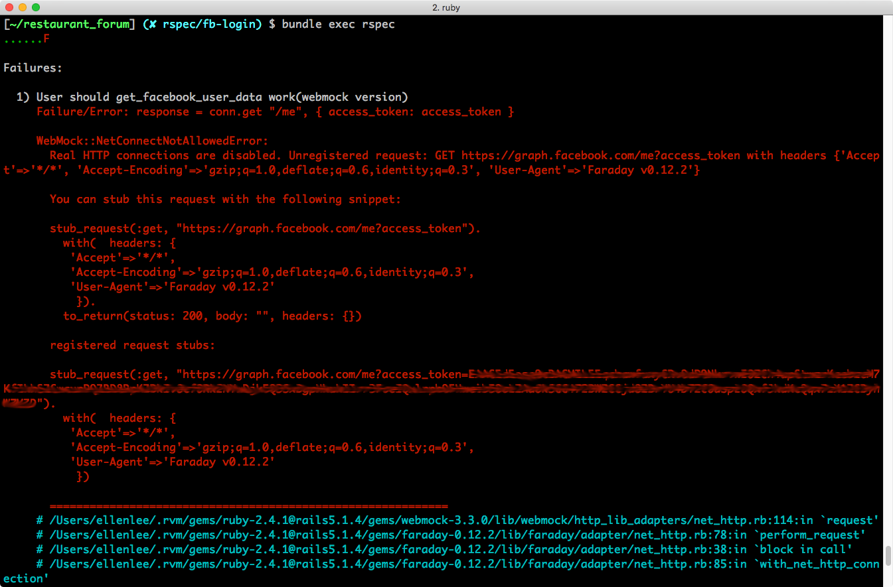

## 測試第三方 API 技巧：假造 & 錄製
> 認識測試第三方 API 時會遇到的問題
> 理解如何使用「假造」和「錄製」技巧來測試第三方 API 

到目前為止，我們透過了基礎的功能練習了許多 RSpec 的寫法。這個單元，我們將針對第三方 API 的測試，討論在處理第三方 API 時，會遇到什麼特殊的問題，又有什麼對應的解法。

### 為什麼第三方 API 需要刻意處理

仔細觀察近年來建立的網站，你會發現大量使用第三方 API 的現象，從社群登入（Google、Facebook 登入），到金流串接都屬於第三方 API 的範疇。

然而，在跑測試的時候，實務上會避免在測試中真正去呼叫第三方 API，理由是：

- 呼叫外部 API 時，可能會因為網路問題導致測試結果失敗
- 呼叫外部 API 會讓測試完成的速度大幅下降
- 因為執行測試，無意間超過第三方 API 提供者的使用頻率限制

根據上述這些可能的原因，我們應該確保我們在執行測試的過程中，並不會真的發送請求至第三方 API 的伺服器，但又可以模擬測試。因此就有了以下兩種常見的技法：
- **假造**
- **錄製**

接下來我們會延續上個單元的「Facebook 登入」，示範這兩個觀念的實作。

### 第三方 API 假造

第一個技巧是 **第三方 API 假造**。假造會有三個步驟：
1. 創造一組假回應（fake response），規格應該要跟真的第三方 API 回應類似。
2. 阻擋相關的 API 發送。
3. 回傳我們在第一步創造的假回應。

#### 安裝與設定

我們需要安裝 [Webmock](https://github.com/bblimke/webmock) 這個 gem 來幫助我們完成接下來的任務：

```ruby
# Gemfile
gem 'webmock'
```

在 `spec_helper.rb` 裡面設定阻擋 API 發送：

```ruby
# spec/spec_helper.rb

require 'webmock/rspec'
WebMock.disable_net_connect!(allow_localhost: true)
```

#### 補完 get_facebook_user_data 實作

補完上個單元沒有寫完的 `User.get_facebook_user_data()`，內容是向 Facebook Graph API 發出請求，以權杖來要求回傳臉書的使用者資訊，若請求成功，此方法會回傳臉書資訊內容，否則回傳 `nil`：

```ruby
# app/models/user.rb

def self.get_facebook_user_data(access_token)
  conn = Faraday.new(url: 'https://graph.facebook.com')
  response = conn.get "/me", { access_token: access_token }
  data = JSON.parse(response.body)

  if response.status == 200
    data
  else
    Rails.logger.warn(data)
    nil
  end
end
```

[Faraday](https://github.com/lostisland/faraday#api-documentation) 為筆者習慣用來發送 Request 的 HTTP Client。

####撰寫測試

接著我們撰寫關於 `self.get_facebook_user_data` 的測試：

```ruby
# spec/models/user_spec.rb

RSpec.describe User, type: :model do
  it "should get_facebook_user_data work(webmock version)" do
    # need to replace ACCESS_TOKEN to you fb access token
    expect(User.get_facebook_user_data("ACCESS_TOKEN")).to eq({
      "id" => "FB_UID",
      "name" => "FB_NAME"
    })
  end
end
```
此時你需要將權仗加入程式碼，建立你直接建立 **config/facebook.yml** 來管理權杖資訊，並將該檔案加入 **.gitignore**，避免之後不小心把權杖寫進 GitHub。至於權杖的取得方法，請前往 facebook for developers 的[圖形 API 測試工具](https://developers.facebook.com/tools/explorer/?method=GET&path=me%3Ffields%3Did%2Cname&version=v2.12)，登入後取得權杖。

另外，預期回傳的資訊是 `"id"` 和 `"name"`，這也是來自[圖形 API 測試工具](https://developers.facebook.com/tools/explorer/?method=GET&path=me%3Ffields%3Did%2Cname&version=v2.12)頁面上的設定。



處理好權杖以後，執行 `bundle exec rspec` 跑測試，預期會看到類似以下的錯誤訊息：



這段錯誤訊息嘗試告訴我們，我們想要發送的請求已經被 webmock 擋下來，沒有真的發送。接著我們要偽造假回應，你會發現 webmock 已經把假造的格式幫我們準備好了。

請在錯誤訊息的下半部找到 `You can stub this request with the following snippet:` 這句話，這句話之後是 webmock 幫你做好的假回應，請你去 **spec/spec_helper.rb** 新增設定：

```ruby
# spec/spec_helper.rb

  config.before(:each) do
    # need to replace ACCESS_TOKEN to you fb access token
    stub_request(:get, "https://graph.facebook.com/me?access_token=ACCESS_TOKEN").
      with(headers: {'Accept'=>'*/*', 'Accept-Encoding'=>'gzip;q=1.0,deflate;q=0.6,identity;q=0.3', 'User-Agent'=>'Faraday v0.12.2'}).
      to_return(status: 200, body: '{"id":"FB_UID", "name": "FB_NAME"}', headers: {})
  end
```

唯一需要調整的地方是，webmock 訊息裡原本是 `to_return(:status => 200, :body => "", :headers => {})`，需要把 `body` 的內容換成和測試案例裡一致的內容： `to_return(status: 200, body: '{"id":"FB_UID", "name": "FB_NAME"}', headers: {})`。

如此一來，假回應就完成了！此時可以再執行一次測試 `bundle exec rspec`，預期會看見綠燈通過！


### 第三方 API 錄製

第二個技巧是 **第三方 API 錄製**，我們將透過 [vcr](https://github.com/vcr/vcr) 這個 gem 幫我們完成錄製的任務。

使用錄製技巧時，第一次會真的發送請求到第三方 API 的伺服器，此時 VCR 把回傳結果錄製下來，存成一支 yml 檔案，之後，要針對同樣的網址和參數進行請求，就不再需要發送請求，而可以引用這支 yml 檔案的內容。

「假造」和「錄製」技巧不會同時使用，因此，在練習本內容時，你需要清掉上一步驟的實作內容。

過程中會用到 vcr gem 和 webmock gem：

```ruby
# Gemfile
gem 'vcr'
gem 'webmock'
```

```bash
[~/restaurant_forum] $ bundle install
```

撰寫設定檔：
```ruby
# spec/support/vcr_setup.rb

VCR.configure do |config|
  # 設定儲存 API 檔案的目錄位置
  config.cassette_library_dir = "spec/fixtures/vcr"
  # 設定假造 API 的函式庫
  config.hook_into :webmock
end
```

導入 `vcr` 設定檔：

```ruby
# spec/rails_helper.rb
require 'support/vcr_setup'
```

然後撰寫錄製的測試檔，請注意你需要把 webmock version 的測試替換掉：

```ruby
# spec/models/user_spec.rb

RSpec.describe User, type: :model do
  # other examples

  it "should get_facebook_user_data work(vcr version)" do
    VCR.use_cassette 'get facebook user data' do
      expect(User.get_facebook_user_data('ACCESS_TOKEN')).to eq({
        "name" => "FB_NAME",
        "id" => "FB_ID"
      })
    end
  end
end
```

執行 `bundle exec rspec` 跑測試，預期會出現 Failure，但同時跑完測試後，你會在 `spec/vcr` 資料夾裡發現多了一隻名為 `get_facebook_user_data.yml` 的檔案，裡面的內容大概會是這樣，記錄了一切重製這個請求所需要的資訊：

```
---
http_interactions:
- request:
    method: get
    uri: https://graph.facebook.com/me?access_token=ACCESS_TOKEN
    body:
      encoding: US-ASCII
      string: ''
    headers:
      User-Agent:
      - Faraday v0.12.2
      Accept-Encoding:
      - gzip;q=1.0,deflate;q=0.6,identity;q=0.3
      Accept:
      - "*/*"
  response:
    status:
      code: 200
      message: OK
    headers:
      X-App-Usage:
      - '{"call_count":3,"total_cputime":4,"total_time":3}'
      Etag:
      - '"1951a445ed3d35b8ed9189ed52fb3b3a6f579c80"'
      Strict-Transport-Security:
      - max-age=15552000; preload
      X-Fb-Trace-Id:
      - AEDfjs2s2g1
      X-Fb-Rev:
      - '3775614'
      Expires:
      - Sat, 01 Jan 2000 00:00:00 GMT
      Content-Type:
      - application/json; charset=UTF-8
      Facebook-Api-Version:
      - v2.5
      Cache-Control:
      - private, no-cache, no-store, must-revalidate
      Pragma:
      - no-cache
      Access-Control-Allow-Origin:
      - "*"
      X-Fb-Debug:
      - zkDHFUAjqH9lJ8gAJdeAVbf6EnXro0ApeWYV8YyG0BAJwuyILYuHONEoy01oUvLO6EyAdTFGt+pvvY8dDA/tWQ==
      Date:
      - Tue, 03 Apr 2018 05:41:45 GMT
      Connection:
      - keep-alive
      Content-Length:
      - '60'
    body:
      encoding: UTF-8
      string: '{"email":"YOUR_FB_EMAIL","id":"YOUR_FB_ID"}'
    http_version:
  recorded_at: Tue, 03 Apr 2018 05:41:45 GMT
recorded_with: VCR 3.0.3
```
如果成功看見這個檔案，就表示你成功完成了錄製的任務，之後要針對同樣的網址和參數進行請求，就可以引用這支 yml 檔案的內容。

### 小結

在這個單元裡，我們介紹了兩種在測試中處理 API 的方法，彼此分別適合不同的情境，各有彼此的優缺點：
- 假造：需要手動撰寫請求以及回傳的 header 以及 body，雖然說較為麻煩，但是對於假造內容的掌握度較高。
- 錄製：直接幫我們記錄下來整個請求以及回傳構通的過程，開發起來很快，但很多時候我們其實只是需要比對 body 而已，大多數的資訊其實不需要用到。

### 參考程式碼

| 主題 | 說明 |
| ----- | ----- |
| 假造|[LINK](https://github.com/ALPHACamp/photo-album-testing/commit/10b260e702842f1228cf2890c123740eb29f6ff5)|
|錄製|[LINK](https://github.com/ALPHACamp/photo-album-testing/commit/61de9112d8b43634579c4137f3082e60b8b4d825)|
