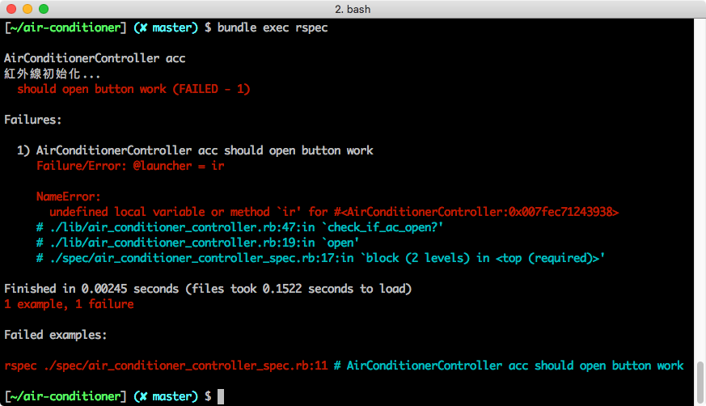
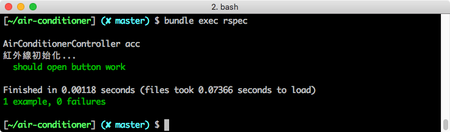

## 重構

在上個單元，我們成功以 TDD 的流程做出了「打開冷氣」的功能，然而，有 TDD 開發經驗的工程師都知道，第一次寫出來的代碼，通常不會是最好的代碼，所以，在撰寫功能結束並且通過測試之後，我們會再回過頭改寫程式，把程式寫的更好。

這個過程稱為重構 (refactor)。


由於重構是一件吃力不討好的事情，對客戶/老闆而言，你花了時間沒有產出任何的新功能，而且，不小心改一改會把程式搞壞，所以優先權往往被排在比較後面。然而，長遠來說，如果程式碼不進行適當的重構，未來要維護時會愈來愈困難。

如果你採用 TDD 的開發流程，幾乎可以說是把重構的副作用降到最低。透過測試的把關，任何可能影響到功能正確性的重構，都會讓測試無法通過，不用擔心在重構的過程不小心把功能改壞。

### 回顧程式碼

請你回顧上個單元寫出來的程式碼，雖然是以 Pseudocode 的方式呈現，應該也可以看出在「按下開關按鈕」到「真正打開冷氣」之前，發生了好幾個步驟：

```ruby
class AirConditionerController
  def 初始化
    將遙控器與冷氣機配對
    初始化儀表板，顯示冷氣關機
  end

  def 打開冷氣
    載入紅外線模組
    設定指令 -> 「確認冷氣是否開啟」
    呼叫紅外線發射器
    發送指令給冷氣機，要求冷氣機回報「開啟狀態」

    if 開啟狀態 == 冷氣沒開
      要求冷氣機執行「打開冷氣」指令
      呼叫紅外線發射器
      發送指令給冷氣機，要求冷氣機回報「執行結果」
    end

    if 執行結果 == 成功
      於冷氣遙控器儀表板上顯示 on
    else
      於設定冷氣遙控器儀表板上顯示 off
    end
  end
end
```

而這些步驟都是一口氣寫在一起的，也就是說，一旦中間有任何一個環節出錯，導致冷氣無法打開，你無法很快地知道是哪個環節出了問題。

現在，讓我們重新檢視這組代碼，思考可以寫得更好的地方。

### 將可能會共同的函式獨立出來

在程式的最一開始，遙控器和冷氣器之間先確認當前開機狀態，確認狀態是「冷氣沒開」，才要求冷氣器執行「打開冷氣」的指令。

考慮到我們之後會需要實作 `關閉冷氣` 的功能，會重覆執行這個流程，我應該可以把這個 `確認冷氣是否已經開啟` 動作，封裝成一個私有函式 (private method)。不只是 `關閉冷氣`，別的行為也很有可能會需要先判斷冷氣的開機狀態，雖然還不明確知道未來需要開發什麼樣的新功能，在此時此刻，我們最好先把 `確認冷氣是否已經開啟` 拉出來獨立成一個函式，以便未來在多個功能中可以呼叫使用。

重構完的結果如下：

```ruby
class AirConditionerController
  def 初始化
    將遙控器與冷氣機配對
    初始化儀表板，顯示冷氣關機
  end

  def 打開冷氣
    載入紅外線模組
    確認冷氣是否已經開啟，要求冷氣機回報「開啟狀態」

    if 開啟狀態 == 冷氣沒開
      要求冷氣機執行「打開冷氣」指令
      呼叫紅外線發射器
      發送指令給冷氣機，要求冷氣機回報「執行結果」
    end

    if 執行結果 == 成功
      於冷氣遙控器儀表板上顯示 on
    else
      於設定冷氣遙控器儀表板上顯示 off
    end
  end

  private

  def 確認冷氣是否已經開啟
    設定指令 -> 「確認冷氣是否開啟」
    呼叫紅外線發射器
    發送指令給冷氣機
  end
end
```

重構完成之後，要回頭跑一下測試，看看這次重構之後，功能是否正常運作，結果測試結果為失敗（紅燈），我們來看看發生什麼事：



錯誤提示訊息是「紅外線未被定義」(undefined local variable or method \`ir')，看起來是我們忘記把紅外線傳進去私有函式裡面，再一次的修改代碼：

```ruby
class AirConditionerController
  def 初始化
    將遙控器與冷氣機配對
    初始化儀表板，顯示冷氣關機
  end

  def 打開冷氣
    載入紅外線模組
    確認冷氣是否已經開啟，要求冷氣機回報「開啟狀態」

    if 開啟狀態 == 冷氣沒開
      要求冷氣機執行「打開冷氣」指令
      呼叫紅外線發射器
      發送指令給冷氣機，要求冷氣機回報「執行結果」
    end

    if 執行結果 == 成功
      於冷氣遙控器儀表板上顯示 on
    else
      於設定冷氣遙控器儀表板上顯示 off
    end
  end

  private

  def 確認冷氣是否已經開啟（設定紅外線發射器）
    設定指令 -> 「確認冷氣是否開啟」
    呼叫紅外線發射器
    發送指令給冷氣機
  end
end
```

我們把紅外線當成參數傳進去 `判斷冷氣是否已經開啟` 裡面，並且再跑一次測試，回到綠燈的狀態：



### 再回顧

再更進一步地檢視程式碼，思考整個程式的架構，你可能會發現 `判斷冷氣是否已經開啟` 這個私有函式，更適合被歸類到 `冷氣` 這個 model 之下，當作 model instance method 來使用，可能更符合使用情境：

```ruby
class AirConditioner
  # 原有程式碼

  def 是否開啟（設定紅外線發射器）
    設定指令 -> 「確認冷氣是否開啟」
    呼叫紅外線發射器
    發送指令給冷氣機
  end
end
```
重構在整個軟體開發的過程是很重要的一環，目的是為了寫出品質更好的代碼。每個人對於程式架構的想法都不同，上面簡單展示了兩種可能的重構方式，很有可能你想到重構方向跟我不一樣！歡迎大家分享自己的想法。

### 參考程式碼

以下附上對應到 Pseudocode 的程式碼，實際撰寫程式碼時，還需要處理物件導向等細節，請你確保你已經充分了解「冷氣遙控器」的案例的邏輯之後，再開啟程式碼來研究：


| 步驟 | GitHub |
| ----- | ----- |
| 初始化專案 | LINK |
| 打開冷氣 | LINK |
| 重構 | LINK |
| 將「確認冷氣是否已經開啟」移到冷氣 model 裡 | LINK |
