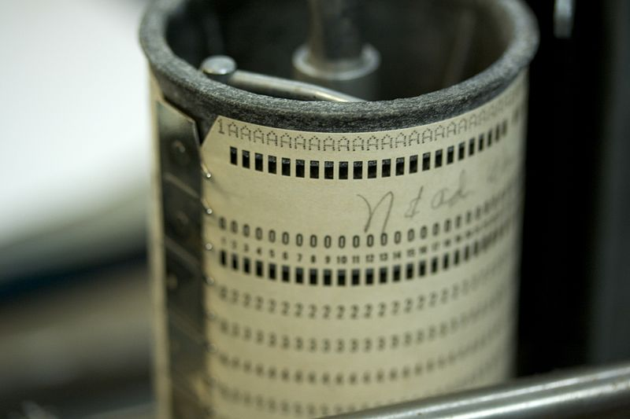
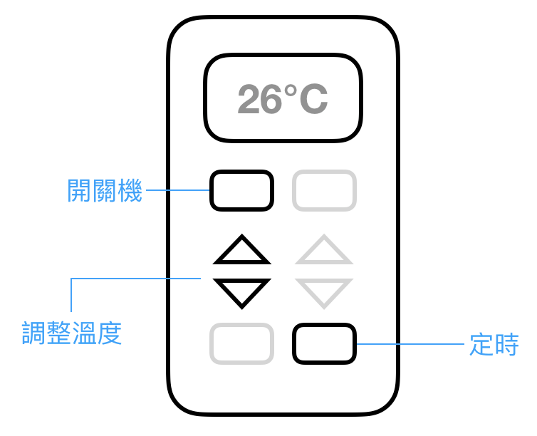

## 認識「測試驅動開發（TDD）」
> 能夠解釋 TDD 的基礎概念、使用情境以及優缺點

Test-Driven Development 全名測試驅動開發，簡稱 TDD，是一種程式開發的技巧，簡單來說就是先寫測試程式，然後才實作功能。

### 起源

歷史上最早出現類似 TDD 的開發方式，發生在 1960 年代早期，那是個電腦主機比一間套房還要大的年代，像今天這㮔人性化的圖形介面編輯器（如 Sublime 或 Vim）還沒有問世，工程師無法像今天一樣方便地編寫程式碼，而是需要先把程式碼寫在打孔卡上，讓電腦讀取程式、執行，最後才能輸出執行結果。

在這個情況下，一台電腦能夠同時讀取的打孔卡數量有限，再加上電腦執行程式以後，還要驗證輸出的結果是否正確，整個「測試」的過程必須花費不少時間，導致工程師每一波提交程式的週期變得很長。



_IBM 的打孔卡。Source: Marcin Wichary / Computer History Museum / Wikimedia_

TDD 就是在這樣的背景下誕生，目的是透過最小化 debug 的時間來降低提交程式的週期。

TDD，也就是所謂的「測試驅動開發」，作法是這樣：針對這一波提交的代碼，事先撰寫執行後的「預期結果」，電腦運算結束之後，直接把電腦輸出的結果和「預期結果」做比較，就能立刻知道程式碼是否出了問題。
這樣的作法除了能大幅度減少 debug 時間，「在一開始就計算出預期結果」也使得工程師更能夠在代碼提交之前意識到自己的錯誤，意味著整體專案開發的效率提升。

到了 2002 年，TDD 再次展露頭角。Kent Beck 和他的夥伴維護一套名為 JUnit 的 Java 測試框架。受到大家好評，之後陸續有開發者把類似 JUnit 的測試方式導入到不同的領域，逐漸形成現在 TDD 的生態圈。

### 優缺點

透過 TDD 開發有不少的優點，像是：
- 減少軟體的錯誤
- 軟體架構更有組織化
- 軟體架構更容易被測試
- 長期來看帶來更小的維護成本

缺點的部分：
- 產品複雜度增加
- 一開始的學習的曲線比較陡峭
- 短期可能看不到效果

### TDD 核心精神

在正式開始討論 TDD 開發流程之前，我們先介紹他的核心概念。總共有三項：
1. 先寫出一個不會通過的測試，再開始寫功能
2. 一次只專注在通過一個測試
3. 只需要撰寫剛好通過該測試的代碼

這樣講可能會有點抽象，讓我們來把以上概念套用到實質的軟體開發流程：

<mark>Ellen's todo : 這裡改成圖解</mark>

| 一般常見的軟體開發流程                    | 套用 TDD 的軟體開發流程                                                                                            |
|-------------------------------------------|--------------------------------------------------------------------------------------------------------------------|
| 逐項功能開始撰寫代碼<br>替每一項功能加上測試 | 寫 A 功能的測試<br> 撰寫代碼直到通過 A 功能的測試<br>寫 B 功能的測試<br>撰寫代碼直到通過 B 功能的測試<br>以此類推到功能開發結束 |

### 練習案例說明：冷氣遙控器

在接下來的課程中，我們會以開發一個冷氣遙控器為例，運用 TDD 完成遙控器的基本功能如「開關機」、「調整溫度」、「定時」⋯⋯。

我們會一邊講解這個例子的 TDD 實作，一邊帶入 Rails 的框架觀念，過程中，為聚焦在觀念的示範，會以 Pseudocode 來進行實作。



#### 先寫「打開冷氣」功能測試

如果採用 TDD 開發流程，我們會先撰寫「打開冷氣」的測試，請你先準備好一個資料夾 **/air-conditioner**，並且創建一個測試檔案：<mark>Ellen: 需要阿鋒改寫</mark>

```
確認冷氣出風口沒有出風
打開冷氣
感覺到冷氣出風口開始出風
```
因為功能尚未撰寫，因此跑測試的結果為未通過（紅燈）。<mark>Ellen: 改寫成真實專案後，加截圖</mark>

#### 實作「打開冷氣」功能測試
<mark>Ellen: 需要阿鋒改寫</mark>
```
def 打開冷氣
    ...
    ...
end
```
實作完打開冷氣的功能之後，再跑一次測試結果顯示為未通過（紅燈）。

錯誤訊息是冷氣沒插插頭打不開（<mark>Ellen: 這裡的錯誤訊息要怎麼跑出來 XD？原為「錯誤訊息是冷氣沒插插頭打不開」麻煩再想想怎麼 fix XD</mark>），這個時候我們會修改測試，在測試裡面假設冷氣有插著插頭：
```
假設冷氣有插著插頭
確認冷氣出風口沒有出風
打開冷氣
感覺到冷氣出風口開始出風
```
這個時候再跑一次測試結果顯示為通過（綠燈）。

到這邊打開冷氣的功能算是實作完成，接下來就是依照同樣的模式繼續開發剩下的功能。如果你回過頭檢視 TDD 的三個核心精神，你會發現這次的實作完全符合 TDD 的開發標準。

這一章我們介紹了 TDD 的起源、核心精神和優缺點，還有透過一個簡單的範例詮釋了 TDD 的開發場景，希望到這邊讀者能對 TDD 有一點基本的認識。下一章我們會帶入更詳細的範例，結合生活化的場景配上實際的程式做更詳細的教學。

----

### 參考資料
- https://en.wikipedia.org/wiki/Test-driven_development
- http://derekbarber.ca/blog/2012/03/27/why-test-driven-development/
- http：//digitalcommons.calpoly.edu/cgi/viewcontent.cgi?article=1027&context=csse_fac
