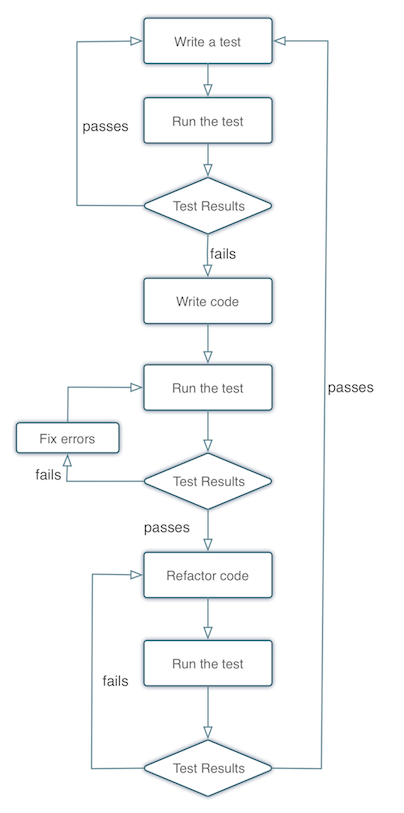

## TDD 與重構

這一章我們會深入探討冷氣遙控器的情境，詳細展示用 TDD 開發可能會遇到的各種狀況。

### 實作流程

上一章我們介紹了 TDD 的軟體開發流程:

1. 寫 A 功能的測試
2. 撰寫代碼直到通過 A 功能的測試
3. 寫 B 功能的測試
4. 撰寫代碼直到通過 B 功能的測試
5. 以此類推到功能開發結束

這樣的流程其實已經達到了 TDD 的最低要求。然而，有 TDD 開發經驗的工程師都知道第一次寫出來代碼通常不會是最好的代碼，所以通常我們會在撰寫功能結束，通過測試之後，再回過頭改寫程式，把程式寫的更好，也就是重構。

很多時候重構的優先權都被排在比較後面，它實在是一件吃力不討好的事情。不過如果是透過 TDD 開發，幾乎可以說是把重構的副作用降到最低，原因是透過測試的把關，任何可能影響到功能正確性的重構都會讓測試無法通過，不用擔心在重構的過程不小心把功能改壞。

加上重構的步驟，整個流程變成像是下圖：



1. 寫 A 功能的測試
2. 撰寫代碼直到通過 A 功能的測試
3. 重構 A 功能之後通過 A 功能的測試
4. 寫 B 功能的測試
5. 撰寫代碼直到通過 B 功能的測試
6. 重構 B 功能之後通過 B 功能的測試
7. 以此類推到功能開發結束

### 重構之前

延續上一章冷氣遙控器的例子，首先，加入 Rails 的語法:

```
# 冷氣遙控器.rb

def 打開冷氣
	...
	...
end
```

冷氣遙控器對應到 controller，而打開冷氣對應到 controller 裡面的一個 action。

下面是測試的代碼:

```
# 冷氣遙控器_測試.rb

it "測試打開冷氣" do
	假設冷氣有插著插頭
	確認冷氣出風口沒有出風
	打開冷氣
	感覺到冷氣出風口開始出風
end
```

然後我們把在上一章省略的 `冷氣遙控器#打開冷氣` 的流程寫的完整一點:

```
# 冷氣遙控器.rb

def 打開冷氣
	紅外線 = 紅外線模組載入

	設定指令 -> 確認冷氣是否開啟
	設定發射器 -> 紅外線發射器
	開啟狀態 = 發送問題給冷氣

	if 開啟狀態 == 沒開
		設定開機為要執行的指令
		選擇透過紅外線發送
		結果 = 發送開機指令

		if 結果 == 成功
			於冷氣遙控器儀表板上顯示 on
		else
			於設定冷氣遙控器儀表板上顯示 off
		end
	end
end
```

在完整流程裡面，我們可以看到其實在按下開關按鈕到真正打開冷氣之前，其實做了好幾個步驟。我們現在開始重新檢視自己寫的代碼，檢查可以寫得更好的地方。

### 重構

（五分鐘後）

你發現了嗎？關於是 `判斷冷氣是否已經開啟` 這邊的邏輯，可以把他們另外包成一個私有函式，因為我要實作的下一個功能是 `關閉冷氣`，而這個功能會用到同樣的邏輯。

重構完的結果如下:

```
# 冷氣遙控器.rb

def 打開冷氣
	紅外線發射器 = 紅外線模組載入
	開啟狀態 = 判斷冷氣是否已經開啟

	if 開啟狀態 == 沒開
		設定指令 -> 開機
		設定發射器 -> 紅外線發射器
		結果 = 發送開機指令給冷氣

		if 結果 == 成功
			於設定冷氣遙控器儀表板上顯示 on
		else
			於設定冷氣遙控器儀表板上顯示 off
		end
	end
end

private

def 判斷冷氣是否已經開啟
	設定指令 -> 確認冷氣是否開啟
	設定發射器 -> 紅外線發射器
	發送問題給冷氣
end
```

其實除了 `關閉冷氣`，別的行為也很有可能會需要先判斷冷氣得開機狀態，所以我會在重構的階段把他拉出來獨立成一個函式，可以在多個功能中呼叫使用。重構完成之後，我們要跑一下測試，確認這次重構之後功能還能正常運作，結果測試結果為失敗（紅燈），我們來看看發生什麼事。

我們發現錯誤提示訊息是 `紅外線未被定義`，看起來是我們忘記把紅外線傳進去私有函式裡面，再一次的修改代碼之後，完整的程式碼如下:

```
# 冷氣遙控器.rb

def 打開冷氣
	紅外線發射器 = 紅外線模組載入
	開啟狀態 = 判斷冷氣是否已經開啟（紅外線發射器）

	if 開啟狀態 == 沒開
		設定指令 -> 開機
		設定發射器 -> 紅外線發射器
		結果 = 發送開機指令給冷氣

		if 結果 == 成功
			於設定冷氣遙控器儀表板上顯示 on
		else
			於設定冷氣遙控器儀表板上顯示 off
		end
	end
end

private

def 判斷冷氣是否已經開啟（紅外線發射器）
	設定指令 -> 確認冷氣是否開啟
	設定發射器 -> 紅外線發射器
	發送問題給冷氣
end
```

我們把紅外線當成參數傳進去 `判斷冷氣是否已經開啟` 裡面，並且再跑一次測試，顯示為通過（綠燈）。

### 再重構

再更一步地檢視程式碼之後，會發現 `判斷冷氣是否已經開啟` 這個私有函式，應該被歸類到 `冷氣` 這個 model 之下，當作 model instance method 來使用，可能更符合使用情境:

```
# 冷氣.rb

def 判斷是否開啟（紅外線發射器）
	設定指令 -> 確認冷氣是否開啟
	設定發射器 -> 紅外線發射器
	發送問題給冷氣
end
```

### 一定要這樣重構嗎？

上面簡單的展示了兩種可能的重構方式，不過每個人對於冷氣遙控器的想法都不同，所以很有可能你想到重構方向跟我不一樣！實際上，在一開始需求不是那麼明顯的專案，重構也不會馬上發生，而是隨著需求越多越明確才會開始。歡迎大家上討論區分享自己的想法。

### 小結

相對於上一章介紹基礎的 TDD 流程，這個章節加入了重構的概念。其實不只在 TDD，重構在整個軟體開發的過程是很重要的一環，目的是為了寫出品質更好的代碼。

本章的這兩個案例加入了重構的元素，邏輯可能比較複雜，如果覺得不熟悉的話記得多看幾次，或是在討論區跟大家分享自己的想法。下一章會從各種不同的角度出發，討論實際用 TDD 開發會面臨的狀況。
