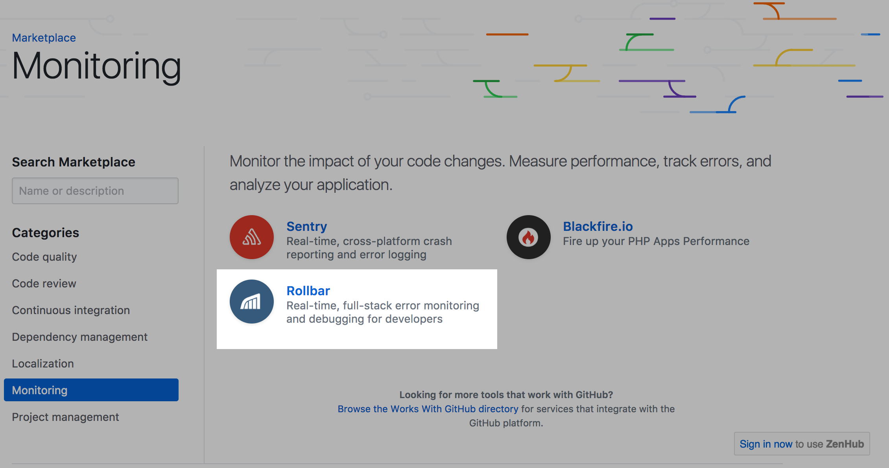
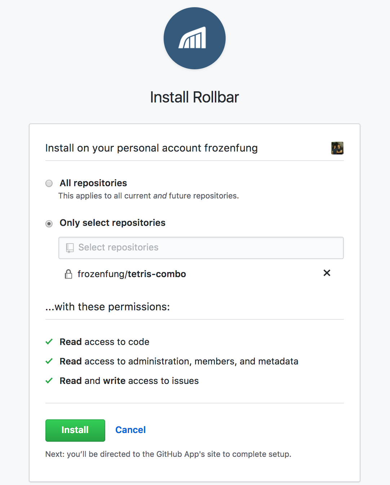
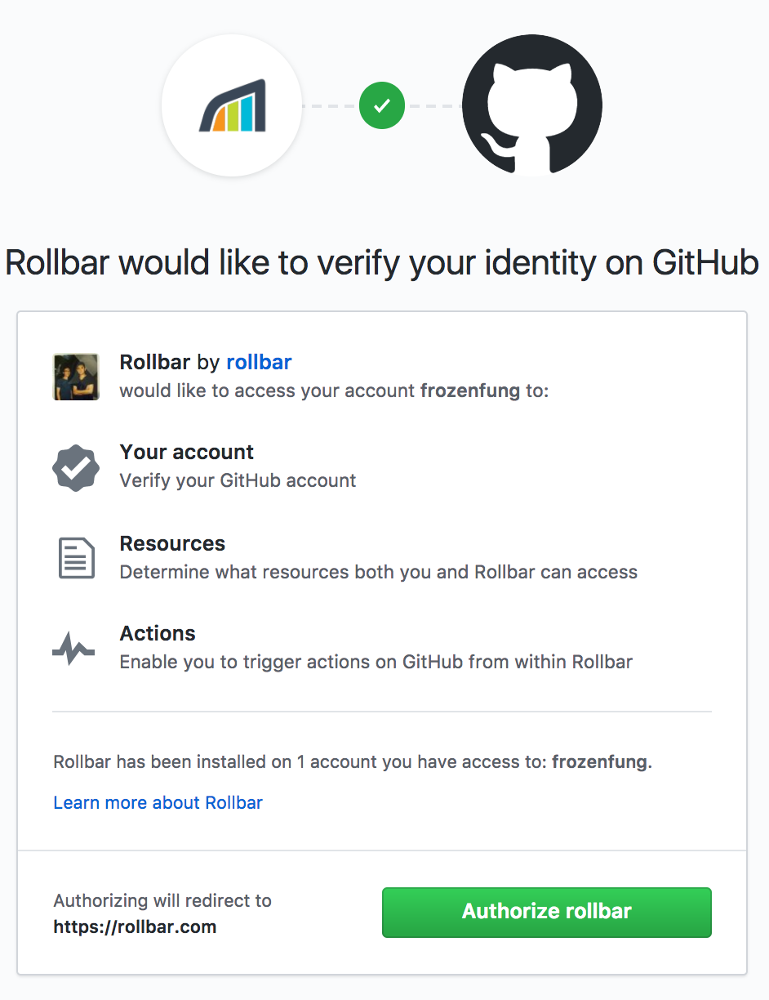
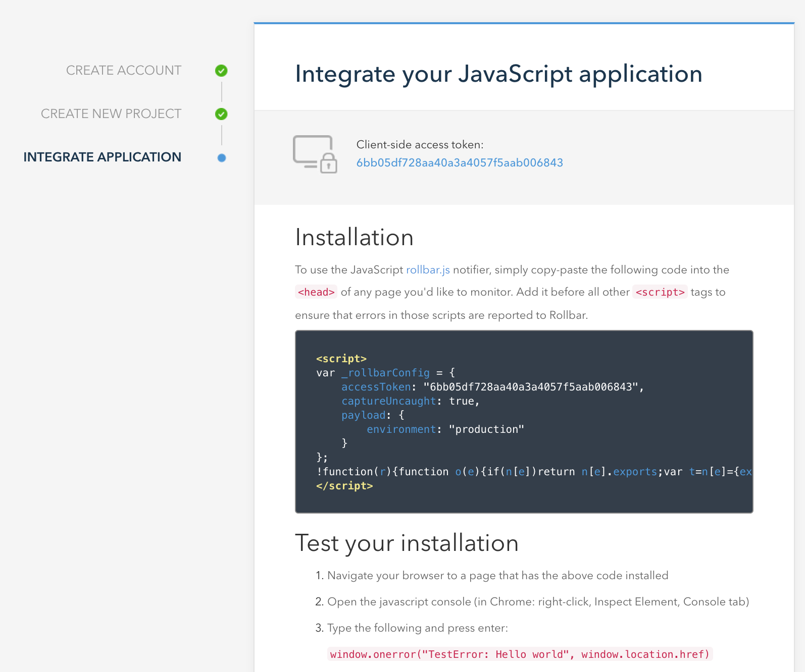
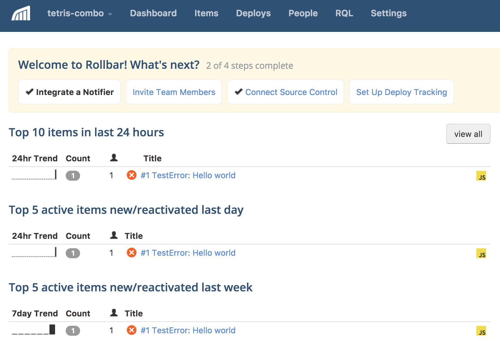
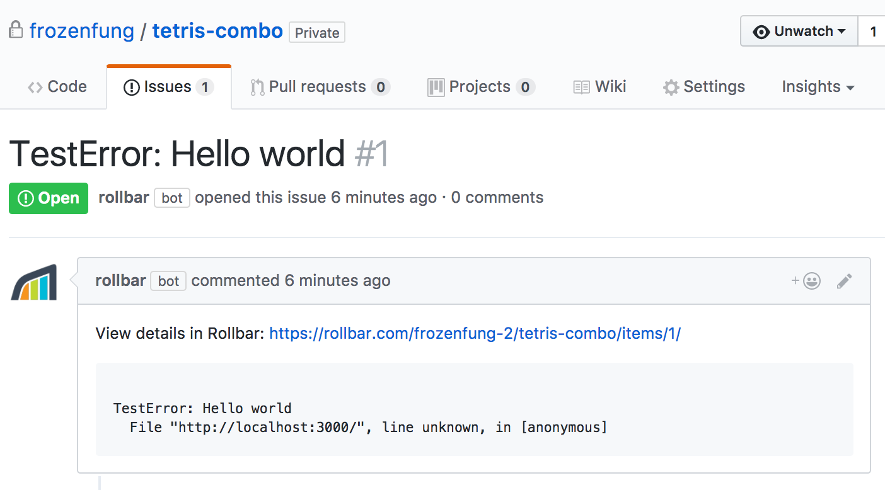
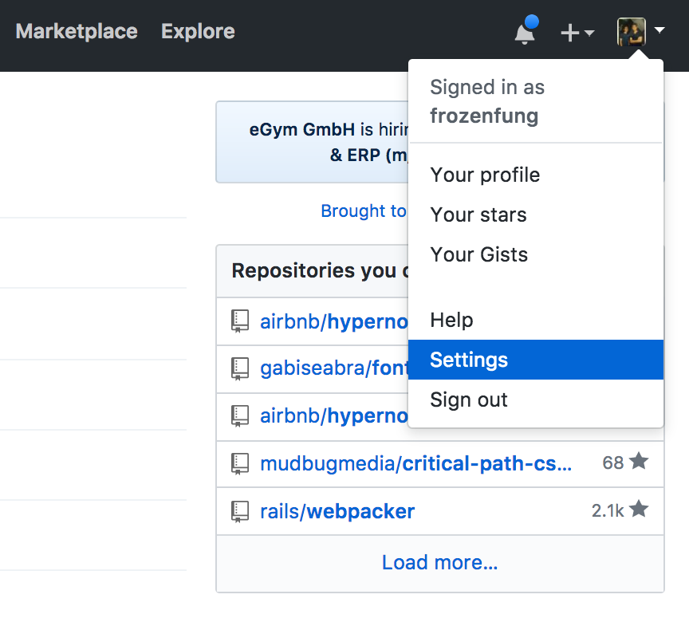
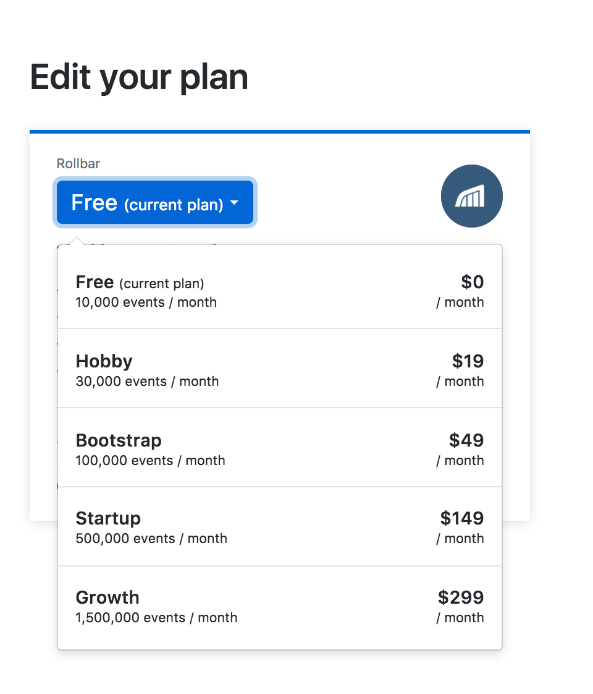

## CI 任務基礎篇

在上一章介紹了 CI 的基本概念。這一章我們會針對 CI 可以執行的任務做簡單的介紹，讓讀者大概了解到 CI 的任務可以哪些事情，並且依照自己專案的需求幫自己的加入設定。

### 一百種任務

CI 的任務有很多種，在這一章裡面不會把所有的任務都講到。相對的，我會從介紹基礎的類別開始，接著從中挑選一項服務做完整的安裝教學。

入門款大概可以分成幾個類型:

- code quality
- code review
- continuous integration
- dependency management
- localization
- monitoring
- project management

#### code quality

這類型的任務主要是幫你檢查程式碼風格，部分有提供測試覆蓋率的檢查。

####  code review

這類型的任務會幫你做簡單的 code review。

#### continuous integration

這類型的任務的客製化程度比較高，通常我們會拿來跑測試和建立新版本，但是設定步驟也會比較複雜。

#### dependency management

這類型的任務比較少見，但出乎意料的方便。他會幫你檢查套件有沒有推出新的版本，然後提醒你升級版本。

#### localization

這類型的任務可以幫你做 project 的翻譯，算是比較少見的需求，可能適合跨國團隊合作的情境。

#### monitoring

這類型的任務可以幫你檢測網站狀況，當 bug 發生或是網站沒有回應的時候馬上通報。

#### project management

這類型的任務可以幫整合代碼與專案的一致性，對於有做專案管理的團隊比較有幫助。

### Rollbar 設定

接下來我會以 Rollbar 為例，介紹怎麼設定這些好用的任務。Rollbar 是 monitoring 裡面算蠻實用的任務之一，主要功能是在上線的網站出現 bug 的時候寄送 email 給網站負責人，debug 再也不算件事。

#### 安裝 Rollbar 到自己的專案

Step1

到 `https://github.com/marketplace` 裡面，選取左邊導覽列的 `monitoring`

Step2

選擇 Rollbar

Step3

進入 Rollbar 的介紹頁，一開始看到使用說明和功能介紹，接著展示了一幅 Rollbar 後台的 UI。最後是價格，在發送一萬個事件之前都是免費的。閱讀完說明之後，按下 `Install it for free`。

Step4

這一步我們要設定安裝的範圍，看你是要全部在 GitHub 上面的方案都安裝或是安裝特定某個專案，這邊我選擇我自己的一個私有專案安裝。

Step5

這一步是 Rollbar 跟你要求 GitHub 的資料，按下 `Authorize rollbar`。

Step6

你可能會覺得畫面突然變得有點陌生，是因為現在已經是在 Rollbar 的服務，接下來的程序會在這邊完成。切換到 Back-end 的 tab，選擇 Rails，然後按下 continue。

Step7

終於到了最後一步！照著他的步驟安裝 `rollbar` 的 gem，然後 `bundle install` 安裝這個 gem。接者跑 `rails generate rollbar SERVER SIDE ACCESS TOKEN`，他會幫你產生一隻 `config/initializers/rollbar.rb` 檔案，記得把他 commit 進去。最後，執行 `rake rollbar:test` 發送測試用的 error。

Step8

進入 `rollbar.com` ，順利的話應該就可以在 dashboard 看到剛剛發送的 error！

Step9

除此之外，應該也可以在專案的底下發現 Rollbar 針對剛剛的 error 幫你開了一個 issue，讓你更方便管理。

#### 調整 Rollbar 方案

也許你原本已經有經營自己的粉絲團，網站一上線就受到大批粉絲的湧入，流量爆炸，一個晚上過後就發現免費專案不夠用。這個時候我們需要到 GitHub 升級我們的方案。

Step1

進入 GitHub，從右上個人選單選擇 setting

Step2

左邊的導覽列選擇 billing，找到 Marketplace Apps 區域裡面的 Rollbar，點選 edit

Step3

依照流量選擇適合自己的方案

#### 解除 Rollbar 服務

如果有一天我們不需要 Rollbar，想要試試看別的 monitoring 服務。這個時候我們需要到 GitHub 取消

Step1

進入 GitHub，從右上個人選單選擇 setting

Step2

左邊的導覽列選擇 billing，找到 Marketplace Apps 區域裡面的 Rollbar，點選 cancel 之後就正式解除

### 小結

這一章介紹了 CI 常見任務的類型，這些任務的功能與用途，並且實際安裝了 Rollbar 的服務。上面介紹的這些服務許多都有提供免費試用，超過某些限制才需要收費，有興趣的讀者可以自己在 [GitHub marketplace](https://github.com/marketplace) 摸索適合自己的服務。下一章我們會針對比較複雜的 continuous integration 類別做比較詳細的介紹，然後帶大家實際走過一次流程。

---

### 參考資料

- https://github.com/marketplace
