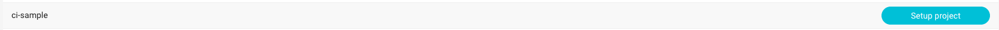
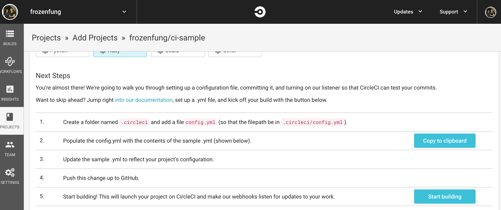
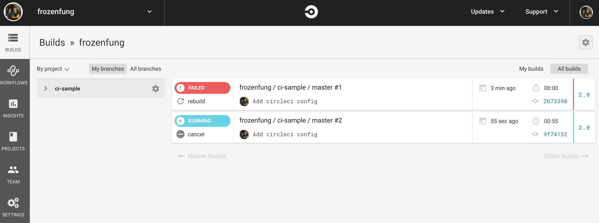
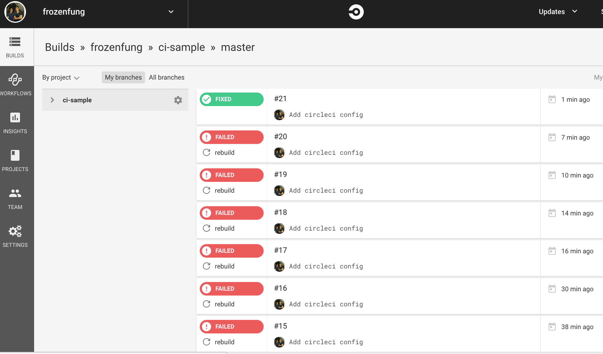
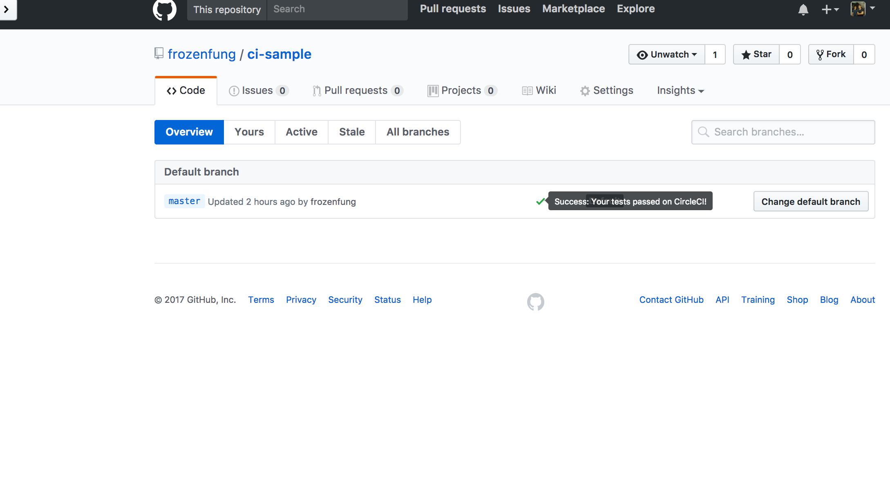

## CI 任務進階篇

在上一章介紹了 CI 任務基礎，透過這些已經跟 GitHub 整合過的服務，我們很容易可以透過幫專案設定任務，讓我們的開發過程更完整和流暢。然而，有時候這些任務沒辦法滿足我們的需求，這個時候就要透過客製化任務幫我們完成更複雜的需求。這一章要介紹進階任務的定位和功能，以及怎麼把客製化任務導入專案。

### 客製化任務

在每個 branch 推上線之後，為了減少新的代碼在實際部署到 production 後可能會發生的問題，我們希望能夠在一個實際模擬線上環境的地方實際把 app 跑起來試試看。除此之外，我們也會在上面跑測試，甚至 build docker image，這些比較複雜的任務會透過客製化任務來達成。

下面我們會示範如何在 Circle CI 上執行 RSpec。

### Circle CI 設定

Step1

打開瀏覽器連上 [Circle CI](http://circleci.com/) ，選擇 `Sign in with GitHub`

Step2

進入主畫面，選擇 `Skip - I don't want to follow any projects`


Step3

找到自己的專案，按下 `setup project`



Step4

選擇自己喜歡的參數，建議設定如下:

- Operating System 選擇 Linux
- Platform 選擇 2.0
- Language 選擇 Ruby

Step5

接下來我們要撰寫自己的 `circle.yml`， Circle CI 的 Server 會用這個檔案裡面的內容決定之後每一次執行的環境和指令。在照著 `Next Steps` 操作之前，我們必須先建立適合自己專案的 `.circleci/config.yml`。

Step6

我自已的 circle.yml 如下:

```
version: 2
jobs:
  build:
    parallelism: 3
    working_directory: ~/ci-sample
    docker:
      - image: circleci/ruby:2.3.4-node
        environment:
          PGHOST: 127.0.0.1
          PGUSER: ubuntu
          RAILS_ENV: test
      - image: circleci/postgres:9.4.12-alpine
        environment:
          POSTGRES_USER: ubuntu
          POSTGRES_DB: ci-sample-test
          POSTGRES_PASSWORD: ""
    steps:
      - checkout

      # Restore bundle cache
      - type: cache-restore
        key: rails-demo-{{ checksum "Gemfile.lock" }}

      # Bundle install dependencies
      - run: bundle install --path vendor/bundle

      # Store bundle cache
      - type: cache-save
        key: rails-demo-{{ checksum "Gemfile.lock" }}
        paths:
          - vendor/bundle

      # Database setup
      - run: bundle exec rake db:create
      - run: bundle exec rake db:schema:load

      # Run rspec in parallel
      - type: shell
        command: |
          bundle exec rspec --profile 10 \
                            --format RspecJunitFormatter \
                            --out /tmp/test-results/rspec.xml \
                            --format progress \
                            $(circleci tests glob "spec/**/*_spec.rb" | circleci tests split --split-by=timings)

      # Save artifacts
      - type: store_test_results
        path: /tmp/test-results

```

設定檔大概會長得像上面這樣，依照每個人的需求不同，可能會有部分不一樣。再檔案編輯完成之後，記得把代碼推上 GitHub。

Step7

確認推上 GitHub 之後，點擊步驟五的 Start Build



Step8

這個時候 Circle CI 就開始 build 你的專案，選擇左邊欄位第一個 `BUILDS` 看看 build 的情況吧！順利的話他會顯示 `RUNNING`。

Step9

失敗是在所難免的，如果不幸真的失敗了，記得點進去看看失敗的原因，重新調整`config.yml` 檔案的設定。



Step10

每一次調整完，只要記得把代碼推上 GitHub，Github 就會主動通知 Circle CI。終於，在無數次的失敗之後，我們成功了！可以看到狀態從紅色的 `FAILED` 轉變成綠色的 `FIXED`。



Step11

回到 GitHub 的 branch 裡面，會發現 master branch 的狀態顯示為通過！



### 小結

這一章我們嘗試在 Circle CI 的 server 上面將專案設定好，並且成功的將測試跑起來。設定 config.yml 的過程比較複雜，可能會需要多試幾次，如果不知道自己的專案該怎麼設定，記得上討論區提問。如果設定成功，也記得上討論區分享自已的 config.yml。如果對於上面的內容覺得不夠清楚，所有的代碼都可以在這個 [Repo](https://github.com/frozenfung/ci-sample) 找到。

### 參考資料

- https://circleci.com/docs/
