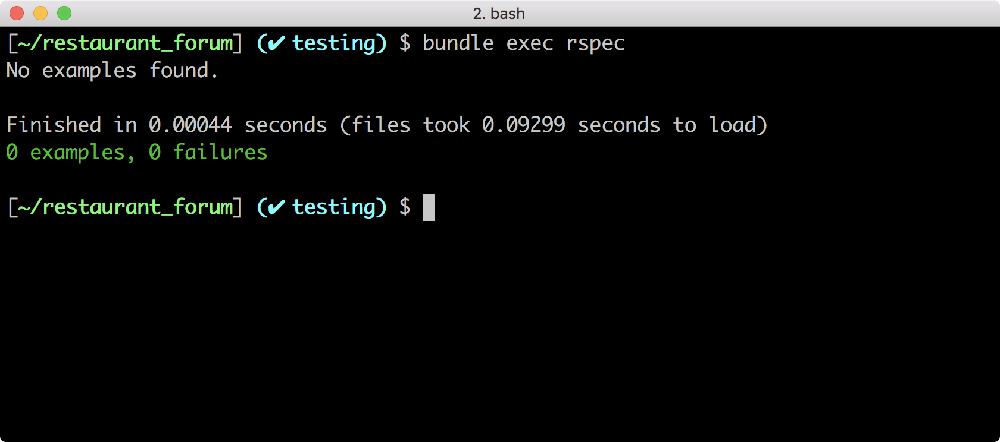

## 專案與工具準備

在之前 TDD 相關的單元裡面，我們已經蠻詳盡的介紹 TDD 的用法和好處，也圍繞著冷氣遙控器舉了幾個例子。接下來，我們會針對 Rails 討論測試的概念，以及搭配的測試工具。

### 專案準備：餐廳論壇

本課程的展示，會以你之前完成的「餐廳論壇」為出發點，教你怎麼把既有的功能加上測試。

你可以選擇下載[我們準備的示範專案](https://github.com/ALPHACamp/restaurant-forum-testing)，也可以選擇打開你自己的專案成果。

### 安裝 RSpec

在正式開始之前，我們需要安裝一些需要的工具，加速我們撰寫測試的過程。

首先是 RSpec，在整合到 Ruby on Rails 時，我們會使用 [rspec-rails](https://github.com/rspec/rspec-rails) 這個 gem，請你在 **Gemfile** 裡面加上：

```ruby
group :development, :test do
  gem 'rspec-rails', '~> 3.6'
end
```
*Path: Gemfile*

請注意要加在 `:development, :test` 的群組裡，來和正式 production 的環境做區分。

然後執行：
```bash
[~/restaurant_forum] $ bundle install
```

接著要幫專案初始化 RSpec：

```bash
[~/restaurant_forum] $ bundle exec rails generate rspec:install
```

這個指令會幫你安裝三個設定檔：

- **.rspec**: 你可以把常用的參數加到這個檔案裡面。舉例來說，如果你想顯示來自 Ruby 的 warning，你可以在檔案裡面加上一行 `--warnings`，這樣之後每次在跑 `bundle exec rspec` 的時候就會自動帶上這個參數。你可以透過 `rspec -h` 這個指令看到所有的參數。
- **spec/rails_helper.rb**: 我們會在這裡撰寫跟 Rails 相關的內容。舉例來說，在測試開始跑之前，導入自定義的 matcher 檔案。
- **spec/spec_helper.rb**: 我們會在這裡撰寫跟 RSpec 本身設定有關的內容。舉例來說，調整 `rspec-mock` 或是 `rspec-expectation` 的設定。

透過 rspec 的指令看看安裝有沒有成功

```bash
[~/restaurant_forum] $ bundle exec rspec
```

順利的話會看到下面的畫面



### 安裝 factory_girl_rails

撰寫測試時，由於每個 `it` 是獨立的，因此每次都要重新建立測試用的假資料。你現在已經知道可以用 `before` 的方法來做一次性的宣告。然而，當 Model 之間的關聯變得複雜時，資料建置就會愈來愈麻煩。因此，實務上會搭配 FactoryGirl 這個函式庫，用來快速產生假資料，可以省下很多準備資料的時間。

（編註：FactoryGirl 已於 2017 年底更名為 FactoryBot，若你進入 GitHub 的網頁會注意到 gem 的名稱變動，但由於絕大多數網路資料仍稱其 FactoryGirl，Ruby 程式碼內的常數名稱也仍是 （編註：FactoryGirl，故本教案仍稱此服務為 FactoryGirl。）

安裝 [factory_girl_rails](https://github.com/thoughtbot/factory_girl_rails) ：

```ruby
group :development, :test do
  gem 'factory_girl_rails'
end
```
*Path: Gemfile*

```bash
[~/restaurant_forum] $ bundle install
```

接著請你打開 **spec/spec_helper.rb**，找到適當的位置，加上 FactoryGirl 的設定：

```ruby
RSpec.configure do |config|
  # 其他預設設定
  config.include FactoryGirl::Syntax::Methods
end
```
*Path: spec/spec_helper.rb*


安裝完成之後，我們必須先針對目標 model 新增相對應的設定檔。舉例來說，假設我們要新增 `user` model 的假資料，就會加在 `spec/factories/` 目錄下面建立 `model.rb` 檔案，並撰寫 User Model 需要的資料內容，如下：

```
FactoryGirl.define do
  factory :user do
    sequence(:username) { |n| "user#{n}" }
    sequence(:email) { |n| "user#{n}@gmail.com" }
    phone_number { "0227011001" }
    nickname { FFaker::Name.last_name }
    description { FFaker::Lorem.sentence }
  end
end
```
*Path: spec/model/factories/model.rb*

在這裡我們沿用了專案[稍早安裝的 FFaker gem](https://lighthouse.alphacamp.co/units/426) 來產生亂數資料。做好以上設定之後，之後就可以在測試裡面透過 `Factory.create(:user)` 的 API 來幫我們建立新的 user，加速開發的流程。如果針對 user 的屬性需要更詳細的調整，可以參考[官方文件](https://github.com/thoughtbot/factory_girl/blob/master/GETTING_STARTED.md#configure-your-test-suite)。


### 安裝 Shoulda-matchers

Shoulda-matchers 是一個 RSpec 的補充包，裡面針對 `ActiveModel`、`ActiveRecord` 和 `ActionController` 的設定提供了方便的 API 來進行測試。

安裝 shoulda-matchers：

```ruby
group :development, :test do
  gem 'shoulda-matchers', '~> 3.1'
end
```
*Path: Gemfile*


```bash
[~/restaurant_forum] $ bundle install
```

在 `spec/rails_helper.rb` 裡面新增設定

```
Shoulda::Matchers.configure do |config|
  config.integrate do |with|
    with.test_framework :rspec
    with.library :active_record
    with.library :active_model
  end
end
```
*Path: spec/rails_helper.rb*


現在你可以使用更直覺的方式做測試，像是測試 user.name 的 validation：
<mark>Ellen: 能否把以下示範和原本的「不直覺」做個比較？</mark>

```
RSpec.describe User, type: :model do
  it { should validate_presence_of(:name) }
end
```

或是測試兩個 model 之間的關聯：

```
RSpec.describe User, type: :model do
  it { should have_many(:restaurants) }
end
```
這一章介紹了許多方便的工具，讓我們撰寫測試維護更加的方便。關於這些工具的使用方法和細節，在每個專案的文件裡面都有詳細的紀錄，由於內容繁多，請有需要的學員自行到專案裡面查詢。下一章我們會示範這些工具在各種不同的測試情境裡面將如何幫助我們開發。

```
#### 參考連結
<mark>Ellen: 麻煩上架人員注意此區域的格式（使用黃色 div）</mark>

- http://rspec.info/documentation/
- https://github.com/thoughtbot/factory_girl_rails
- https://github.com/thoughtbot/shoulda-matchers
```
