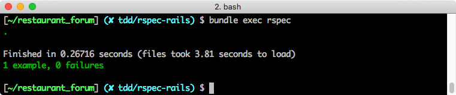

## 測試 Model 與 Controller

在上個單元，你已經在你的「餐廳論壇」專案裡安裝了 RSpec 的相關環境，接下來，我們會跟隨 TDD 的開發原則，實作一個「關於本站」的頁面，在這個頁面裡會呈現全站統計數據，包括：
1. 全站有多少使用者
2. 全站總共有多少回覆

我們曾經在【[S16 主題論壇：強化功能 > 餐廳 Dashboard - restaurants#dashboard](https://lighthouse.alphacamp.co/units/496)】裡寫過一個 **/dashboard** 頁面，在本單元裡，由於要練習 TDD，我們會特地另外做一個 **/about** 來練習。

### 定義期待結果

#### 構思 API

在一切開始之前，先複習一次 TDD 的流程：
<mark>Ellen's todo: need switch to illustration</mark>
1. 撰寫測試
2. 跑測試（測試未通過）
3. 撰寫程式碼
4. 跑測試（測試通過）

在撰寫 model 相關的測試之前，我們通常會先把需要的情境條列出來，做成一個一個的 API。每一次的轉換需要以下步驟：
1. 思考這個 API 有沒有必要拆解成更小的 API
2. 考慮把 API 放在哪裡
3. 幫這個 API 想一個適合的名字。

對應到我們在上文列出的情境需求，

- **查看全站有多少使用者**：
  - 可以透過 `User.all.size` 得到我們要的資訊，不需要進一步的拆解的必要。
  - 又因為 `User.all.size` 只會被 `User` 資料表影響，所以我會傾向於把此 API 定義成一個類別方法 (class method)，歸類在 `model/user.rb` 裡面。
  - 最後，我打算將此 API 命名為 `get_user_count`。

- **查看某個使用者做過多少回覆**：
  - 這個 API 跟「查看全站有多少使用者」類似，我們可以透過 `user.comments.size` 來達到
  - 同理，定義在 `model/user.rb` 裡面，當成一個實例方法 (instance method)
  - 命名為 `get_comment_count`。

#### 定義路由

我們打算為這個頁面的 route 為 **/about**，並且預期呼叫 **/about** 的時候，回傳的 template 裡面帶有**全站使用者的數量**和**全站回覆的數量**的資訊。

這將會需要一組 controller 的測試，我們通常會直接在測試裡面模擬呼叫想測試的路由，然後依據我們的情境設計測試內容。

<mark>Ellen: 需要阿鋒特別 review 這段的潤試有沒有意思跑掉</mark>


### 開發 User Model API

#### 查看全站使用者人數

既然是 TDD，顧名思義，我們會先寫測試的程式，首先從 model 的 API 開始，請你新增一個 **spec/model/user_spec.rb** 來撰寫測試案例：

```ruby
require 'rails_helper'

RSpec.describe User, type: :model do
  it "should count all user" do
    expect(User.get_user_count).to eq(0)
    create(:user)
    expect(User.get_user_count).to eq(1)
  end
end
```
*Path: spec/model/user_spec.rb*

<mark>Ellen: 麻煩阿鋒看一下程式碼（需要加 require 嗎）</mark>

在這個測試案例中，我們先測試我們的 User 數量，此時測試環境下的資料庫裡面什麼都沒有，所以可以預期 user 的數量為零。

接著我們透過 FactoryGirl 的 create API 創造一個 user `create(:user)`，現在測試資料庫裡面的應該會有一個 user，我們透過 `expect` 來測試 API 的呼叫結果是不是跟我們預期的一樣。

這個時候透過 `bundle exec rspec` 執行測試，應該會出現 `1 example, 1 failure`。


失敗原因是因為我們在 User 的 model 裡面還沒有定義 `get_user_count` 這個方法。

寫完測試之後，現在要來寫 API 程式內容，請你在 User Model 裡加入 `get_user_count` 方法:

```ruby
def self.get_user_count
  User.all.size
end
```
*Path: model/user.rb*

透過 `User.all.size` 取得資料庫裡面所有的 user 數量，完成之後，重新執行一次測試，應該會出現 `1 example, 1 success`。



#### 查看全站使用者的回覆數

接著是查看使用者有過多少回覆的 API，一樣我們先寫測試：

```ruby
RSpec.describe User, type: :model do

  # other examples

  it "should count all comments by this user" do
    user = create(:user)
    expect(user.get_comment_count).to eq(0)
    comment = create(:comment)
    user.comments << comment
    expect(user.get_comment_count).to eq(1)
  end
end
```
*Path: spec/model/user_spec.rb*

首先，透過 `user = create(:user)` 先建立起一個測試用的 user，接著我們用 `expect(user.get_comment_count).to eq(0)` 先確認 comment 為零。再來 `comment = create(:comment)` 建立測試用的 comment，然後把 `user.comments << comment` 讓這個 comment 跟 user 建立關聯，最後用 `expect(user.get_comment_count).to eq(1)` 測試 user 目前的 comment 數量為 1。

透過 `bundle exec rspec` 執行測試，應該會出現 `1 example, 1 failure`。失敗的原因是因為我們在 User 的 model 裡面還沒有定義 `get_comment_count` 這個方法。


```ruby
def get_comment_count
  comments.all.size
end
```
*Path: model/user.rb*

定義完成之後，重新執行一次測試，應該會出現 `1 example, 1 success`。

### 撰寫測試：controller API

在 controller 的部分，我們一樣先從測試開始:

```
# spec/controller/restaurants_controller_spec.rb

describe "GET dashboard" do
  it "check we have user count info in view template" do
    # part 1
    sign_in(create(:user))
    user_count = rand(20..100)
    allow(User).to receive(:get_user_count).and_return(user_count)

    # part 2
    get :dashboard
    expect(assigns(:user_count)).to eq(user_count)
    expect(response.body).to have_content("There are totally #{user_count} users in this website.")
  end
end
```

首先我們要開一個新的檔案作為測試 restaurants controller 來使用，命名慣例為 `restaurants_controller_spec.rb`。接著我們會定義一個 describe 的區塊，通常 describe 是用來分類同一個 controller 下面不同的 action，這部分的命名則使用 http verb 搭配上 action name，在這個例子裡面就是 `GET dashboard`。

接著我們正式進入測試的程式碼。在 controller 這個階段我們主要會測試兩件事:

1. 變數有確實被 assign
2. template 裡面有我們想要的結果

而整個測試的過程會被分成兩個部分:

1. 準備工作
2. 測試

關於準備工作，考慮到這是一個需要登入的路徑，我們需要先創造一個使用者並且用這個使用者的身份登入，也就是 `sign_in(create(:user))`。接著我們要偽造 get_user_count 的回傳結果，原因是我們在上一個 model 的例子裡面已經寫過它的測試，所以我們可以相信 `get_user_count` 回傳的結果。而為了保持測試的單元性，我們希望盡量不讓其他因素影響到這個測試的結果。透過 `user_count = rand(20..100)` 偽造使用者的人數，並且用 `allow(User).to receive(:get_user_count).and_return(user_count)` 嘗試偽造 `get_user_count` 的結果。

準備完之後就可以正式開始測試了！首先，用 `get :dashboard` 讓 RSpec 模擬呼叫路徑的情形，然候我們就可以開始檢視我們的假設跟實際狀況是不是吻合。第一步是 `expect(assigns(:user_count)).to eq(user_count)`，用來檢視 action 裡面的 @user_count 這個變數跟我們偽造的值是不是一樣，再來是用 `expect(response).to have_content("There are totally #{user_count} users in this website.")` 來判斷最後的頁面上有沒有我們預期的字串。

透過 `bundle exec rspec` 執行測試，應該會出現 `1 example, 1 failure`。原因是我們還沒有在 controller 裡面加上對應的程式。

```
# controllers/restaurants_controller_spec.rb

def dashboard
	...
	@user_count = User.get_user_count
	...
end

```

補上之後，再跑一次 `bundle exec rspec` 看看，應該會發現還是沒有通過。原因是我們沒有在 view 裡面加上我們要顯示的資訊。

```
# views/restaurants/dashboard.html.erb

...
<div>There are totally <%= @user_count %> users in this website.</div>
...
```

這個時候再跑一次 `bundle exec rspec` 會發現順利通過，TDD 開發成功。

### 小結

這一章用比較基礎的功能當作範例，目的是要讓大家熟習在 Rails 裡面開發 TDD 的感覺，而拆解 API 和命名其實是很主觀的，所以如果你有想到什麼更好的拆解方式或是命名方式，請多上討論區跟同學們分享與討論。下一張章我們將會討論加入 Facebook 的 API 之後，應該要怎麼在測試裡面處理這類型的情境。
