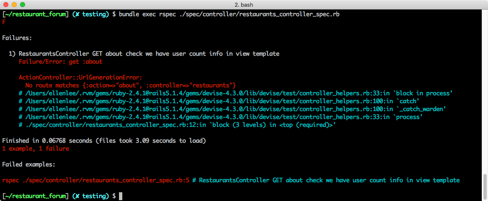
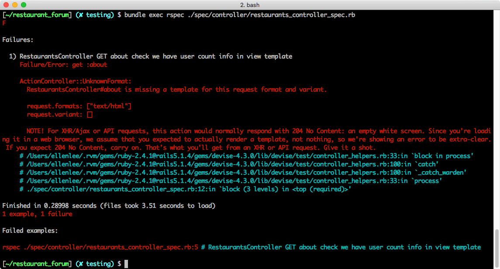

### controller API

到現在為止，我們還沒有定義 **/about** 的 controller，一樣我們先從測試開始。

首先我們要開一個專門測試 RestaurantsController 的檔案，命名慣例為 `restaurants_controller_spec.rb`，會歸類在 **spec/controllers** 的目錄下，並撰寫以下測試案例：

```ruby
require 'rails_helper'

RSpec.describe RestaurantsController, type: :controller do
  describe "GET dashboard" do
    it "check we have user count info in view template" do
      # part 1
      sign_in(create(:user))
      user_count = rand(20..100)
      allow(User).to receive(:get_user_count).and_return(user_count)

      # part 2
      get :about
      expect(assigns(:user_count)).to eq(user_count)
      expect(response.body).to have_content("There are totally #{user_count} users in this website.")
    end
  end
end
```
*Path: spec/controller/restaurants_controller_spec.rb*

我們定義了一個 describe 區塊來分類同一個 controller 下面不同的 action，這部分的命名則使用 http verb 搭配上 action name，在這個例子裡面就是 `GET dashboard`。

接著我們正式進入測試的程式碼。在 controller 這個階段我們主要會測試兩件事:

1. 變數有確實被 assign
2. template 的內容含有我們想要的結果

而整個測試的過程會被分成兩個部分:

1. 準備變數
2. 測試

#### 準備變數

關於準備工作，考慮到這是一個需要登入的路徑，我們需要先創造一個使用者並且用這個使用者的身份登入，也就是 `sign_in(create(:user))`。由於 `sign_in` 是 Devise 提供的方法，需要在 **spec/rails_helper.rb** 裡引入：

<mark> Ellen: 要和阿鋒確認程式碼</mark>

接著我們要偽造 `get_user_count` 的回傳結果，原因是我們在上一個 model 的例子裡面已經寫過它的測試，所以我們可以相信 `get_user_count` 回傳的結果。而為了保持測試是一個獨立的單元，我們希望盡量不要讓其他因素影響到這個測試，所以我們會用偽造的方式處理。

所謂「偽造的方式」，就是透過 `user_count = rand(20..100)` 來偽造使用者的人數，並且用 `allow(User).to receive(:get_user_count).and_return(user_count)` 嘗試偽造 `get_user_count` 的結果。

#### 測試

準備完之後，就可以正式開始測試了！

首先，用 `get :dashboard` 讓 RSpec 模擬呼叫路徑的情形，然候我們就可以開始檢視我們的假設跟實際狀況是不是吻合：
- `expect(assigns(:user_count)).to eq(user_count)`，用來檢視 action 裡面的 `@user_count` 這個變數跟我們偽造的值是不是一樣；
- `expect(response).to have_content("There are totally #{user_count} users in this website.")` 判斷對應的 template 頁面上有沒有我們預期的字串。

此時我們還沒有在 controller 裡面加上對應的程式，但我們先執行測試看看，你可以在指令後加上檔名，只跑單一檔案的測試，來提高效率：

```bash
[~/restaurant_forum] $ bundle exec rspec ./spec/controller/restaurants_controller_spec.rb
```

預期會出現 `1 example, 1 failure`，表示該測試不通過，因為根本就還沒有實作路由和 controller action：



讓我們加上對應的路由：
```ruby
collection do
  get :about
end
```
*Path: config/routes.rb*

以及到 RestaurantsController 裡補上對應的方法：

```ruby
# GET restaurats/about
def about
  @user_count = User.get_user_count
end
```
*Path: app/controllers/restaurants_controller.rb*

補上之後，再跑一次測試看看，應該會發現還是沒有通過。原因是我們沒有在 view 裡面加上我們要顯示的資訊：



讓我們建立一個 template，把指定的變數放進去：

```
<div>There are totally <%= @user_count %> users in this website.</div>
```
*Path: views/restaurants/dashboard.html.erb*

這個時候再跑一次 `bundle exec rspec` 會發現順利通過：

<mark>Ellen: 事實上這裡遇到各種困難，不成功～</mark>


恭喜你！TDD 開發成功！

這一章用比較基礎的功能當作範例，目的是要讓大家熟習在 Rails 裡面開發 TDD 的感覺，拆解 API 和命名其實是很主觀的，如果你有想到什麼更好的拆解方式或是命名方式，請多上討論區跟同學們分享與討論。下一張章我們將會討論加入 Facebook 的 API 之後，應該要怎麼在測試裡面處理這類型的情境。
