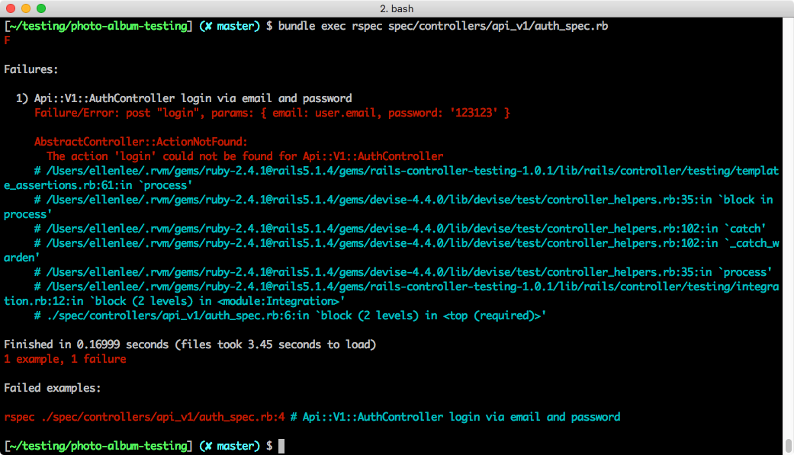
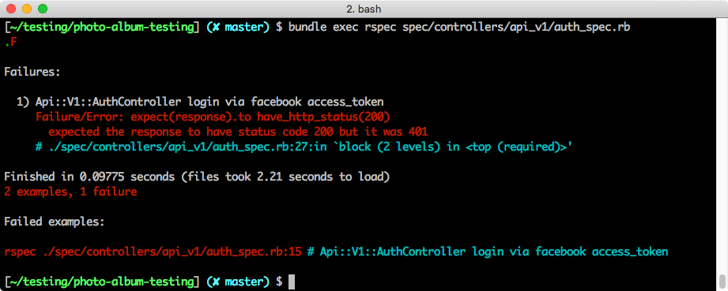

## 測試 Web API
> 能夠為 Devise 的登入、登出功能撰寫測試
> 能夠為 FB 登入功能撰寫測試

在前面的單元，我們使用「餐廳論壇」結合 TDD 完成了基礎功能的實作。在這個單元，我們會展示如何測試登入登出的 API，透過這個比較完整的應用，讓大家更完整體驗 TDD 可能的應用方式。

### 準備專案

請你準備任一個你自己的專案來做練習，並依照前幾單元的介紹，安裝好 RSpec、載入 Devise 設定並準備假資料。

### 確認目標

了解運作機制之後，我們先把這次的目標列出來，我們的目標是開發以下兩支 API：
- `api_v1/login`
- `api_v1/logout`

接著我們先把登入的邏輯想清楚，可能的情境有兩種：

1. 使用者使用 email 登入，確認從客戶端來的帳號和密碼無誤後，回傳使用者認證碼
2. 使用者使用 Facebook 登入，透過 Facebook 個人資料 API 確認從客戶端帶來的 Facebook 權杖有效並取回個人資訊。如果個人資訊尚未登陸資料庫，則建立新的使用者，並回傳使用者認證碼。如果個人資訊已經存在於資料庫，則找到該名使用者並回傳使用者認證碼。

登出情境相對單純，只需要重設使用者認證碼，這樣下次客戶端帶著舊的認證碼進來時，就找不到使用者了。

### 準備路由

讓我們先把目標路由設定上去：

```ruby
# config/routes.rb

namespace :api, defaults: {format: :json} do
  namespace :v1 do
    post "/login" => "auth#login"
    post "/logout" => "auth#logout"
  end
end
```

### 登入

#### 撰寫測試

首先我們嘗試撰寫 email 登入的測試:

```ruby
# spec/controllers/api_v1/auth_spec.rb

require 'rails_helper'

RSpec.describe Api::V1::AuthController, type: :controller do
  it "login via email and password" do
    user = create(:user, email: '123@gmail.com', password: '123123')
    post "login", params: { email: user.email, password: '123123' }

    expect(response).to have_http_status(200)
    expect(JSON.parse(response.body)).to eq({
      message: 'ok',
      auth_token: user.auth_token,
    })
  end
end
```

首先建立一個使用者，然後用這個使用者的帳號密碼當作參數去呼叫 `api/v1/login`，預期 response status 為 200，而 response body 應該會帶有使用者認證碼的相關資訊。這個時候透過 `bundle exec rspec` 執行測試，應該會出現 failure，因為我們還沒有開發任何功能。



####實作功能

接下來我們要開始撰寫 `ApiV1::AuthController` 裡面的 `login` 行為，試著讓測試通過：

```ruby
# app/controllers/api/v1/auth_controller.rb

class Api::V1::AuthController < ApiController

  # POST /api/v1/login
  def login
    success = false

    if params[:email] && params[:password]
      user = User.find_by_email(params[:email])
      success = user && user.valid_password?(params[:password])
  	end

    if success
      render json: {
        message: "ok",
        auth_token: user.authentication_token
      }
    else
      render json: { message: "failed" }, status: 401
    end
  end
end

```

重新執行一次測試，此時預期會亮起綠燈。

### Facebook 登入

在進行這組測試練習前，你的專案需要先有 [Facebook 帳號登入](https://lighthouse.alphacamp.co/lessons/236/units/1154)的功能。

#### 撰寫測試

到目前為止已經完成 email 登入功能。接著我們試著加上 Facebook 登入的功能，先撰寫測試的部分：

```ruby
# spec/controllers/api_v1/auth_spec.rb

it "login via facebook access_token" do
  user = create(:user, email: '123@gmail.com', password: '123123')
  fb_data = { "id" => "123", "email" => "123@gmail.com", "name" => "fung" }
  fb_access_token = 'blablabla'
  auth_hash = double('OmniAuth::AuthHash')
  allow(User).to receive(:get_facebook_user_data).with(fb_access_token).and_return(fb_data)

  allow(OmniAuth::AuthHash).to receive(:new).and_return(auth_hash)
  allow(User).to receive(:from_omniauth).with(auth_hash).and_return(user)

  post "login", params: { access_token: fb_access_token }

  expect(response).to have_http_status(200)
  expect(JSON.parse(response.body)).to eq({
    'message' => 'ok',
    'auth_token' => user.authentication_token
  })
end
```

說明如下：
- 首先假造了 `fb_data` 做為透過客戶端來的權杖，進行身份確認的回傳資訊。
- 接著偽造 `fb_access_token`，在這邊我們要做三個假設：
  - 第一，預期 User 的 `get_facebook_user_data` 這個 class method 會被呼叫，並回傳我們假造的 `fb_data`；
  - 第二，我們會利用 `OmniAuth::AuthHash` 產生一個該類別下的 instance，並且回傳該 instance 定義為 auth_hash
  - 最後，User 類別下的 `from_omniauth` 應該會被呼叫並回傳該使用者。

此時，透過 `bundle exec rspec` 執行測試，應該會出現紅燈：



#### 調整 login 功能

我們需要稍微調整 `ApiV1::AuthController` 裡面的 `login` 的邏輯，試著讓 email 登入與 facebook 登入能夠一起運作:

```diff
# app/controllers/api/v1/auth_controller.rb

  def login
    success = false

    if params[:email] && params[:password]
      user = User.find_by_email(params[:email])
      success = user && user.valid_password?(params[:password])
-   end
+   elsif params[:access_token]
+     fb_data = User.get_facebook_user_data(params[:access_token])
+     if fb_data
+         auth_hash = OmniAuth::AuthHash.new({
+           uid: fb_data["id"],
+           info: { email: fb_data["email"] },
+           credentials: {
+            token: params[:access_token],
+            expires_at: Time.now + 60.days
+          }
+         })
+       user = User.from_omniauth(auth_hash)
+     end
+     success = fb_data && user.persisted?
+   end

    if success
      render json: {
        message: "ok",
        auth_token: user.authentication_token
      }
    else
      render json: { message: "failed" }, status: 401
    end
  end
end
```

在以上的程式碼中，我們透過 `User.get_facebook_user_data` 從 Facebook 取得 `params[:access_token]` 持有者的個人資訊存進 `fb_data` ，透過裡面的資訊判斷目前客戶端的使用者的身份。

接著我們把 auth_hash 當作參數丟進 `User.from_omniauth` 回傳對應的使用者，登入成功。重新執行一次測試，這時候預期會亮起綠燈。

到目前為止，我們已經成功使用 TDD 開發出 email 登入以及 Facebook 登入邏輯。

### 登出

登入完成之後，接下來是登出。登入的邏輯比較單純，我們只需要重新產生該使用者的 auth_token 就可以達到我們的目的。我們先寫測試：

```ruby
# spec/controllers/api_v1/auth_spec.rb

it "logout succesfully" do
  user = create(:user, email: '123@gmail.com', password: '123123')
  token = user.authentication_token

  post "logout", parmas: { auth_token: user.authentication_token }

  user.reload
  expect(user.authentication_token).not_to eq(token)
end
```

接著完成登出功能的撰寫：

```ruby
# app/controllers/api/v1/auth_controller.rb

before_action :authenticate_user!, only: :logout

def logout
  current_user.generate_authentication_token
  current_user.save!

  render json: { message: "ok" }
end
```

到這裡，你可以再次執行測試，預期會看見綠燈亮起。

### 小結

這一章我們透過常見的情境 - Web API 登入登出，搭配前面兩章所學到的 TDD 的技巧做了一個相對來說較為完整的練習。下一章我們會討論外部 API 在測試裡面可能會遇到的問題，以及我們該如何處理。
