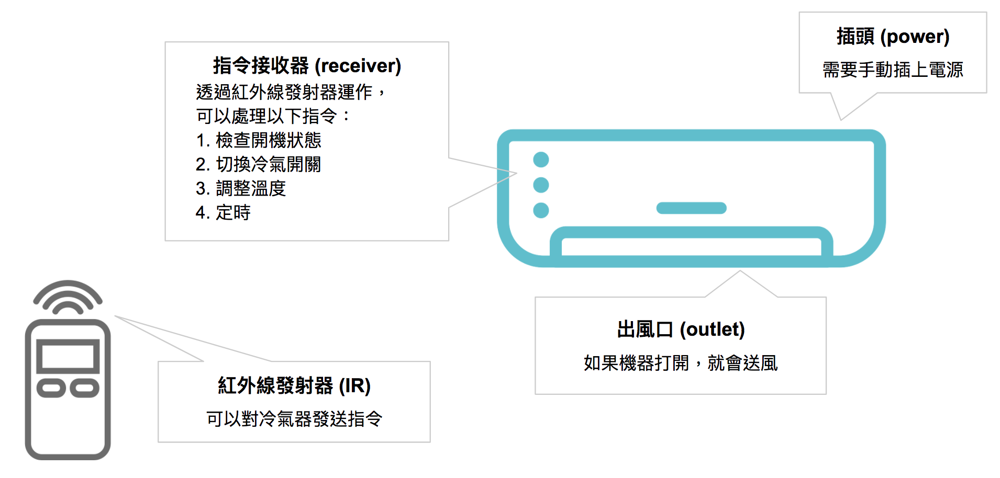
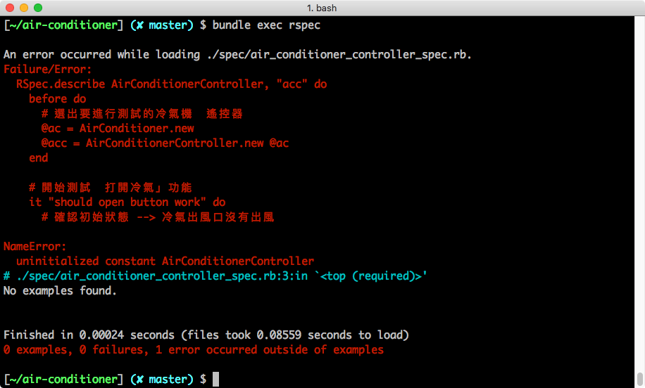
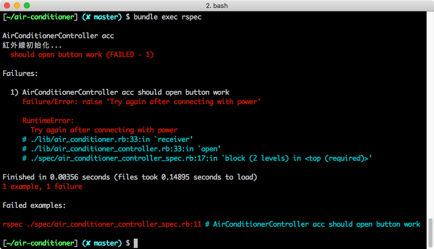

## TDD 練習：打開冷氣
> 能夠使用 Pseudocode 來思考 TDD 開發流程
> 能夠針對單一的 API 介面，撰寫剛剛好的測試與功能程式

在接下來的課程中，我們會以開發一個冷氣遙控器為例，運用 TDD 完成遙控器的基本功能如「開關冷氣」和「定時功能」。

為了專注在邏輯層面的討論，在講解案例時，我們會使用 Pseudocode 進行實作，課程後會附上程式碼，給有興趣的同學參考。

### 情境

在「冷氣遙控器」的開發情境中，「冷氣」軟體介面已經存在了，而「冷氣」和「遙控器」之間的紅外線收送系統也設定好了，現在只缺「冷氣遙控器」的功能：



對應到專案架構，會是以下的樣子，只有「冷氣遙控器」(air_conditioner_controller) 的函式庫與測試檔還未開發，其他的軟體程式都已經存在：


### 撰寫「打開冷氣」的測試檔

在這個單元裡，我們會先開發「打開冷氣」的功能。按照 TDD 開發流程，我們會先撰寫「打開冷氣」的測試：

```ruby
RSpec.describe AirConditionerController, "acc" do
  before do
    選出要進行測試的冷氣機和遙控器
  end

  it "should open button work" do
    確認初始狀態 -> 期待冷氣出風口沒有出風
    執行「打開冷氣」動作
    期待感覺到到冷氣出風口開始出風
  end
end
```

由於此時沒有撰寫任何功能，因此跑測試的結果為一片紅燈：：



### 實作「打開冷氣」功能

```ruby
class AirConditionerController
  def 初始化
    將遙控器與冷氣機配對
    初始化儀表板，顯示冷氣關機
  end

  def 打開冷氣
    載入紅外線模組
    設定指令 -> 「確認冷氣是否開啟」
    呼叫紅外線發射器
    發送指令給冷氣機，要求冷氣機回報「開啟狀態」

    if 開啟狀態 == 冷氣沒開
      要求冷氣機執行「打開冷氣」指令
      呼叫紅外線發射器
      發送指令給冷氣機，要求冷氣機回報「執行結果」
    end

    if 執行結果 == 成功
      於冷氣遙控器儀表板上顯示 on
    else
      於設定冷氣遙控器儀表板上顯示 off
    end
  end
end
```

實作完打開冷氣的功能之後，再跑一次測試結果，竟然仍然是紅燈！



閱讀冷氣機傳來的錯誤訊息，原來是忘記插上插頭，讓我們修改測試的步驟，先記得把冷氣插頭插上電源：
```ruby
RSpec.describe AirConditionerController, "acc" do
  before do
    選出要進行測試的冷氣機和遙控器
  end

  it "should open button work" do
    將冷氣插上電源
    確認初始狀態 -> 期待冷氣出風口沒有出風
    執行「打開冷氣」動作
    期待感覺到到冷氣出風口開始出風
  end
end
```

再跑一次測試，結果顯示為通過（綠燈），表示我們預期的結果（出風口開始出風）有發生：


到這邊，打開冷氣的功能算是實作完成，接下來就是依照同樣的模式繼續開發剩下的功能。如果你回過頭檢視我們剛才的實作流程，你會發現這次的實作完全符合 TDD 的開發標準，也就是：

1. 先寫出一個不會通過的測試，再開始寫功能
2. 一次只專注在通過一個測試
3. 只需要撰寫剛好通過該測試的代碼

這一章我們介紹了 TDD 的起源、核心精神和優缺點，還有透過一個簡單的範例詮釋了 TDD 的開發場景，希望到這邊讀者能對 TDD 有一點基本的認識。下一章我們會帶入更詳細的範例，結合生活化的場景配上實際的程式做更詳細的教學。
