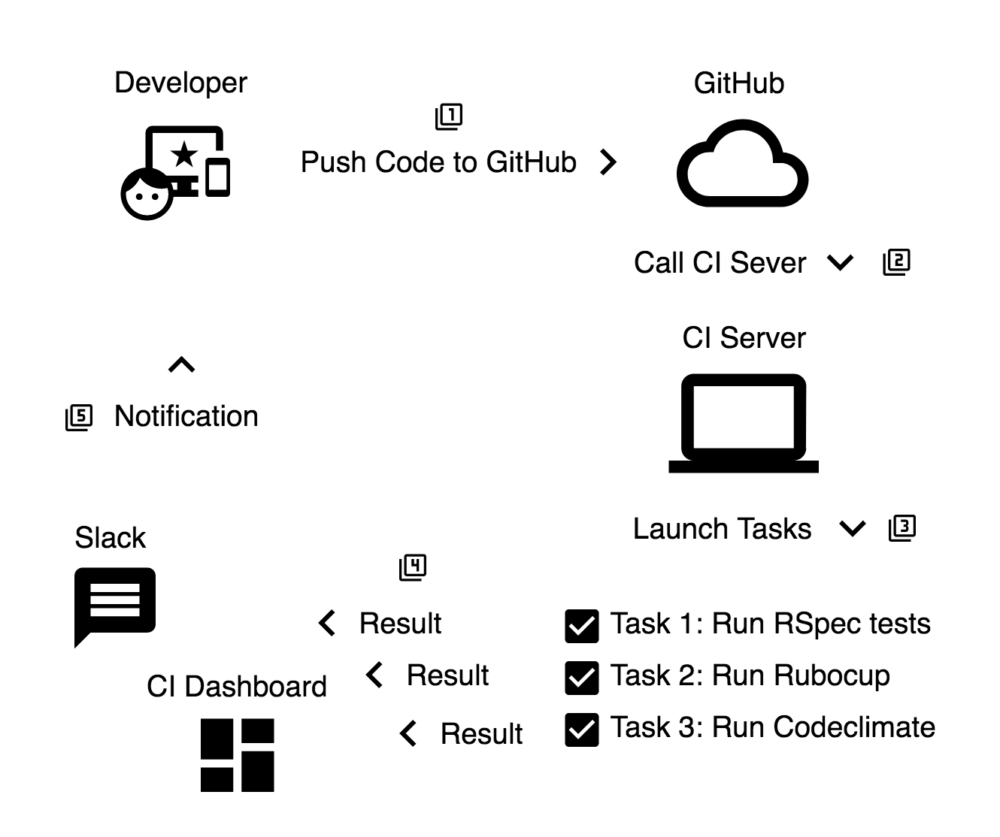

## CI 基本概念介紹

這一章我們要談的是 CI。從什麼是 CI 開始，接著看 CI 在軟體開發流程扮演的角色，然後是優缺點，最後是從日常情境出發，看看在一間已經導入 CI 的軟體公司的工程師會遇到什麼狀況。

### 什麼是 CI

CI 的全名是 Continuously Integration，是現代大型系統開發中的一個觀念，簡單來說CI 指的是在開發完成之後，到確認可以成功部署中間，還有許多工作要做，而這每一個工作都是被自動化過的，也就是說，當一個合格的 CI 被建立起來之後，每一次開發完成，到每一次部署，這中間，都不需要工程師再寫任何的程式。

對管理者來說，CI 很適合管理代碼品質，透過 CI 整理代碼品質資訊，呈現在 CI 儀表板上面，你可以很輕鬆地知道最近代碼品質是有所提升，還是正在下降。除此之外，儀表板上也可以粗略的了解工程師在開發專案的進度，以及各個分支開發的狀況。

### CI 在軟體開發流程扮演的角色

軟體開發流程有很多種，下面列出一個簡單版本:

1. 工程師們把寫好代碼提交到 GitHub 上面
2. 透過 GitHub webhook，通知 CI server 有一批新的代碼剛剛被提交
3. CI server 依照設定好的腳本執行不同任務
4. 將每項任務的結果成功或失敗發送訊息到 Slack，此外，將其他資料傳送到 dashboard
5. 工程師透過 Slack 了解 CI 上的任務執行狀況

從第二個步驟到第四個步驟都算是 CI 涵蓋的範圍。

### 優缺點

導入 CI 的優點很多，像是:

- 實現快速迭代的可能性
- 更方便管理代碼複雜度
- 更方便暸解代碼健康程度趨勢
- 減少管理者管理代碼品質的時間

缺點的部分:

- 系統複雜度提升
- CI 的建構與維護需要花不少時間

### 透過 CI 開發的日常

下面我們要透過一些實際的情境來觀察，有 CI 的開發團隊可能遇到的狀況。

#### 情境一
小明是工程師，在中午吃飯之前把代碼推上 GitHub，他想要利用吃飯期間的空擋跑 CI。中午吃飯回來之後，發現 CI 上有一個任務 A 沒完成，打開 CI dashboard 看，發現因為早上其他部門的工程師發了好幾個測試版本，造成負責執行任務 A 的機器塞車。又等了半個小時之後，終於輪到小明的任務 A 順利通過。因為 CI 已經幫跑過測試，檢查過程式碼品質，小明放心的把代碼部署到機器上。

#### 情境二
小美是 CTO，早上收到一封通知信內容是關於 iOS app 的代碼品質的月報表，小美發現這一個月來代碼品質持續下滑，詳細研究之後發現這幾次的代碼提交，有部分的功能沒有被測試涵蓋到，他決定下禮拜一早上聯絡 iOS app team 的 leader，請他們這個 spring 結束之後安排一個禮拜的時間把測試的涵蓋率補到 80%。

### 小結

這一章很簡單的介紹了 CI 的基本概念和在軟體開發流程扮演的角色。下一章我們會介紹常用的 CI 服務，撰寫給 CI 跑的腳本，最後把 CI 導入你的 Rails 專案。

----

### 參考資料
- https://en.wikipedia.org/wiki/Continuous_integration
