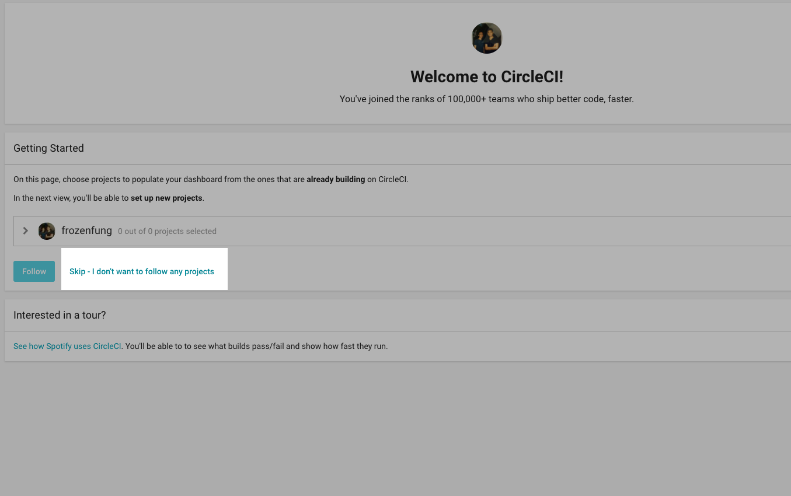
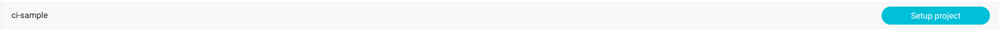
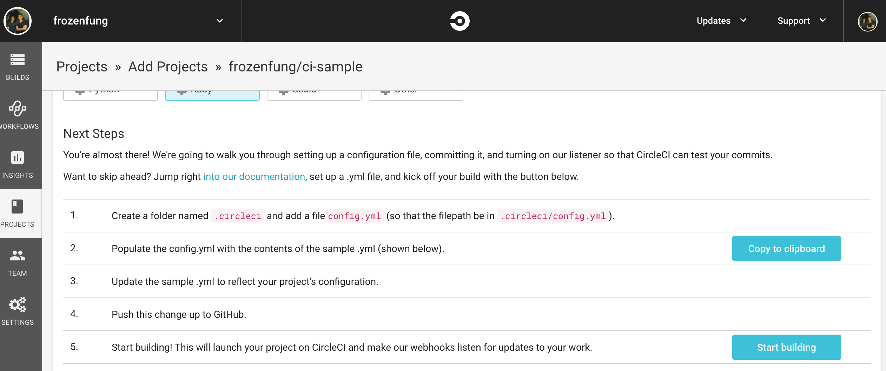
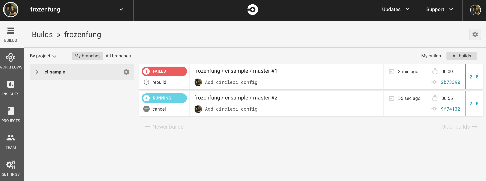
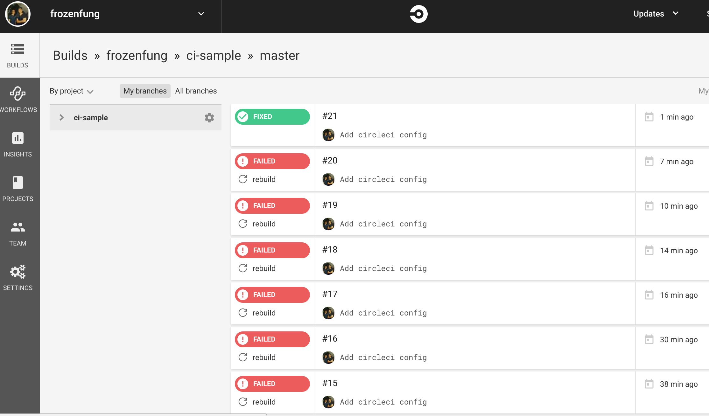
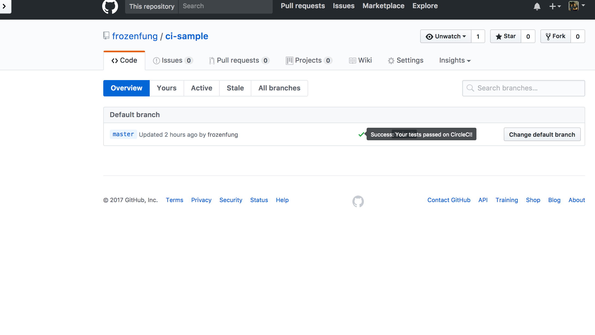

## 導入客製化任務：Circle CI

### 客製化任務

上個單元我們用的 Rollbar 服務和 GitHub 已經有很好的整合，我們可以很容易地為專案設定任務，讓我們的開發過程更完整和流暢。

然而，有時候你的需求比較複雜，可能需要導入客製化的任務。舉例來說，在每個 branch 推上線之後，為了減少新的代碼在實際部署到 production 後可能會發生的問題，我們希望能夠先在一個模擬的環境中，把 app 跑起來試試看。我們還希望能在這個模擬環境裡跑測試，甚至 build docker image。

上述任務需要透過客製化的 CI 任務來達成。接下來我們會以 Circle CI 為例，示範如何在 Circle CI 上執行 RSpec。

### Circle CI 設定

#### Step1

打開瀏覽器連上 [Circle CI](http://circleci.com/) ，選擇 `Sign in with GitHub`

####  Step2

進入主畫面，選擇 `Skip - I don't want to follow any projects`



#### Step3

找到自己的專案，按下 `setup project`



#### Step4

選擇自己喜歡的參數，建議設定如下:

- Operating System 選擇 Linux
- Platform 選擇 2.0
- Language 選擇 Ruby

#### Step5

接下來我們要撰寫自己的 **circle.yml**， Circle CI 的 Server 會用這個檔案裡面的內容，決定之後每一次執行的環境和指令。在照著 `Next Steps` 操作之前，我們必須先建立適合自己專案的 **.circleci/config.yml**。

依照每個人的需求不同，設定檔也會不同，以下提供參考：

```ruby
version: 2
jobs:
  build:
    parallelism: 3
    working_directory: ~/ci-sample
    docker:
      - image: circleci/ruby:2.3.4-node
        environment:
          PGHOST: 127.0.0.1
          PGUSER: ubuntu
          RAILS_ENV: test
      - image: circleci/postgres:9.4.12-alpine
        environment:
          POSTGRES_USER: ubuntu
          POSTGRES_DB: ci-sample-test
          POSTGRES_PASSWORD: ""
    steps:
      - checkout

      # Restore bundle cache
      - type: cache-restore
        key: rails-demo-{{ checksum "Gemfile.lock" }}

      # Bundle install dependencies
      - run: bundle install --path vendor/bundle

      # Store bundle cache
      - type: cache-save
        key: rails-demo-{{ checksum "Gemfile.lock" }}
        paths:
          - vendor/bundle

      # Database setup
      - run: bundle exec rake db:create
      - run: bundle exec rake db:schema:load

      # Run rspec in parallel
      - type: shell
        command: |
          bundle exec rspec --profile 10 \
                            --format RspecJunitFormatter \
                            --out /tmp/test-results/rspec.xml \
                            --format progress \
                            $(circleci tests glob "spec/**/*_spec.rb" | circleci tests split --split-by=timings)

      # Save artifacts
      - type: store_test_results
        path: /tmp/test-results

```

設定 config.yml 的過程比較複雜，可能會需要多試幾次，如果不知道自己的專案該怎麼設定，記得上討論區提問。如果設定成功，也記得上討論區分享自已的 **config.yml**。

檔案編輯完成之後，記得把代碼推上 GitHub。

#### Step7

確認推上 GitHub 之後，點擊「Start Build」按鈕：



#### Step8

這個時候 Circle CI 就開始 build 你的專案，選擇左邊欄位第一個 `BUILDS` 看看 build 的情況吧！順利的話他會顯示 `RUNNING`。

失敗是在所難免的，如果不幸真的失敗了，記得點進去看看失敗的原因，重新調整 **config.yml** 檔案的設定。



### 運用 CI 來管理程式碼

接下來就可以透過 CI 來維護程式碼了。只要記得把代碼推上 GitHub，Github 就會主動通知 Circle CI。終於，在無數次的失敗之後，我們成功了！可以看到狀態從紅色的 `FAILED` 轉變成綠色的 `FIXED`。



此時，回到 GitHub 的 branch 裡面，會發現 master branch 的狀態顯示為通過！



以上是 Circle CI 的安裝說明，希望透過 Circle CI 的安裝與設定，能讓你感受到什麼是「客製化任務」。

### 參考程式碼

本單元裡的程式碼可以在 [這裡](https://github.com/frozenfung/ci-sample) 找到。
