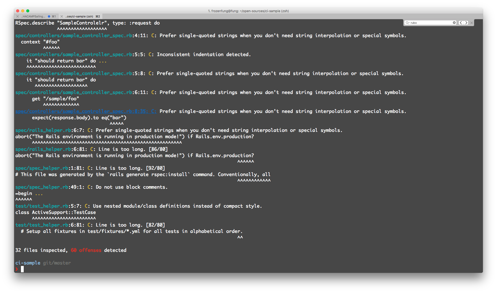
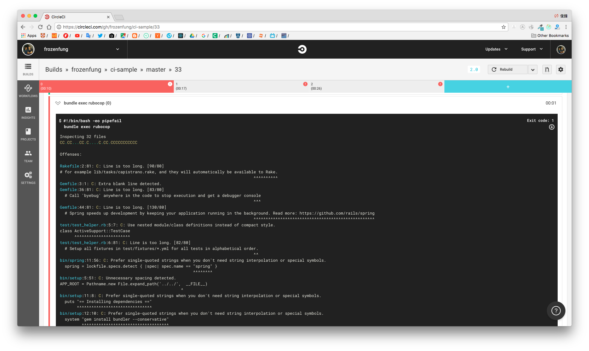

## 客製化 CI 任務：Circle CI 整合 Rubocup
> 能夠在客製化 CI 任務裡導入其他的第三方服務

在這個單元裡，我們來利用你上個單元設定好的 CircleCI，再去整合其他的服務，例如 RuboCop。

### 安裝 RuboCop

[RuboCop](https://github.com/bbatsov/rubocop) 是一個開源專案，他可以幫你的專案做 Ruby 代碼分析和檢查，可以讓不熟悉 Ruby 語法的人學習 Ruby 語法優良的傳統。

請你自行依照 RuboCop README 的指示安裝，完成後輸入 `rubocop`，可以看到很多語法上的建議。這些規則都是可以隨自己的喜好打開或是關閉，請參考[這份文件](https://github.com/bbatsov/rubocop/blob/master/config/default.yml)。



### RuboCop 導入 CI

打開你在上個單元努力設定好的 **.circleci/config.yml**，加上：

```
# Rubocup
- run: bundle exec rubocop
```

這行指令會讓 Circle CI 執行 rubocop。

設定好以後，在你之後執行 CI 時，也會一併執行 rubocop 檢查，只要 rubocop 發現你寫的 Ruby 語法不合格，就不會讓這次的代碼通過。


